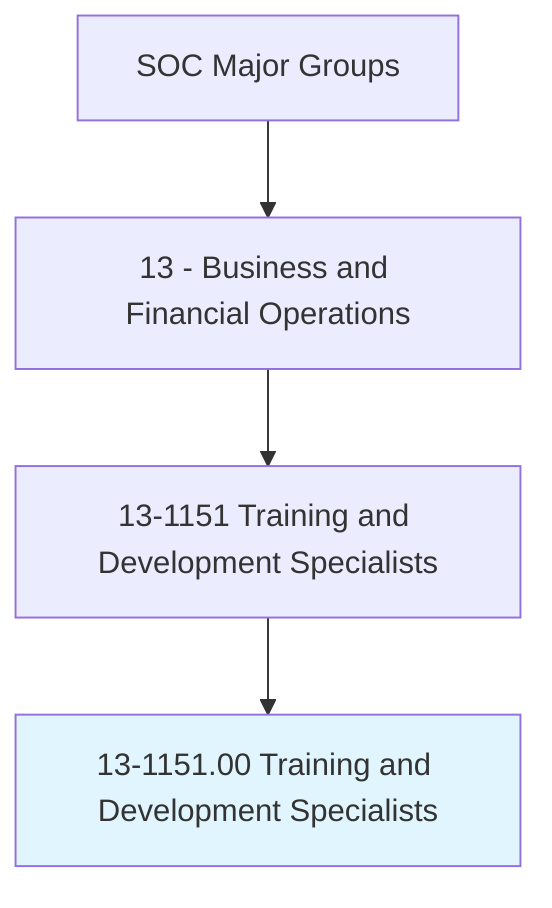
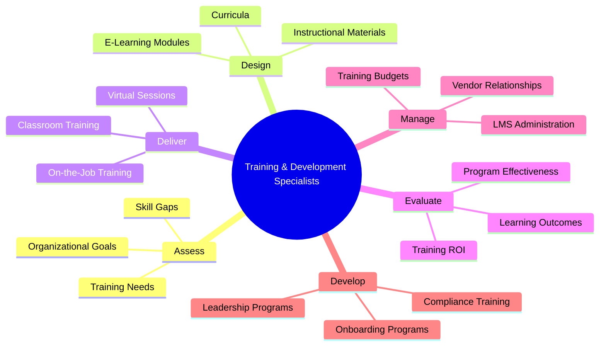
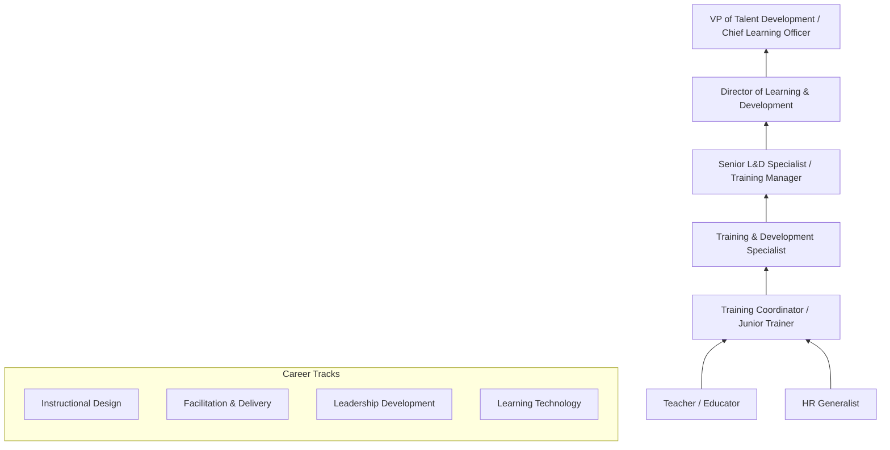
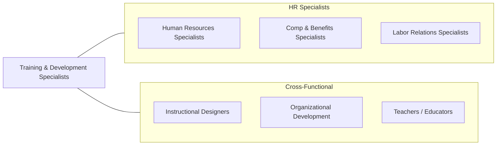

# Training and Development Specialists

> Design or conduct work-related training and development programs to improve individual skills or organizational performance. May analyze organizational training needs or evaluate training effectiveness.

## Overview

Training and Development Specialists design, deliver, and evaluate learning programs that build employee competencies and improve organizational performance. They conduct needs assessments to identify skill gaps, develop curricula and instructional materials, facilitate training sessions, and measure learning outcomes. Their work spans technical skills training, leadership development, compliance education, onboarding programs, and organizational change initiatives.

These professionals apply principles of adult learning theory, instructional design, and performance improvement to create effective training experiences. They must understand how people learn, how to engage diverse audiences, and how to translate business objectives into measurable learning outcomes. The role requires both creative design skills and analytical capabilities to assess training needs and evaluate program effectiveness.

The profession has been transformed by e-learning platforms, learning management systems, virtual classroom technologies, microlearning, gamification, and AI-powered adaptive learning. The shift to remote and hybrid work has accelerated the adoption of digital learning tools and created demand for specialists who can design engaging virtual learning experiences. Modern training professionals must be technologists, designers, facilitators, and data analysts, using learning analytics to demonstrate the business impact of training investments.

## Classification Hierarchy

## Key Statistics

| Metric | Value |
|--------|-------|
| SOC Code | 13-1151.00 |
| Job Zone | 4 (Considerable Preparation) |
| Category | [Business and Financial Operations](/occupations/Business/index) |
| Median Salary | $63,080 |
| Employment | ~357,000 |
| Projected Growth | 6% (As fast as average) |
| Task Count | 38 |
| Source | O*NET |

## Core Tasks

### assess.TrainingNeeds

Conduct needs assessments to identify organizational and individual training requirements.

**Actions:**
- `assess.TrainingNeeds.to.identify.SkillGaps` - Diagnose learning needs
- `assess.OrganizationalGoals.to.align.TrainingStrategy` - Connect to business objectives
- `analyze.PerformanceData.to.target.DevelopmentAreas` - Use data for prioritization
- `consult.Managers.to.understand.TeamRequirements` - Gather stakeholder input

### design.LearningPrograms

Design and develop instructional materials and learning programs.

**Actions:**
- `design.Curricula.based.on.AdultLearningPrinciples` - Apply instructional design
- `design.ELearningModules.for.ScalableDelivery` - Create digital content
- `design.BlendedLearningPrograms.for.OptimalEngagement` - Mix delivery methods
- `develop.AssessmentTools.to.measure.LearningOutcomes` - Create evaluations

### deliver.TrainingSessions

Facilitate training through various delivery methods and platforms.

**Actions:**
- `deliver.ClassroomTraining.to.engage.Learners` - Lead in-person sessions
- `deliver.VirtualSessions.through.DigitalPlatforms` - Facilitate online learning
- `deliver.OnboardingPrograms.for.NewEmployees` - Orient new hires
- `evaluate.ProgramEffectiveness.using.KirkpatrickModel` - Measure impact

## Skills & Competencies

### Technical Skills
- **Instructional Design (ADDIE, SAM)** - Expert
- **Adult Learning Theory** - Expert
- **E-Learning Development** - Advanced
- **Learning Management Systems (LMS)** - Advanced
- **Facilitation & Presentation** - Advanced
- **Needs Assessment** - Advanced
- **Training Evaluation (Kirkpatrick)** - Proficient
- **Learning Analytics** - Proficient

### Soft Skills
- **Communication** - Critical
- **Presentation & Facilitation** - Critical
- **Creativity** - Essential
- **Empathy & Patience** - Essential
- **Adaptability** - Important
- **Collaboration** - Important

## Education & Certifications

| Requirement | Details |
|-------------|---------|
| Typical Education | Bachelor's degree in Education, HR, Organizational Development, or related field |
| Advanced Degree | Master's in Instructional Design, Ed Tech, or OD preferred |
| Key Certifications | CPTD (Certified Professional in Talent Development - ATD) |
| Additional Certs | APTD (Associate), CPLP (legacy), PHR |
| Technical Skills | Articulate Storyline/Rise, Adobe Captivate, video production |
| Work Experience | 2-5 years in training, education, or instructional design |

## Career Progression

## Industry Variations

| Industry | Focus | Typical Tasks |
|----------|-------|---------------|
| **Corporate** | Skills & leadership | Technical training, management development, succession |
| **Healthcare** | Clinical competency | Medical education, compliance training, simulation |
| **Technology** | Technical skills | Developer training, product training, certification prep |
| **Financial Services** | Compliance & skills | Regulatory training, sales training, risk education |
| **Government / Military** | Mission readiness | Defense training, civil service development, leadership |
| **Education** | Faculty development | Pedagogy workshops, technology training, accreditation |

## Technology & Tools

| Category | Tools |
|----------|-------|
| **LMS** | Cornerstone, SAP Litmos, Docebo, Canvas |
| **Authoring** | Articulate 360, Adobe Captivate, Lectora |
| **Video** | Camtasia, Vyond, Loom |
| **Virtual Classroom** | Zoom, Webex, Microsoft Teams, Adobe Connect |
| **Design** | Canva, Adobe Creative Suite, PowerPoint |
| **Assessment** | Qualtrics, SurveyMonkey, quiz tools |
| **AI / Adaptive** | EdCast, Degreed, AI coaching platforms |

## Related Occupations

## Departments

This occupation typically works in:
- [Learning & Development](/departments/LearningDevelopment)
- [Human Resources](/departments/HumanResources)
- [Talent Management](/departments/TalentManagement)
- [Organizational Development](/departments/OrgDevelopment)
- [Training Operations](/departments/TrainingOperations)

---

*Source: O*NET 13-1151.00 - ONETOccupation*
