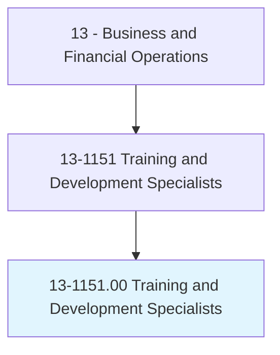
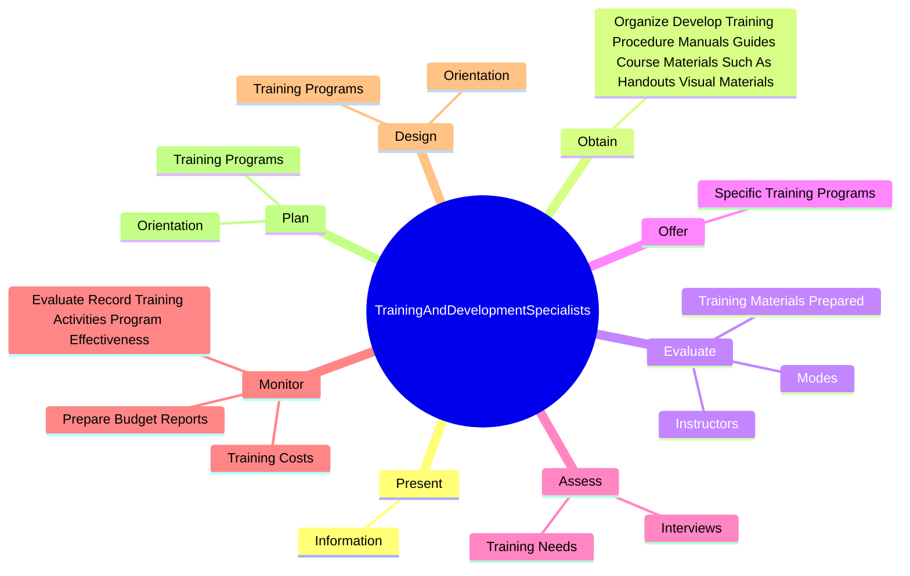

# Training and Development Specialists

> Design or conduct work-related training and development programs to improve individual skills or organizational performance. May analyze organizational training needs or evaluate training effectiveness.

## Overview

Training and Development Specialists is an occupation within the Business and Financial Operations category. Design or conduct work-related training and development programs to improve individual skills or organizational performance. 

## Classification Hierarchy

## Key Statistics

| Metric | Value |
|--------|-------|
| SOC Code | 13-1151.00 |
| Category | [Business and Financial Operations](/occupations/Business/index) |
| Task Count | 79 |
| Source | O*NET |

## Core Tasks

### present.Information

Training and Development Specialists present information as part of their core responsibilities.

**Actions:**
- `present.Information.with.Variety.of.InstructionalTechniques`
- `present.Information.with.Formats`
- `present.Information.with.RolePlaying`
- `present.Information.with.Simulations`

### obtain.OrganizeDevelopTrainingProcedureManualsGuidesCourseMaterialsSuchAsHandoutsVisualMaterials

Training and Development Specialists obtain organize develop training procedure manuals guides course materials such as handouts visual materials as part of their core responsibilities.

**Actions:**
- `obtain.OrganizeDevelopTrainingProcedureManualsGuidesCourseMaterialsSuchAsHandoutsVisualMaterials`

### evaluate.Modes

Training and Development Specialists evaluate modes as part of their core responsibilities.

**Actions:**
- `evaluate.Modes.of.TrainingDelivery`
- `evaluate.Modes.of.InPerson`
- `evaluate.Modes.of.Virtual`
- `evaluate.Modes.of.optimize.TrainingEffectiveness`

## Skills & Competencies

### Technical Skills
- **Financial Analysis** - Advanced
- **Data Analysis** - Advanced
- **Regulatory Compliance** - Advanced

### Soft Skills
- **Communication** - Essential
- **Problem Solving** - Essential
- **Critical Thinking** - Important
- **Teamwork** - Important
- **Adaptability** - Important

## Related Occupations

## Industries

This occupation is found across multiple industries. See [Industries](/industries) for sector-specific employment data.

## Career Progression

---

*Source: O*NET 13-1151.00 - ONETOccupation*
