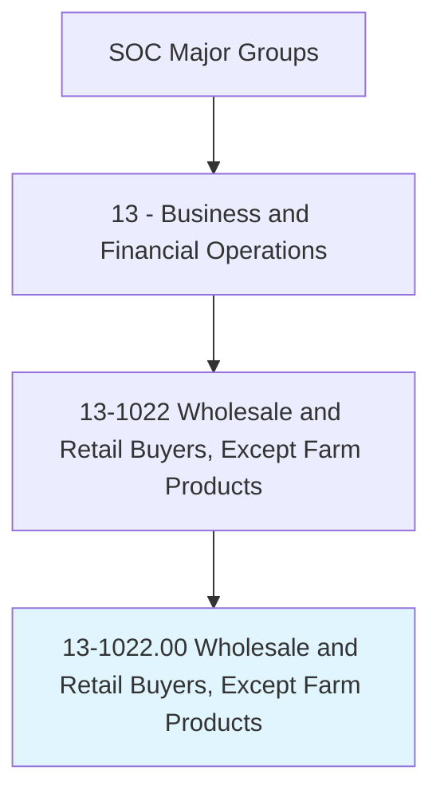
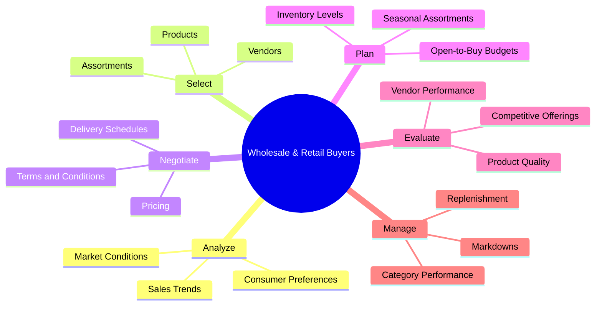
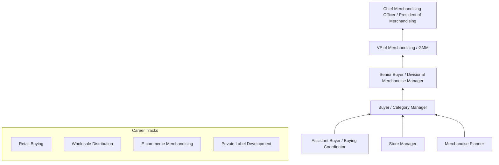
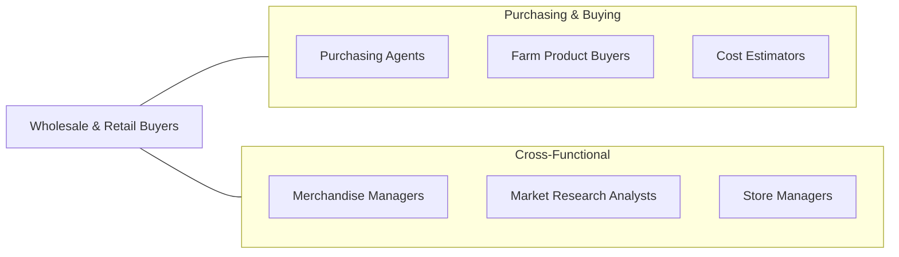

# Wholesale and Retail Buyers, Except Farm Products

> Buy merchandise or commodities, other than farm products, for resale to consumers at the wholesale or retail level, including both durable and nondurable goods. Analyze past buying trends, sales records, price, and quality of merchandise to determine value and yield.

## Overview

Wholesale and Retail Buyers select and purchase merchandise for resale in retail stores, wholesale distributors, and e-commerce operations. They analyze market trends, sales data, consumer preferences, and competitive offerings to determine what products to stock, in what quantities, and at what prices. Their buying decisions directly affect store revenues, inventory investment, and customer satisfaction, making this a high-impact role in the retail and wholesale industries.

These professionals combine analytical skills with market intuition, evaluating product samples, negotiating with vendors, planning assortments, and managing inventory levels to maximize sales and minimize markdowns. They attend trade shows, review vendor proposals, analyze sales velocity data, and collaborate with merchandising and marketing teams to create compelling product offerings. The role requires balancing creative product selection with financial discipline and inventory management rigor.

The profession has been transformed by data analytics, e-commerce, direct-to-consumer brands, and changing consumer shopping behaviors. Modern buyers use predictive analytics, AI-driven demand forecasting, and real-time sales data to make faster and more accurate buying decisions. Omnichannel retailing requires buyers to consider both in-store and online assortments, while sustainability and ethical sourcing add new dimensions to vendor evaluation and product selection.

## Classification Hierarchy

## Key Statistics

| Metric | Value |
|--------|-------|
| SOC Code | 13-1022.00 |
| Job Zone | 4 (Considerable Preparation) |
| Category | [Business and Financial Operations](/occupations/Business/index) |
| Median Salary | $67,620 |
| Employment | ~108,000 |
| Projected Growth | -4% (Declining) |
| Task Count | 48 |
| Source | O*NET |

## Core Tasks

### analyze.MarketAndSalesData

Analyze market trends, sales history, and consumer behavior to inform buying decisions.

**Actions:**
- `analyze.SalesTrends.to.identify.GrowthOpportunities` - Find winning products
- `analyze.MarketConditions.to.anticipate.DemandShifts` - Predict market changes
- `analyze.ConsumerPreferences.to.align.Assortments` - Match customer needs
- `analyze.CompetitiveOfferings.to.maintain.MarketPosition` - Benchmark competition

### select.ProductsAndVendors

Select products, vendors, and assortments that maximize sales and margins.

**Actions:**
- `select.Products.to.create.CompellingAssortments` - Curate merchandise
- `select.Vendors.based.on.QualityAndReliability` - Source from best suppliers
- `negotiate.Pricing.to.achieve.TargetMargins` - Secure competitive costs
- `negotiate.Terms.to.optimize.CashFlow` - Structure favorable payments

### plan.InventoryAndBudgets

Plan open-to-buy budgets, inventory levels, and markdown strategies.

**Actions:**
- `plan.OpenToBuyBudgets.to.control.InventoryInvestment` - Manage buying dollars
- `plan.SeasonalAssortments.to.match.CustomerDemand` - Time product flow
- `manage.Markdowns.to.clear.SlowMovingInventory` - Optimize sell-through
- `manage.Replenishment.to.maintain.InStockPosition` - Prevent stockouts

## Skills & Competencies

### Technical Skills
- **Merchandise Planning & Buying** - Expert
- **Sales & Trend Analysis** - Expert
- **Vendor Negotiation** - Expert
- **Inventory Management** - Advanced
- **Retail Mathematics** - Advanced
- **Category Management** - Advanced
- **E-commerce Merchandising** - Proficient
- **Data Analytics** - Proficient

### Soft Skills
- **Analytical Thinking** - Critical
- **Negotiation** - Critical
- **Decision Making** - Essential
- **Market Awareness** - Essential
- **Communication** - Important
- **Creativity** - Important

## Education & Certifications

| Requirement | Details |
|-------------|---------|
| Typical Education | Bachelor's degree in Business, Marketing, Merchandising, or related field |
| Key Certifications | CPSM (Certified Professional in Supply Management), CPM |
| Additional Certs | CPIM (Certified in Planning and Inventory Management) |
| Industry Knowledge | Fashion buying, electronics, food, or specialty product expertise |
| Work Experience | 2-5 years in retail, wholesale, or merchandising |
| Technical Skills | Excel proficiency, retail planning software |

## Career Progression

## Industry Variations

| Industry | Focus | Typical Tasks |
|----------|-------|---------------|
| **Department Stores** | Fashion & lifestyle | Trend forecasting, brand management, floor planning |
| **Grocery / Food** | Category management | Planogramming, promotional planning, local assortment |
| **E-commerce** | Digital merchandising | Algorithmic assortment, A/B testing, drop shipping |
| **Specialty Retail** | Niche expertise | Deep category knowledge, exclusive product sourcing |
| **Wholesale Distribution** | Volume purchasing | Price negotiation, inventory turns, logistics |
| **Off-Price / Discount** | Opportunistic buying | Close-out purchasing, deal sourcing, fast turns |

## Technology & Tools

| Category | Tools |
|----------|-------|
| **Retail Planning** | Oracle Retail, JDA/Blue Yonder, SAP Retail |
| **Analytics** | Tableau, Power BI, Excel, Python |
| **Sourcing** | Bamboo Rose, CBX, NuOrder |
| **E-commerce** | Shopify, Magento, marketplace platforms |
| **Inventory** | SAP, Oracle, NetSuite |
| **Communication** | Microsoft 365, Slack |
| **Market Intelligence** | NPD, Euromonitor, retail analytics platforms |

## Related Occupations

## Departments

This occupation typically works in:
- [Merchandising / Buying](/departments/Merchandising)
- [Category Management](/departments/CategoryManagement)
- [Procurement](/departments/Procurement)
- [E-commerce](/departments/Ecommerce)
- [Planning & Allocation](/departments/PlanningAllocation)

---

*Source: O*NET 13-1022.00 - ONETOccupation*
