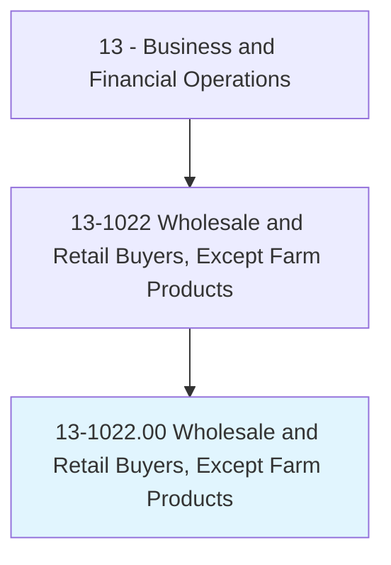
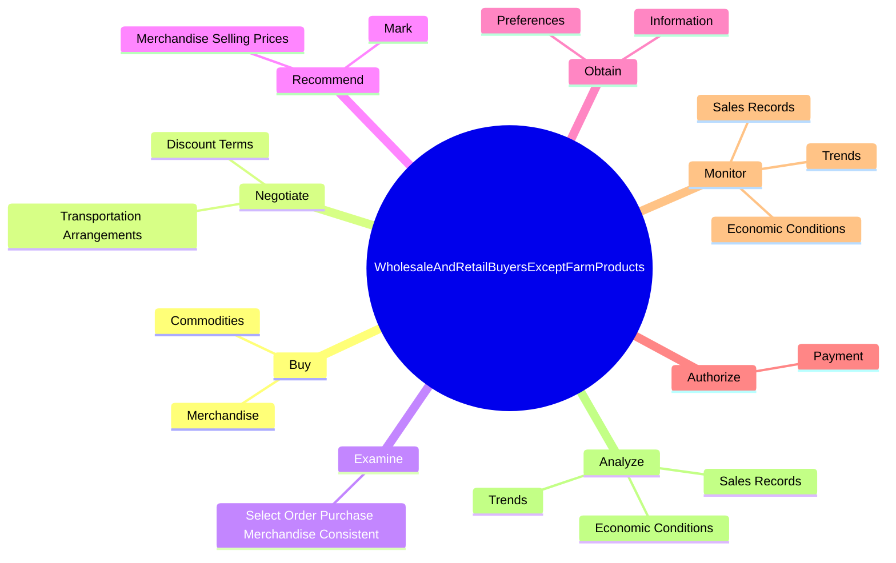
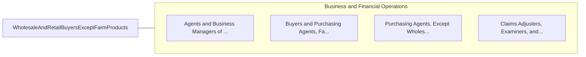

# Wholesale and Retail Buyers, Except Farm Products

> Buy merchandise or commodities, other than farm products, for resale to consumers at the wholesale or retail level, including both durable and nondurable goods. Analyze past buying trends, sales records, price, and quality of merchandise to determine value and yield. Select, order, and authorize payment for merchandise according to contractual agreements. May conduct meetings with sales personnel and introduce new products. May negotiate contracts. Includes assistant wholesale and retail buyers of nonfarm products.

## Overview

Wholesale and Retail Buyers, Except Farm Products is an occupation within the Business and Financial Operations category. Buy merchandise or commodities, other than farm products, for resale to consumers at the wholesale or retail level, including both durable and nondurable goods. Analyze past buying trends, sales records, price, and quality of merchandise to determine value and yield.

## Classification Hierarchy

## Key Statistics

| Metric | Value |
|--------|-------|
| SOC Code | 13-1022.00 |
| Category | [Business and Financial Operations](/occupations/Business/index) |
| Task Count | 69 |
| Source | O*NET |

## Core Tasks

### buy.Merchandise

Wholesale and Retail Buyers, Except Farm Products buy merchandise as part of their core responsibilities.

**Actions:**
- `buy.Merchandise.for.ResaleToWholesaleConsumers`
- `buy.Merchandise.for.RetailConsumers`
- `buy.Commodities.for.ResaleToWholesaleConsumers`
- `buy.Commodities.for.RetailConsumers`

### negotiate.DiscountTerms

Wholesale and Retail Buyers, Except Farm Products negotiate discount terms as part of their core responsibilities.

**Actions:**
- `negotiate.DiscountTerms.with.Suppliers`
- `negotiate.TransportationArrangements.with.Suppliers`

### examine.SelectOrderPurchaseMerchandiseConsistent

Wholesale and Retail Buyers, Except Farm Products examine select order purchase merchandise consistent as part of their core responsibilities.

**Actions:**
- `examine.SelectOrderPurchaseMerchandiseConsistent.with.QualityQuantitySpecificationRequirementsOtherFactorsSuchAsEnvironmentalSoundness`

## Skills & Competencies

### Technical Skills
- **Financial Analysis** - Advanced
- **Data Analysis** - Advanced
- **Regulatory Compliance** - Advanced

### Soft Skills
- **Communication** - Essential
- **Problem Solving** - Essential
- **Critical Thinking** - Important
- **Teamwork** - Important
- **Adaptability** - Important

## Related Occupations

## Industries

This occupation is found across multiple industries. See [Industries](/industries) for sector-specific employment data.

## Career Progression

---

*Source: O*NET 13-1022.00 - ONETOccupation*
