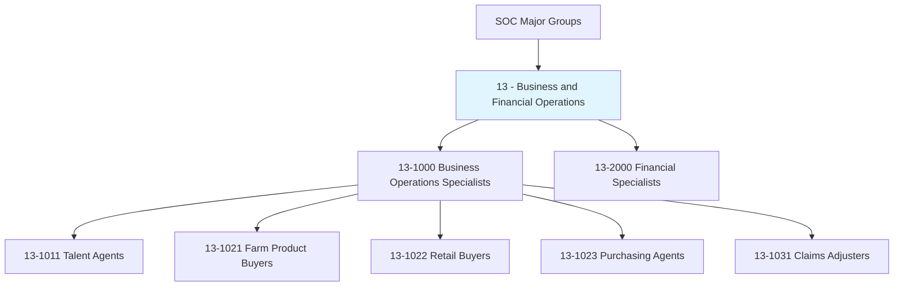
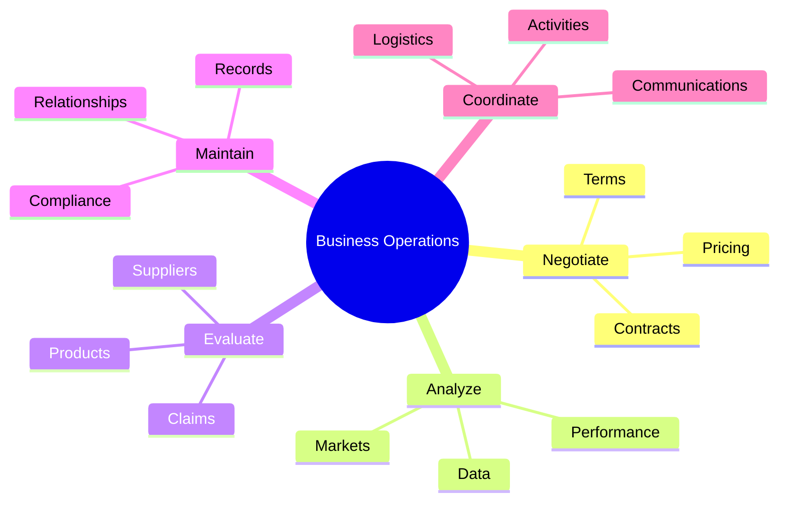
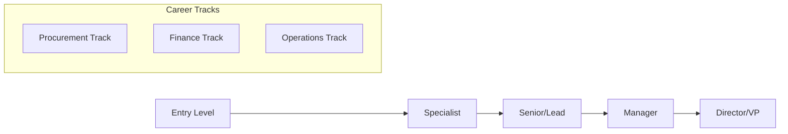

# Business and Financial Operations

> Category 13 occupations encompass a wide range of business operations specialists, buyers, purchasing agents, financial analysts, and related professionals who manage commercial activities across all industries.

## Overview

Business and Financial Operations occupations represent the backbone of commercial enterprise, providing essential services in procurement, financial analysis, risk management, talent representation, and operational support. These roles require strong analytical abilities, negotiation skills, and business acumen to drive organizational success. Professionals in this category work across virtually every industry sector, from manufacturing and retail to entertainment and insurance.

## Classification Hierarchy

## Key Statistics

| Metric | Value |
|--------|-------|
| SOC Category Code | 13 |
| Occupations Listed | 5 |
| Primary Industries | All sectors |
| Growth Outlook | Stable to Growing |

## Occupations in this Category

### Business Operations Specialists (13-1000)

| Occupation | Code | Description |
|------------|------|-------------|
| [Talent Agents](./TalentAgents.mdx) | 13-1011.00 | Represent and promote artists, performers, and athletes |
| [Farm Product Buyers](./FarmProductBuyers.mdx) | 13-1021.00 | Purchase farm products for processing or resale |
| [Retail Buyers](./RetailBuyers.mdx) | 13-1022.00 | Buy merchandise for wholesale or retail resale |
| [Purchasing Agents](./PurchasingAgents.mdx) | 13-1023.00 | Purchase machinery, equipment, and services |
| [Claims Adjusters](./ClaimsAdjusters.mdx) | 13-1031.00 | Review and settle insurance claims |

## Common Tasks Across Category

## Skills Profile

### Technical Skills
- **Contract Management** - Negotiating and administering agreements
- **Market Analysis** - Understanding market dynamics and trends
- **Financial Analysis** - Evaluating costs, prices, and values
- **Regulatory Compliance** - Ensuring adherence to laws and policies
- **Supply Chain Management** - Managing procurement and logistics

### Soft Skills
- **Negotiation** - Achieving favorable outcomes in discussions
- **Communication** - Clear written and verbal expression
- **Analytical Thinking** - Breaking down complex problems
- **Relationship Building** - Developing professional networks
- **Decision Making** - Making informed choices under pressure

## Industries

Business and Financial Operations professionals work across all sectors:

- [Manufacturing](/industries/Manufacturing/index) - Procurement and supply chain
- [Retail Trade](/industries/Retail/index) - Merchandising and buying
- [Insurance](/industries/Insurance/index) - Claims and risk management
- [Entertainment](/industries/Entertainment) - Talent representation
- [Agriculture](/industries/Manufacturing/MachineryManufacturing/Agriculture/index) - Commodity purchasing
- [Government](/industries/PublicAdministration) - Public sector procurement

## Career Pathways

## Related Categories

- [11 - Management](/occupations/Management/index) - Leadership roles overseeing business operations
- [41 - Sales and Related](/occupations/Sales/index) - Customer-facing commercial roles
- [43 - Office and Administrative Support](/occupations/Administrative/index) - Administrative support functions

---

*Source: Bureau of Labor Statistics Standard Occupational Classification*
