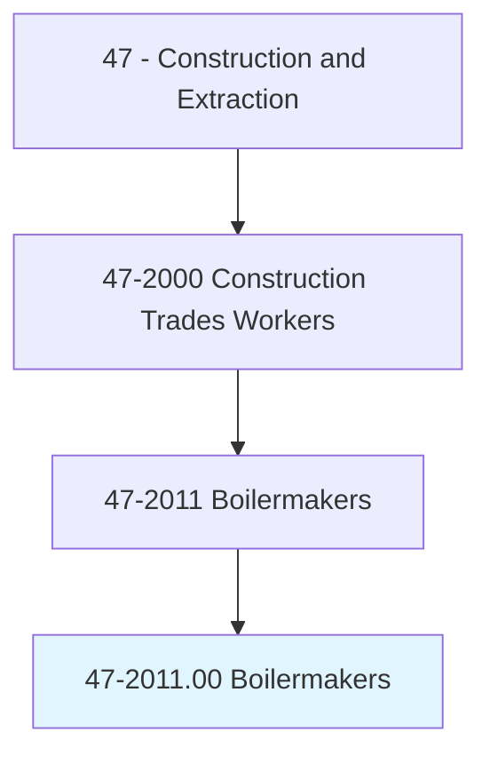
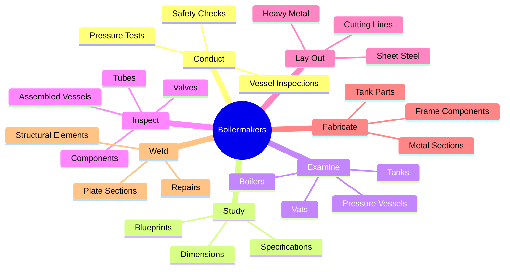
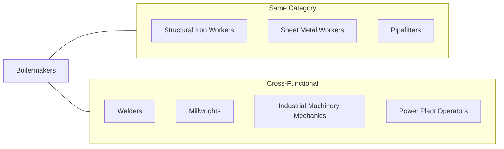
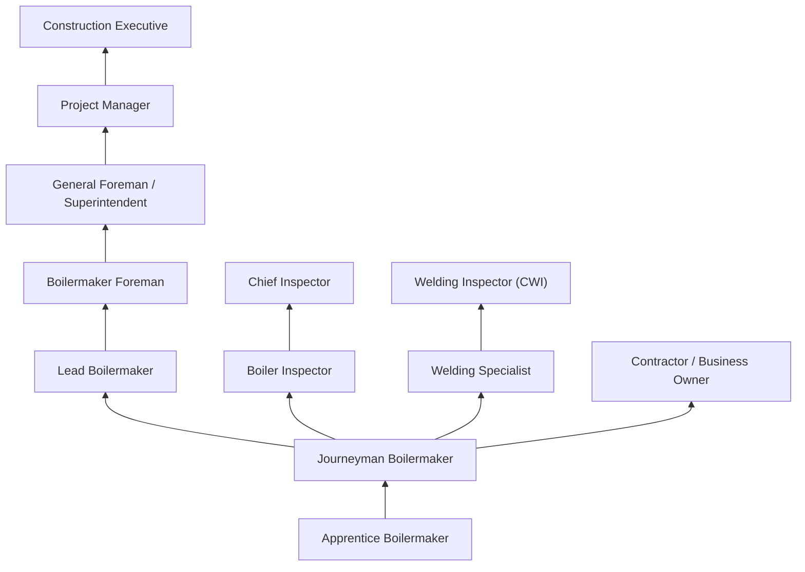

# Boilermakers

> Construct, assemble, maintain, and repair stationary steam boilers and boiler house auxiliaries. Align structures or plate sections to assemble boiler frame tanks or vats, following blueprints. Work involves use of hand and power tools, plumb bobs, levels, wedges, dogs, or turnbuckles. Assist in testing assembled vessels. Direct cleaning of boilers and auxiliary equipment.

## Overview

Boilermakers are highly skilled tradespeople who construct, install, maintain, and repair boilers, closed vats, and other large vessels that hold liquids and gases. These vessels are critical components in power plants, refineries, chemical facilities, and manufacturing operations. The work requires precision metalworking skills, the ability to read complex blueprints, and expertise in welding and fabrication. Boilermakers often work in challenging environments, including confined spaces and at heights, making safety awareness paramount in this occupation.

## Classification Hierarchy

## Key Statistics

| Metric | Value |
|--------|-------|
| SOC Code | 47-2011.00 |
| Job Zone | 3 (Medium Preparation) |
| Category | [Construction](/occupations/Construction/index) |
| Core Tasks | 12+ |
| Physical Demands | Heavy |
| Source | O*NET |

## Core Tasks

### conduct.PressureTests

Boilermakers perform pressure testing to verify vessel integrity and safety compliance.

**Actions:**
- `conduct.PressureTests.on.Vessels` - Test pressure vessel integrity before commissioning
- `conduct.PressureTests.on.Boilers` - Verify boiler safety through hydrostatic testing

### study.Blueprints

Boilermakers interpret technical drawings to understand construction requirements.

**Actions:**
- `study.Blueprints.to.determine.Locations` - Identify precise positioning for components
- `study.Blueprints.to.Relationships` - Understand how parts connect and interact
- `study.Blueprints.to.DimensionsOfParts` - Calculate accurate measurements for fabrication

### examine.Boilers

Boilermakers inspect vessels to identify defects requiring repair.

**Actions:**
- `examine.Boilers.to.locate.Defects` - Identify structural problems in boiler systems
- `examine.Boilers.to.Leaks` - Find sources of steam or water leaks
- `examine.Boilers.to.WeakSpots` - Detect areas of metal fatigue or corrosion
- `examine.Boilers.to.DefectiveSections` - Identify components needing replacement
- `examine.PressureVessels.to.locate.Defects` - Inspect high-pressure containers
- `examine.Tanks.to.locate.Defects` - Assess storage tank condition
- `examine.Vats.to.locate.Defects` - Inspect industrial processing vessels

### inspect.AssembledVessels

Boilermakers verify component quality during and after assembly.

**Actions:**
- `inspect.AssembledVesselsComponents.to.locate.Defects` - Check completed assemblies
- `inspect.IndividualComponents.to.locate.Defects` - Examine parts before installation
- `inspect.Tubes.to.locate.Defects` - Check boiler tubes for wear and damage
- `inspect.Fittings.to.locate.Defects` - Verify pipe and valve fittings
- `inspect.Valves.to.locate.Defects` - Test valve operation and seals
- `inspect.Controls.to.locate.Defects` - Check control mechanisms
- `inspect.AuxiliaryMechanisms.to.locate.Defects` - Inspect pumps and supporting equipment

### lay.SheetSteel

Boilermakers lay out and mark heavy metal for cutting and forming.

**Actions:**
- `lay.SheetSteel` - Position flat steel for marking
- `lay.OtherHeavyMetal` - Work with various metal alloys
- `lay.LocateBendingCuttingLines` - Mark precise locations for fabrication
- `lay.MarkBendingCuttingLines` - Create visual guides for cutting operations
- `lay.UsingProtractors` - Measure angles accurately
- `lay.Compasses` - Mark curves and circles
- `lay.DrawingInstruments` - Use specialized layout tools

### fabricate.MetalSections

Boilermakers shape and form metal components for vessel construction.

**Actions:**
- `fabricate.PlateSections.to.AssembleBoilerFrame` - Create structural elements
- `fabricate.TankComponents.following.Blueprints` - Build custom vessel parts
- `weld.StructuralSections.to.AssembleVessels` - Join metal sections permanently

## Skills & Competencies

### Technical Skills
- **Blueprint Reading** - Expert
- **Welding (Multiple Processes)** - Expert
- **Metal Fabrication** - Expert
- **Rigging and Hoisting** - Advanced
- **Pressure Testing** - Advanced
- **Mathematics (Geometry/Trigonometry)** - Advanced
- **Power Tool Operation** - Expert

### Soft Skills
- **Attention to Detail** - Critical
- **Physical Stamina** - Critical
- **Safety Awareness** - Critical
- **Problem Solving** - Essential
- **Teamwork** - Essential
- **Communication** - Important

## Related Occupations

## Industry Variations

### Power Generation
- Large-scale boiler installation and maintenance
- Nuclear and fossil fuel power plants
- Strict regulatory compliance (ASME codes)
- Scheduled outage work
- Extended travel requirements

### Petroleum Refining
- Process vessel fabrication and repair
- High-temperature, high-pressure applications
- Specialized alloy materials
- Turnaround maintenance work
- Hazardous environment protocols

### Chemical Manufacturing
- Reactor vessel construction
- Corrosion-resistant materials
- Clean room fabrication requirements
- Process safety management compliance
- Specialty welding certifications

### Shipbuilding
- Marine boiler systems
- Hull and superstructure work
- Navy and commercial vessels
- Dry dock operations
- Coastal work locations

### Commercial Construction
- HVAC boiler installation
- Building heating systems
- New construction and renovations
- Urban work environments
- Faster project timelines

## Industries

- [Electric Power Generation](/industries/ElectricPower) - High Employment
- [Petroleum Refining](/industries/PetroleumRefining) - High Employment
- [Chemical Manufacturing](/industries/Manufacturing/ChemicalManufacturing/index) - Moderate Employment
- [Specialty Trade Contractors](/industries/SpecialtyTrade) - Moderate Employment
- [Shipbuilding](/industries/Shipbuilding) - Moderate Employment

## Career Progression

## Education & Training

| Requirement | Details |
|-------------|---------|
| Typical Education | High school diploma or equivalent |
| Apprenticeship | 4-year apprenticeship program (minimum 8,000 hours) |
| On-the-Job Training | Continuous skills development throughout career |
| Certifications | ASME welding certifications, NCCER credentials |

## Certifications

- **ASME Welding Certifications** - Multiple process certifications
- **NCCER Boilermaker** - Industry-recognized credential
- **AWS Certified Welder** - American Welding Society certifications
- **OSHA 30-Hour Construction** - Safety certification
- **Rigging and Signal Person** - Material handling credentials
- **Confined Space Entry** - Safety certification
- **TWIC (Transportation Worker ID)** - Required for port/refinery access

## Work Environment

### Physical Demands
- Heavy lifting (up to 100+ pounds)
- Working at heights on scaffolding and platforms
- Confined space work inside vessels
- Exposure to extreme temperatures
- Prolonged standing, kneeling, and bending

### Safety Considerations
- Fall protection requirements
- Respiratory protection for welding fumes
- Heat stress management
- Noise exposure controls
- Lockout/tagout procedures

### Travel Requirements
- Many positions require extensive travel
- Project-based work across regions
- Extended stays at industrial sites
- Local work available in some markets

## Departments

This occupation typically works in:
- [Field Operations](/departments/FieldOperations)
- [Maintenance](/departments/Maintenance)
- [Fabrication Shop](/departments/Fabrication)
- [Quality Control](/departments/QualityControl)

## Union Affiliation

Many boilermakers are members of the International Brotherhood of Boilermakers (IBB), which provides:
- Apprenticeship training programs
- Job referral services
- Health and retirement benefits
- Continuing education opportunities
- Safety training programs

---

*Source: O*NET 47-2011.00 - ONETOccupation*
