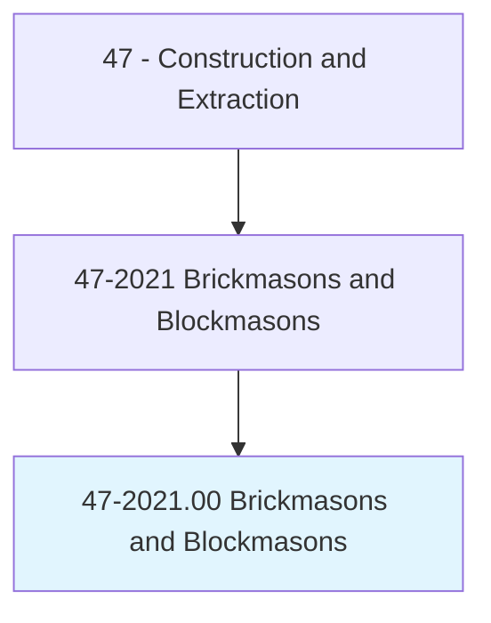
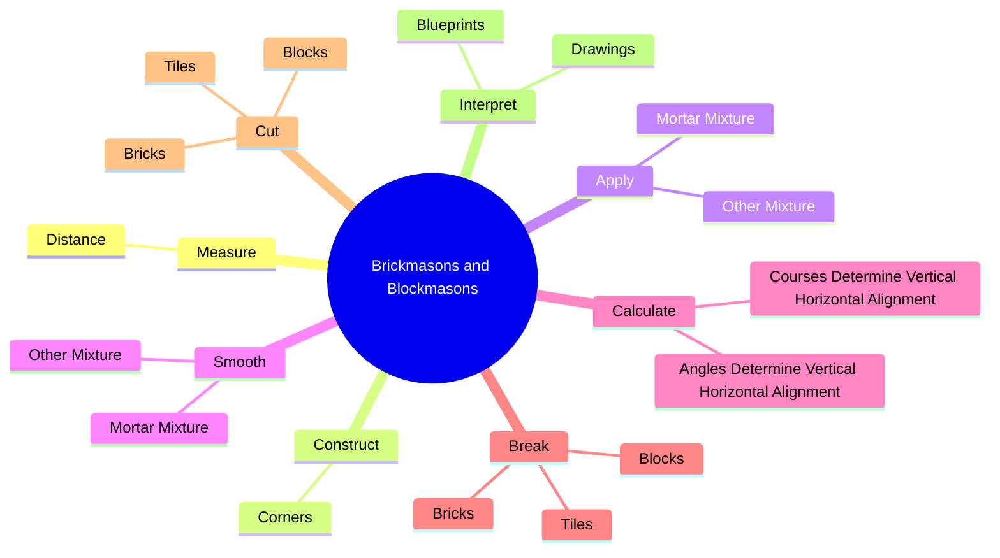
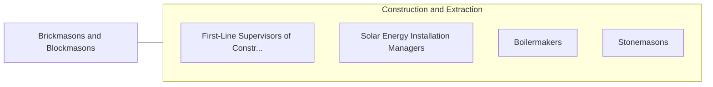

# Brickmasons and Blockmasons

> Lay and bind building materials, such as brick, structural tile, concrete block, cinder block, glass block, and terra-cotta block, with mortar and other substances, to construct or repair walls, partitions, arches, sewers, and other structures.

## Overview

Brickmasons and Blockmasons is classified under Construction and Extraction (SOC 47). Lay and bind building materials, such as brick, structural tile, concrete block, cinder block, glass block, and terra-cotta block, with mortar and other substances, to construct or repair walls, partitions, arches, sewers, and other structures.

## Classification Hierarchy

## Key Statistics

| Metric | Value |
|--------|-------|
| SOC Code | 47-2021.00 |
| Category | [Construction and Extraction](/occupations/Construction) |
| Task Count | 117 |
| Source | O*NET |

## Core Tasks

### measure.Distance

Brickmasons and Blockmasons measure distance as part of their core responsibilities.

**Actions:**
- `measure.Distance.from.ReferencePoints`
- `measure.Distance.from.MarkGuidelines.to.lay.OutWork`
- `measure.Distance.from.UsingPlumbBobs`
- `measure.Distance.from.Levels`

### construct.Corners

Brickmasons and Blockmasons construct corners as part of their core responsibilities.

**Actions:**
- `construct.Corners.by.Fastening.in.PlumbPositionCornerPole`
- `construct.Corners.by.BuildingCornerPyramid.of.Bricks`
- `construct.Corners.by.FillingInBetweenCornersUsingLineFromCornerToCornerToGuideCourse`
- `construct.Corners.by.Layer`

### apply.MortarMixture

Brickmasons and Blockmasons apply mortar mixture as part of their core responsibilities.

**Actions:**
- `apply.MortarMixture.over.WorkSurface`
- `apply.OtherMixture.over.WorkSurface`

## Skills & Competencies

### Technical Skills
- **Construction Methods** - Advanced
- **Blueprint Reading** - Advanced
- **Safety Compliance** - Advanced

### Soft Skills
- **Communication** - Essential
- **Problem Solving** - Essential
- **Critical Thinking** - Important
- **Teamwork** - Important
- **Adaptability** - Important

## Related Occupations

## Industries

This occupation is found across multiple industries. See [Industries](/industries) for sector-specific employment data.

## Career Progression

---

*Source: O*NET 47-2021.00 - ONETOccupation*
