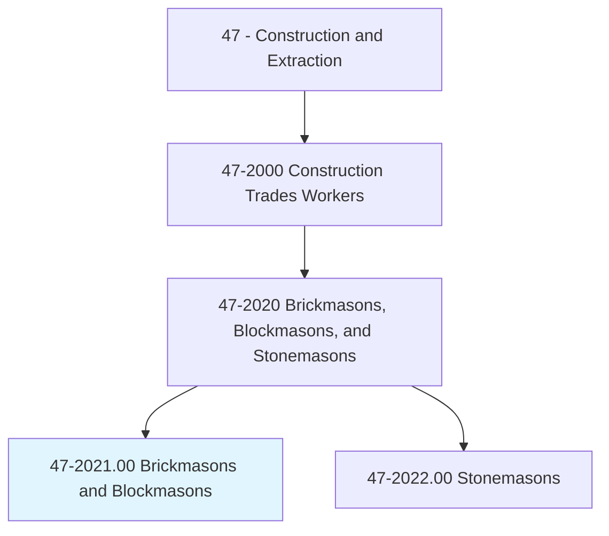
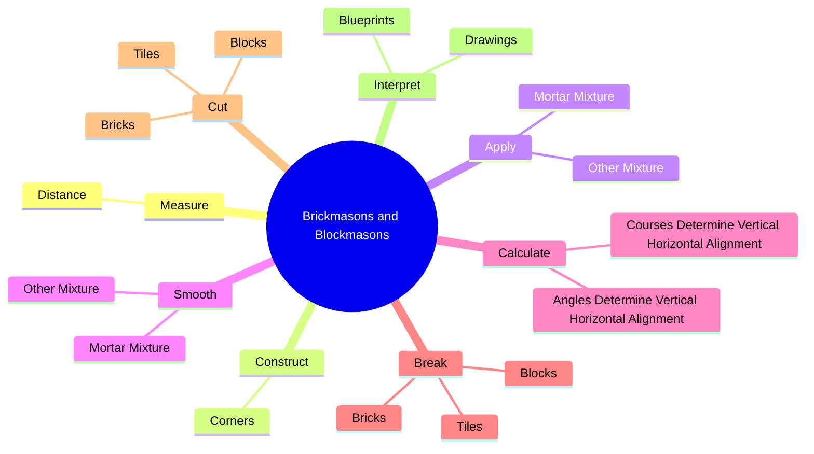
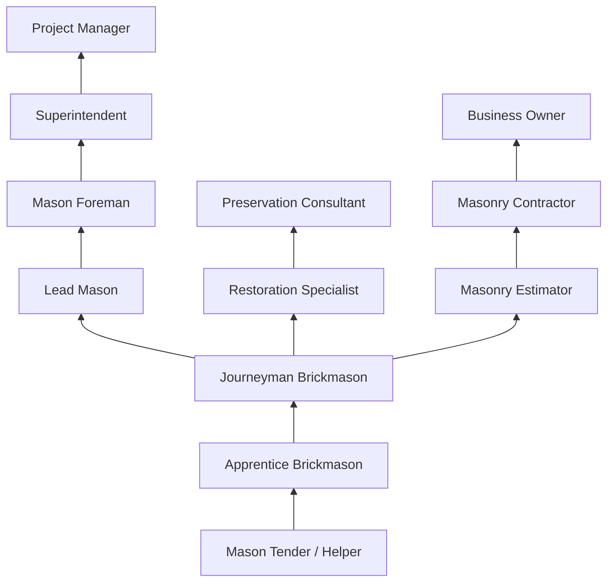
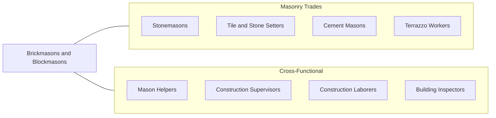

# Brickmasons and Blockmasons

> Lay and bind building materials, such as brick, structural tile, concrete block, cinder block, glass block, and terra-cotta block, with mortar and other substances, to construct or repair walls, partitions, arches, sewers, and other structures.

## Overview

Brickmasons and Blockmasons are skilled construction trade workers who build and repair walls, floors, partitions, fireplaces, chimneys, and other structures using brick, concrete block, and similar masonry materials. This trade combines physical endurance with precision craftsmanship, as masons must ensure that each course of brick or block is level, plumb, and properly bonded. The work forms the structural backbone and aesthetic facade of countless residential, commercial, and industrial buildings.

The trade has a long and storied history, with bricklaying techniques evolving over centuries while the fundamental principles of mortar bonding and pattern laying remain unchanged. Modern brickmasons work with a wider variety of materials than ever before, including traditional clay brick, concrete masonry units (CMU), glass block, and engineered stone veneer. They must understand structural load requirements, thermal expansion properties, moisture management, and seismic design considerations.

Brickmasons typically work outdoors on construction sites in all weather conditions, though some specialize in interior work such as fireplaces and decorative walls. The work is physically demanding, requiring lifting of heavy materials, prolonged standing, bending, and kneeling. Despite advances in construction technology, bricklaying remains a highly manual trade that relies on individual skill and experience.

## Classification Hierarchy

## Key Statistics

| Metric | Value |
|--------|-------|
| SOC Code | 47-2021.00 |
| Job Zone | 3 (Medium Preparation) |
| Category | [Construction and Extraction](/occupations/Construction/index) |
| Task Count | 117 |
| Median Salary | $53,100 / year |
| Employment | ~60,000 |
| Job Outlook | 3% (Slower than average) |
| Physical Demands | Heavy |
| Source | O*NET |

## Core Tasks

### measure.Distance

Brickmasons and Blockmasons measure distance to establish reference points and guide layout for walls and structures.

**Actions:**
- `measure.Distance.from.ReferencePoints`
- `measure.Distance.from.MarkGuidelines.to.lay.OutWork`
- `measure.Distance.from.UsingPlumbBobs`
- `measure.Distance.from.Levels`

### construct.Corners

Brickmasons and Blockmasons construct corners, which serve as the critical reference points for entire wall sections.

**Actions:**
- `construct.Corners.by.Fastening.in.PlumbPositionCornerPole`
- `construct.Corners.by.BuildingCornerPyramid.of.Bricks`
- `construct.Corners.by.FillingInBetweenCornersUsingLineFromCornerToCornerToGuideCourse`
- `construct.Corners.by.Layer`

### apply.MortarMixture

Brickmasons and Blockmasons apply mortar and binding mixtures to create structural bonds between masonry units.

**Actions:**
- `apply.MortarMixture.over.WorkSurface`
- `apply.OtherMixture.over.WorkSurface`

## Skills & Competencies

### Technical Skills
- **Masonry Construction Methods** - Expert
- **Mortar Mixing and Application** - Expert
- **Blueprint Reading** - Advanced
- **Layout and Measurement** - Expert
- **Mathematics (Geometry, Fractions)** - Advanced
- **Structural Load Understanding** - Intermediate
- **Hand and Power Tool Operation** - Expert
- **Scaffold Erection and Use** - Advanced

### Trade-Specific Skills
- **Bond Patterns** - Running bond, Flemish bond, English bond, stack bond
- **Moisture Management** - Weep holes, flashing, vapor barriers
- **Reinforcement** - Rebar placement, grout filling for CMU walls
- **Veneer Installation** - Thin brick, stone veneer, anchoring systems
- **Repointing and Restoration** - Matching mortar, tuckpointing techniques

### Soft Skills
- **Attention to Detail** - Critical
- **Physical Stamina** - Critical
- **Hand-Eye Coordination** - Critical
- **Problem Solving** - Essential
- **Communication** - Essential
- **Teamwork** - Essential

## Education & Certifications

| Requirement | Details |
|-------------|---------|
| Typical Education | High school diploma or equivalent |
| Apprenticeship | 3-4 year registered apprenticeship (BAC/IMI) |
| On-the-Job Training | 4,000-6,000 hours |
| Classroom Training | 144+ hours/year during apprenticeship |

### Certifications
- **NCCER Masonry** - Industry-recognized credential (Levels 1-3)
- **OSHA 10-Hour Construction** - Required safety certification
- **OSHA 30-Hour Construction** - Supervisory safety certification
- **Scaffold User Certification** - Required for elevated work
- **Forklift/Telehandler Certification** - Material handling
- **MCAA Certification** - Mason Contractors Association of America

## Career Progression

## Specializations

### Residential Masonry
- Fireplaces and chimneys
- Brick veneer exteriors
- Foundation walls
- Retaining walls
- Patios and walkways

### Commercial Masonry
- Load-bearing CMU walls
- Curtain wall backup
- Elevator and stairwell shafts
- Multi-story brick facades
- Parking structures

### Industrial Masonry
- Refractory brick for kilns and furnaces
- Acid-resistant brick for chemical plants
- Fire-rated enclosures
- Smoke stacks and flues
- Tunnel linings

### Restoration and Preservation
- Historic building restoration
- Tuckpointing and repointing
- Period-appropriate materials and methods
- Matching existing brick and mortar
- Landmark compliance

## Tools & Equipment

### Hand Tools
- Trowels (brick, pointing, margin)
- Jointers (concave, V-shaped, grapevine)
- Brick hammers and chisels
- Levels (2-foot, 4-foot, torpedo)
- Plumb bobs and line blocks
- Mason's string line
- Story poles

### Power Tools
- Masonry saws (wet cut)
- Angle grinders with diamond blades
- Mortar mixers
- Hammer drills
- Pneumatic grout pumps
- Laser levels

### Equipment
- Scaffolding systems
- Baker scaffolds (rolling)
- Forklifts and telehandlers
- Mortar boards and mud pans

## Safety Considerations

- **Silica Dust Exposure** - Respiratory protection required when cutting; OSHA silica standard compliance
- **Heavy Lifting** - Proper lifting techniques; mechanical aids for heavy units
- **Scaffold Safety** - Fall protection, proper erection, daily inspections
- **Eye Protection** - Required when cutting, chipping, or mixing
- **Hand and Arm Injuries** - Gloves for mortar handling; repetitive motion awareness
- **Heat Illness** - Hydration and rest breaks during hot weather outdoor work
- **Falling Objects** - Hard hats required; toe boards on scaffolds

## Related Occupations

## Industries

- Residential Building Construction - High Employment
- Commercial Building Construction - High Employment
- Masonry Contractors - Primary Employment
- [Government / Public Works](/industries/PublicAdministration) - Moderate Employment
- Historical Preservation - Specialty Employment

## Departments

This occupation typically works in:
- Field Operations
- Masonry Division
- Restoration Division
- Estimating

---

*Source: O*NET 47-2021.00 - ONETOccupation*
