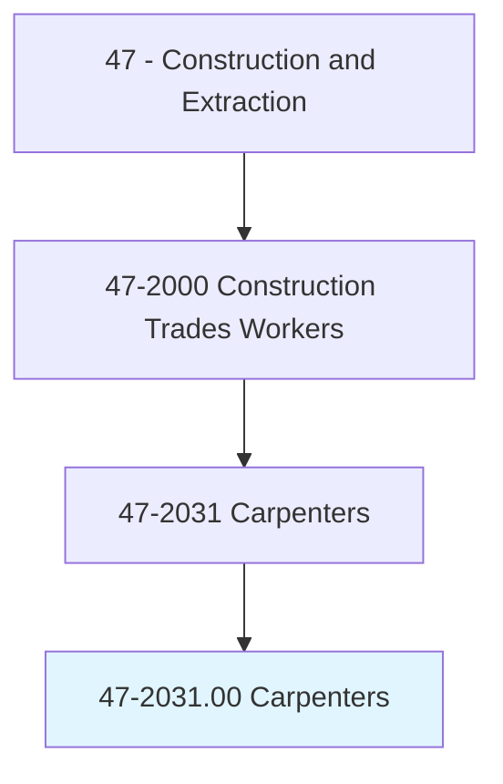
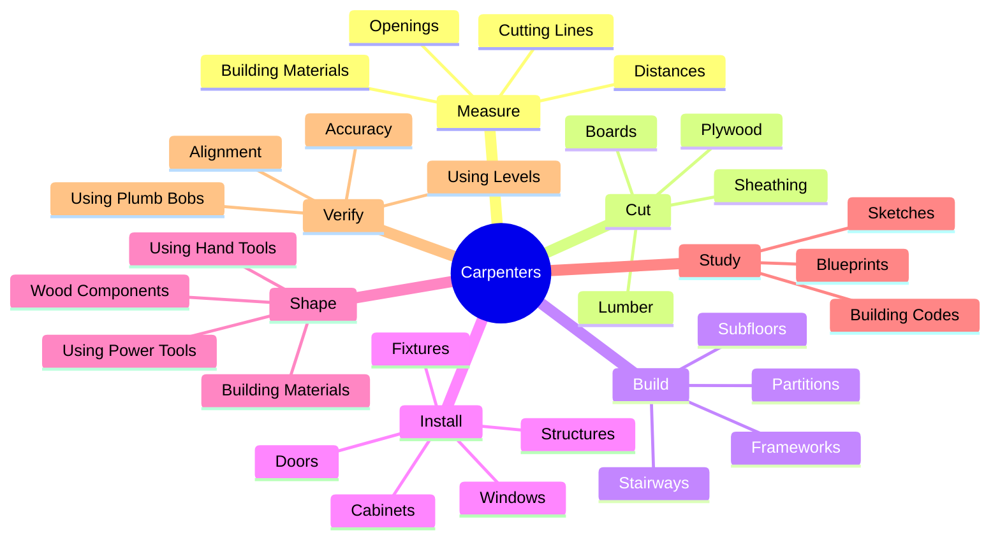
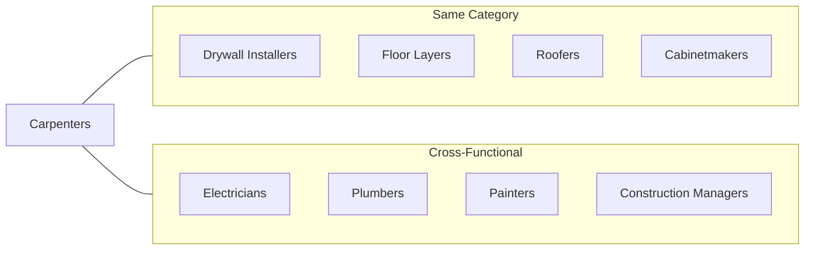
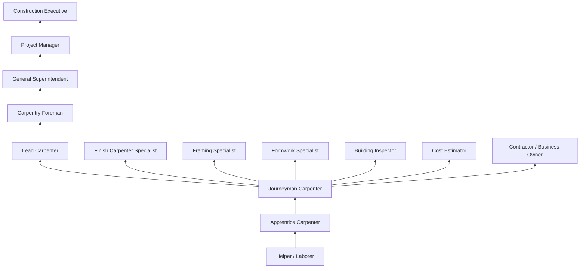

# Carpenters

> Construct, erect, install, or repair structures and fixtures made of wood and comparable materials, such as concrete forms; building frameworks, including partitions, joists, studding, and rafters; and wood stairways, window and door frames, and hardwood floors. May also install cabinets, siding, drywall, and batt or roll insulation. Includes brattice builders who build doors or brattices (ventilation walls or partitions) in underground passageways.

## Overview

Carpenters are skilled tradespeople who work with wood and other materials to construct, install, and repair building frameworks and structures. This versatile occupation encompasses everything from rough framing of new buildings to fine finish work on custom cabinetry. Carpenters must combine physical dexterity with mathematical precision, reading blueprints and specifications to create structures that are both functional and aesthetically pleasing. The trade offers multiple specialization paths and is foundational to virtually all construction projects.

## Classification Hierarchy

## Key Statistics

| Metric | Value |
|--------|-------|
| SOC Code | 47-2031.00 |
| Job Zone | 3 (Medium Preparation) |
| Category | [Construction](/occupations/Construction) |
| Core Tasks | 15+ |
| Physical Demands | Heavy |
| Source | O*NET |

## Core Tasks

### measure.BuildingMaterials

Carpenters calculate and mark dimensions for precise cutting and fitting of materials.

**Actions:**
- `measure.BuildingMaterials.using.Rules` - Use tape measures and rulers for dimensions
- `measure.CuttingLines.on.Lumber` - Mark where to make cuts on wood
- `calculate.Openings.for.Windows` - Determine dimensions for window frames
- `calculate.Openings.for.Doors` - Size openings for door installations

### cut.Lumber

Carpenters shape raw materials to required dimensions using various tools.

**Actions:**
- `cut.Lumber.using.Saws` - Shape framing materials with circular and miter saws
- `cut.Boards.using.Saws` - Trim finish lumber to size
- `cut.Plywood.using.Saws` - Cut sheet goods for sheathing and subflooring
- `cut.Sheathing.using.Saws` - Size panels for wall and roof covering

### build.Frameworks

Carpenters construct the structural skeleton of buildings and structures.

**Actions:**
- `build.Frameworks.including.Partitions` - Frame interior walls
- `build.Frameworks.including.Joists` - Install floor and ceiling supports
- `build.Frameworks.including.Studding` - Erect wall framing
- `build.Frameworks.including.Rafters` - Construct roof framing
- `erect.Subfloors.for.Buildings` - Install subflooring systems

### install.Structures

Carpenters place and secure building components in their final positions.

**Actions:**
- `install.Structures.to.Form.Buildings` - Assemble building components
- `install.Fixtures.made.of.Wood` - Mount wooden components
- `install.WindowFrames.in.Openings` - Set windows in place
- `install.DoorFrames.in.Openings` - Position and secure doors
- `install.Cabinets.in.Buildings` - Mount kitchen and bath cabinetry
- `install.Siding.on.Buildings` - Apply exterior finish materials
- `install.Drywall.on.Walls` - Hang wallboard panels
- `install.Insulation.in.Walls` - Place batt or roll insulation

### shape.Materials

Carpenters form materials using hand and power tools.

**Actions:**
- `shape.Materials.using.HandTools` - Use chisels, planes, and files
- `shape.Materials.using.PowerTools` - Operate routers, planers, and joiners
- `fit.Components.using.Chisels` - Fine-tune joints and connections

### study.Blueprints

Carpenters interpret technical drawings to understand construction requirements.

**Actions:**
- `study.Blueprints.to.determine.Dimensions` - Extract measurements from plans
- `study.Sketches.to.determine.Specifications` - Understand design intent
- `follow.BuildingCodes.for.Construction` - Ensure code compliance

## Specializations

### Rough Carpentry
- Building frameworks and structural components
- Concrete formwork construction
- Roof framing and trusses
- Heavy timber construction
- Commercial and residential framing

### Finish Carpentry
- Trim and molding installation
- Door and window casing
- Custom cabinetry installation
- Staircase construction
- Built-in furniture

### Formwork Carpentry
- Concrete form construction
- Foundation wall forms
- Column and beam forms
- Bridge and infrastructure forms
- Form stripping and rebuilding

### Restoration Carpentry
- Historic building restoration
- Period-authentic techniques
- Matching existing millwork
- Structural rehabilitation

## Skills & Competencies

### Technical Skills
- **Blueprint Reading** - Expert
- **Mathematics (Geometry)** - Expert
- **Power Tool Operation** - Expert
- **Hand Tool Proficiency** - Expert
- **Building Codes** - Advanced
- **Material Estimation** - Advanced
- **Layout and Measurement** - Expert

### Soft Skills
- **Attention to Detail** - Critical
- **Physical Stamina** - Critical
- **Problem Solving** - Essential
- **Manual Dexterity** - Critical
- **Spatial Reasoning** - Essential
- **Communication** - Important

## Related Occupations

## Industries

- [Residential Construction](/industries/ResidentialConstruction) - High Employment
- [Commercial Construction](/industries/CommercialConstruction) - High Employment
- [Specialty Trade Contractors](/industries/SpecialtyTrade) - High Employment
- [Self-Employed](/industries/SelfEmployed) - High Employment
- [Government](/industries/Government) - Moderate Employment
- [Manufacturing](/industries/Manufacturing) - Moderate Employment

## Career Progression

## Apprenticeship Path

| Year | Focus Areas | Hours |
|------|-------------|-------|
| Year 1 | Safety, hand tools, basic layout, framing fundamentals | 2,000 OJT + 144 classroom |
| Year 2 | Floor systems, wall framing, roof framing | 2,000 OJT + 144 classroom |
| Year 3 | Exterior finish, doors, windows, stairs | 2,000 OJT + 144 classroom |
| Year 4 | Interior finish, cabinets, advanced techniques | 2,000 OJT + 144 classroom |

**Total Program**: 4 years (8,000 hours on-the-job training + 576 hours classroom instruction)

## Education & Training

| Requirement | Details |
|-------------|---------|
| Typical Education | High school diploma or equivalent |
| Apprenticeship | 3-4 year program (minimum 6,000-8,000 hours) |
| On-the-Job Training | Continuous skills development |
| Certifications | OSHA safety, NCCER, trade-specific credentials |

## Certifications

- **NCCER Carpentry** - Industry-recognized craft certification
- **OSHA 10-Hour Construction** - Basic safety certification
- **OSHA 30-Hour Construction** - Comprehensive safety certification
- **EPA Lead-Safe Certified Renovator** - Required for work on pre-1978 homes
- **Scaffolding Competent Person** - For elevated work
- **First Aid/CPR** - Emergency response certification
- **Forklift Operator** - Material handling certification

## Safety Requirements

### Personal Protective Equipment
- Safety glasses or goggles
- Hard hat
- Steel-toed boots
- Hearing protection
- Work gloves
- High-visibility clothing

### Common Hazards
- Fall hazards from heights and scaffolding
- Struck-by hazards from falling materials
- Cut hazards from power and hand tools
- Noise exposure from power tools
- Dust and particulate exposure
- Musculoskeletal injuries from repetitive motions

### Required Training
- Fall protection and ladder safety
- Power tool safety
- Scaffold erection and use
- Hazard communication
- Silica dust awareness
- Lock-out/tag-out procedures

## Tools & Equipment

### Hand Tools
- Framing hammer
- Tape measures
- Framing square
- Speed square
- Chalk line
- Levels (2-foot, 4-foot, laser)
- Utility knife
- Pry bars
- Chisels
- Hand planes

### Power Tools
- Circular saw
- Miter saw / Chop saw
- Reciprocating saw
- Jigsaw
- Table saw (job site)
- Drill / Impact driver
- Nail gun (framing, finish, brad)
- Planer
- Router
- Sanders

## Work Environment

### Physical Demands
- Standing, walking, climbing for extended periods
- Lifting materials up to 100+ pounds
- Working in cramped spaces or at heights
- Outdoor work in varying weather conditions
- Repetitive motions (hammering, sawing)

### Work Schedule
- Typically 40+ hours per week
- Early start times common
- Seasonal fluctuations in work availability
- Project deadlines may require overtime
- Travel between job sites

## Departments

This occupation typically works in:
- [Field Operations](/departments/FieldOperations)
- [Residential Division](/departments/ResidentialDivision)
- [Commercial Division](/departments/CommercialDivision)
- [Fabrication Shop](/departments/Fabrication)

## Union Affiliation

Many carpenters are members of the United Brotherhood of Carpenters and Joiners of America (UBC), which provides:
- Apprenticeship training programs
- Job referral services through hiring halls
- Health and pension benefits
- Continuing education opportunities
- Jurisdictional representation
- Safety training programs

---

*Source: O*NET 47-2031.00 - ONETOccupation*
