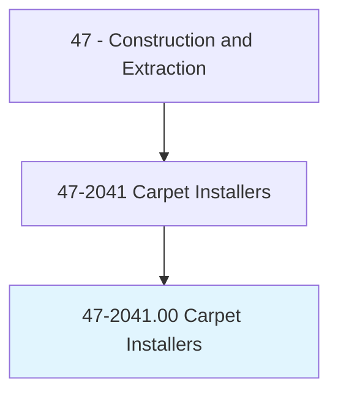
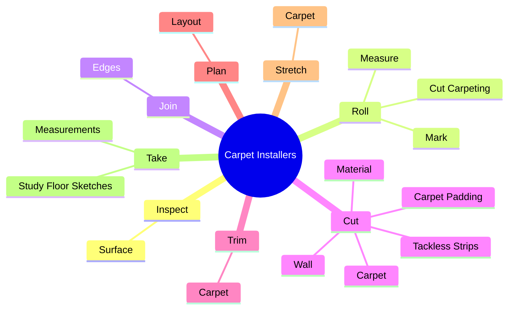
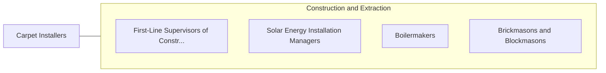

# Carpet Installers

> Lay and install carpet from rolls or blocks on floors. Install padding and trim flooring materials.

## Overview

Carpet Installers is an occupation within the Construction and Extraction category. Lay and install carpet from rolls or blocks on floors. 

## Classification Hierarchy

## Key Statistics

| Metric | Value |
|--------|-------|
| SOC Code | 47-2041.00 |
| Category | [Construction and Extraction](/occupations/Construction) |
| Task Count | 69 |
| Source | O*NET |

## Core Tasks

### inspect.Surface

Carpet Installers inspect surface as part of their core responsibilities.

**Actions:**
- `inspect.Surface.to.BeCoveredToDetermineCondition`
- `inspect.Surface.to.CorrectImperfectionsMightShowThroughCarpet`
- `inspect.Surface.to.CauseCarpetToWearUnevenly`

### roll.Measure

Carpet Installers roll measure as part of their core responsibilities.

**Actions:**
- `roll.Measure.to.size.WithCarpetKnife`
- `roll.Measure.to.FollowingFlo`
- `roll.Measure.to.sketches.ExtraCarpetForFinalFitting`
- `roll.Measure.to.AllowingExtraCarpetForFinalFitting`

### join.Edges

Carpet Installers join edges as part of their core responsibilities.

**Actions:**
- `join.Edges.of.CarpetEdgesWhereNecessary`
- `join.Edges.of.SeamEdgesWhereNecessary`
- `join.Edges.of.BySewing`
- `join.Edges.of.ByUsingTapeWithGlue`

## Skills & Competencies

### Technical Skills
- **Construction Methods** - Advanced
- **Blueprint Reading** - Advanced
- **Safety Compliance** - Advanced

### Soft Skills
- **Communication** - Essential
- **Problem Solving** - Essential
- **Critical Thinking** - Important
- **Teamwork** - Important
- **Adaptability** - Important

## Related Occupations

## Industries

This occupation is found across multiple industries. See [Industries](/industries) for sector-specific employment data.

## Career Progression

---

*Source: O*NET 47-2041.00 - ONETOccupation*
