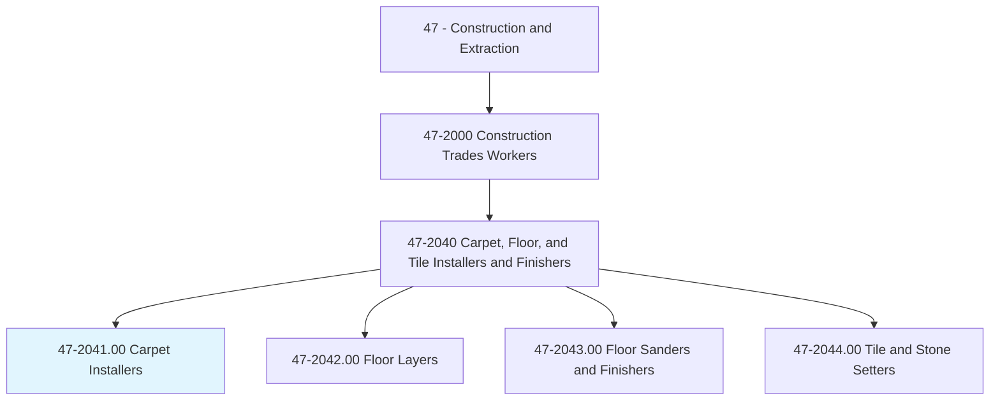
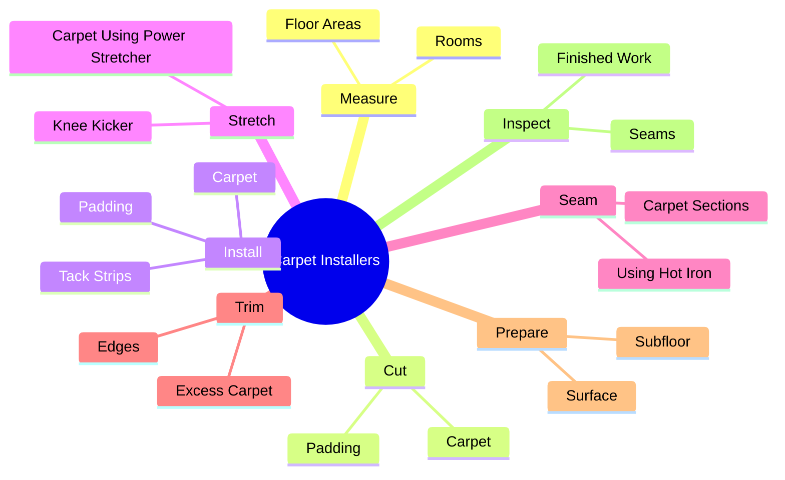
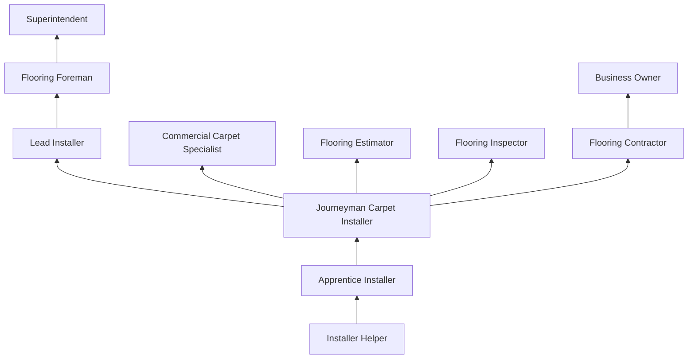
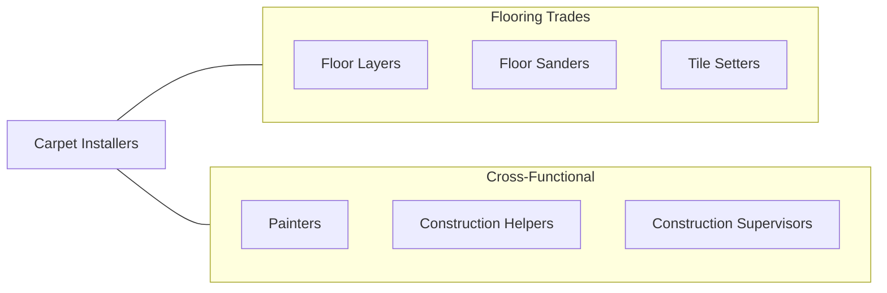

# Carpet Installers

> Lay and install carpet from rolls or blocks on floors. Install padding and trim flooring materials.

## Overview

Carpet Installers are skilled flooring trade workers who measure, cut, and install carpet and padding in residential, commercial, and institutional settings. The trade requires precise measurement skills, knowledge of subfloor preparation, and the physical ability to work on hands and knees for extended periods. Installers must understand different carpet types, backing systems, seaming techniques, and adhesive methods to deliver durable, aesthetically pleasing floor coverings.

Modern carpet installation encompasses a wide range of materials beyond traditional broadloom carpet, including modular carpet tiles, carpet planks, and specialty flooring for healthcare and hospitality environments. Each product type requires specific installation techniques and substrates. Installers must also be skilled in floor preparation, including moisture testing, leveling, and removing old flooring materials.

The trade has evolved significantly with the introduction of modular carpet tile systems, which now dominate commercial installations. However, residential broadloom installation continues to require traditional stretching and seaming skills that take years to master. Quality installation directly affects carpet appearance, wear life, and warranty coverage.

## Classification Hierarchy

## Key Statistics

| Metric | Value |
|--------|-------|
| SOC Code | 47-2041.00 |
| Job Zone | 2 (Some Preparation) |
| Category | [Construction and Extraction](/occupations/Construction/index) |
| Task Count | 85 |
| Median Salary | $44,800 / year |
| Employment | ~28,000 |
| Job Outlook | -1% (Decline) |
| Physical Demands | Heavy |
| Source | O*NET |

## Core Tasks

### measure.FloorAreas

Carpet Installers measure floor areas to calculate material requirements and plan seam placement.

**Actions:**
- `measure.FloorAreas.to.determine.MaterialQuantities`
- `measure.Rooms.to.plan.SeamLocations`
- `measure.Rooms.to.create.CuttingDiagrams`

### cut.Carpet

Carpet Installers cut carpet and padding to fit room dimensions and navigate obstacles.

**Actions:**
- `cut.Carpet.to.fit.RoomDimensions`
- `cut.Padding.to.fit.FloorArea`
- `cut.Carpet.around.Obstacles`

### stretch.Carpet

Carpet Installers stretch carpet using power stretchers to ensure taut, wrinkle-free installations.

**Actions:**
- `stretch.Carpet.using.PowerStretcher`
- `stretch.Carpet.using.KneeKicker`
- `stretch.Carpet.over.Padding.to.TackStrips`

## Skills & Competencies

### Technical Skills
- **Carpet Measurement and Layout** - Expert
- **Seaming Techniques** - Expert
- **Power Stretching** - Expert
- **Subfloor Preparation** - Advanced
- **Adhesive Application** - Advanced
- **Moisture Testing** - Intermediate
- **Pattern Matching** - Advanced
- **Stair Installation** - Advanced

### Trade-Specific Skills
- **Broadloom Installation** - Stretch-in and direct glue methods
- **Carpet Tile Installation** - Monolithic, quarter-turn, ashlar patterns
- **Seam Sealing** - Hot-melt and cold-seam techniques
- **Transition Strips** - Metal, wood, and rubber transitions
- **Restretching** - Repair of buckled or loose carpet

### Soft Skills
- **Attention to Detail** - Critical
- **Physical Stamina** - Critical
- **Customer Service** - Essential (residential work)
- **Problem Solving** - Essential
- **Time Management** - Important

## Education & Certifications

| Requirement | Details |
|-------------|---------|
| Typical Education | High school diploma or equivalent |
| Apprenticeship | 2-4 year apprenticeship available |
| On-the-Job Training | 2,000-4,000 hours |
| Manufacturer Training | Product-specific certification |

### Certifications
- **CFI Certified Installer** - Certified Flooring Installers Association
- **OSHA 10-Hour Construction** - Safety certification
- **INSTALL Flooring Certification** - Union-affiliated certification program
- **Manufacturer Certifications** - Shaw, Mohawk, Interface product training
- **CRI Seal of Approval** - Carpet and Rug Institute standards knowledge

## Career Progression

## Specializations

### Residential Installation
- Broadloom carpet stretch-in
- Stair carpet installation
- Custom area rug binding
- Pad selection and installation

### Commercial Installation
- Carpet tile systems (raised access floors)
- Large-scale broadloom direct glue
- Healthcare and hospitality flooring
- High-traffic specifications

### Specialty Applications
- Anti-static carpet for data centers
- Marine and aviation carpet
- Outdoor carpet and turf

## Tools & Equipment

### Hand Tools
- Carpet knives and blades
- Knee kickers
- Seam rollers
- Edge trimmers
- Row finders and seam cutters
- Stair tools and tucking tools
- Chalk lines and tape measures

### Power Tools
- Power stretchers (tube stretcher systems)
- Hot-melt seam irons
- Carpet trimmers
- Floor scrapers
- Moisture meters

### Equipment
- Carpet dollies and carts
- Heat welding guns
- Adhesive trowels (various notch sizes)
- Subfloor preparation tools

## Safety Considerations

- **Knee Injuries** - Prolonged kneeling; knee pads required; long-term knee damage risk
- **Back Strain** - Heavy lifting of carpet rolls (up to 200+ lbs); use mechanical aids
- **Repetitive Motion** - Cutting and stretching motions; ergonomic tool use
- **Adhesive Fumes** - Ventilation required during glue-down installation
- **Sharp Tools** - Carpet knives cause frequent cuts; retractable blade knives recommended
- **Dust and Fibers** - Respiratory protection during demolition of old flooring
- **Tripping Hazards** - Work area management during installation

## Related Occupations

## Industries

- Flooring Contractors - Primary Employment
- Residential Building Construction - High Employment
- Commercial Building Construction - High Employment
- Flooring Retail Stores - Moderate Employment

## Departments

This occupation typically works in:
- Field Operations
- Flooring Division
- Estimating
- Customer Service

---

*Source: O*NET 47-2041.00 - ONETOccupation*
