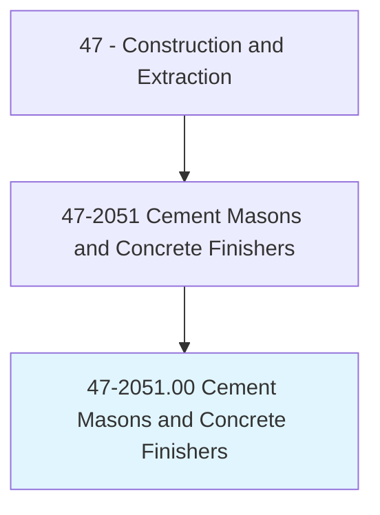
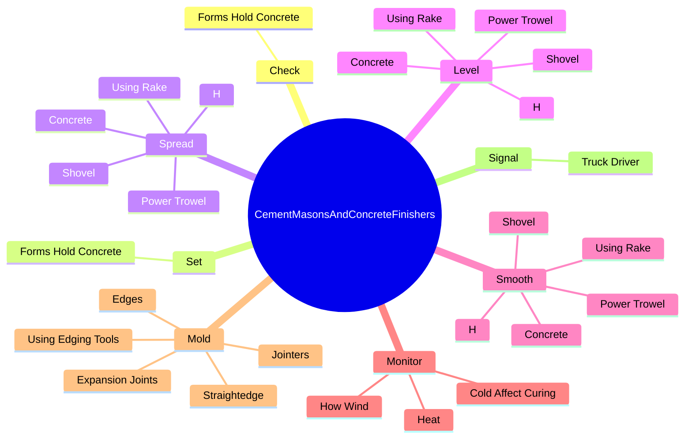
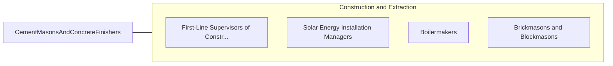

# Cement Masons and Concrete Finishers

> Smooth and finish surfaces of poured concrete, such as floors, walks, sidewalks, roads, or curbs using a variety of hand and power tools. Align forms for sidewalks, curbs, or gutters; patch voids; and use saws to cut expansion joints.

## Overview

Cement Masons and Concrete Finishers is an occupation within the Construction and Extraction category. Smooth and finish surfaces of poured concrete, such as floors, walks, sidewalks, roads, or curbs using a variety of hand and power tools. 

## Classification Hierarchy

## Key Statistics

| Metric | Value |
|--------|-------|
| SOC Code | 47-2051.00 |
| Category | [Construction and Extraction](/occupations/Construction) |
| Task Count | 166 |
| Source | O*NET |

## Core Tasks

### check.FormsHoldConcrete

Cement Masons and Concrete Finishers check forms hold concrete as part of their core responsibilities.

**Actions:**
- `check.FormsHoldConcrete.to.see.TheyAreProperlyConstructed`

### set.FormsHoldConcrete

Cement Masons and Concrete Finishers set forms hold concrete as part of their core responsibilities.

**Actions:**
- `set.FormsHoldConcrete.to.DesiredPitch`
- `set.FormsHoldConcrete.to.Depth`
- `set.FormsHoldConcrete.to.align.Them`

### spread.Concrete

Cement Masons and Concrete Finishers spread concrete as part of their core responsibilities.

**Actions:**
- `spread.Concrete`
- `spread.UsingRake`
- `spread.Shovel`
- `spread.H`

## Skills & Competencies

### Technical Skills
- **Construction Methods** - Advanced
- **Blueprint Reading** - Advanced
- **Safety Compliance** - Advanced

### Soft Skills
- **Communication** - Essential
- **Problem Solving** - Essential
- **Critical Thinking** - Important
- **Teamwork** - Important
- **Adaptability** - Important

## Related Occupations

## Industries

This occupation is found across multiple industries. See [Industries](/industries) for sector-specific employment data.

## Career Progression

---

*Source: O*NET 47-2051.00 - ONETOccupation*
