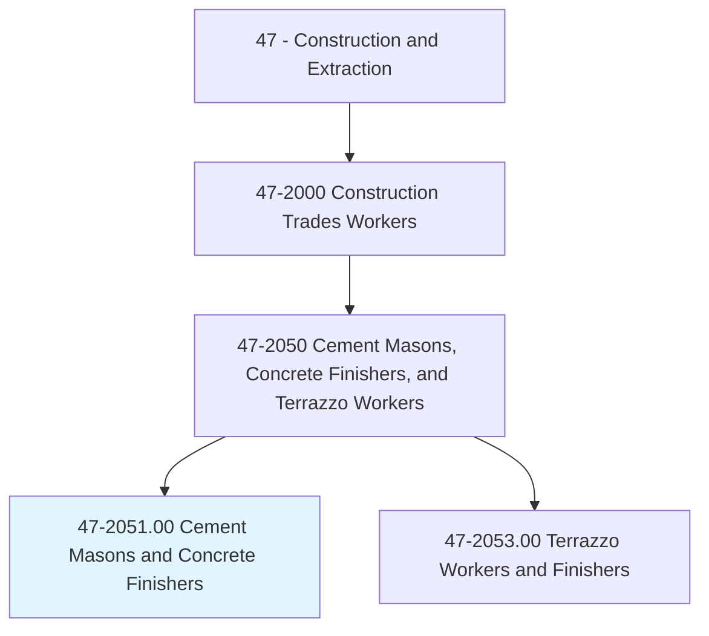
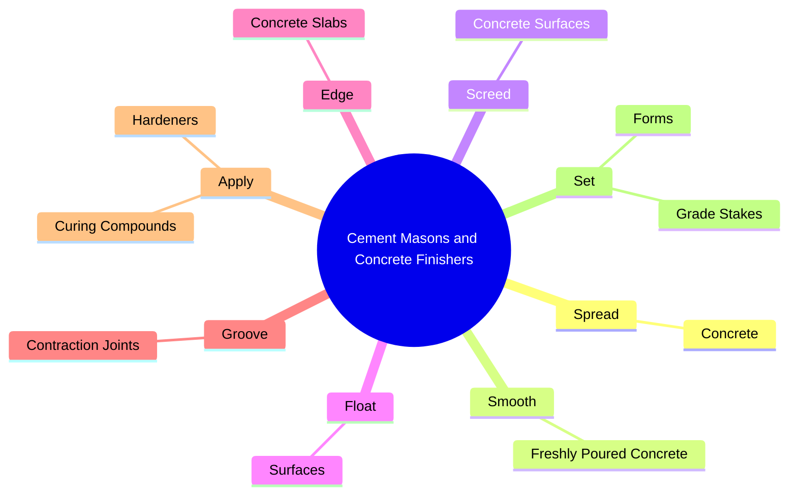
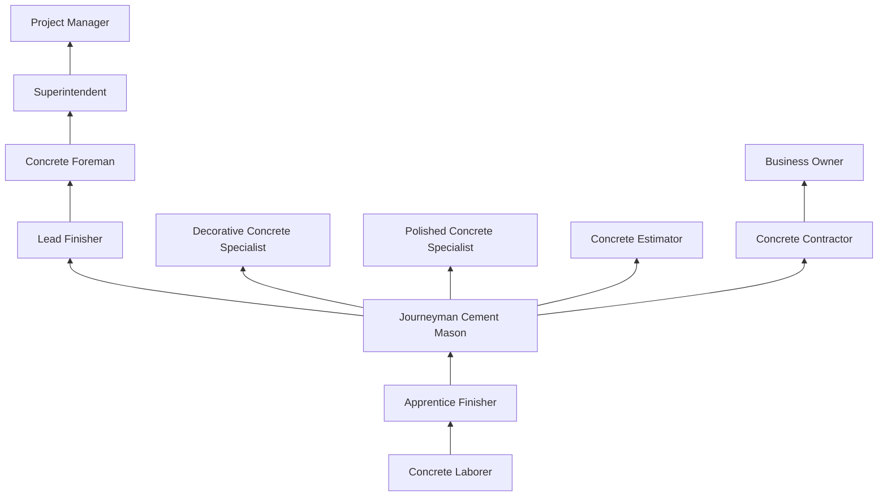
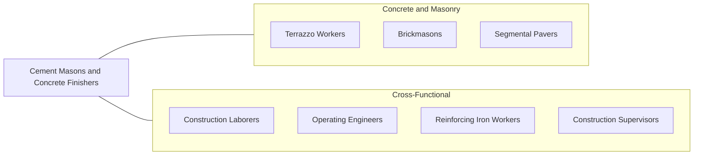

# Cement Masons and Concrete Finishers

> Smooth and finish surfaces of poured concrete, such as floors, walks, sidewalks, roads, or curbs using a variety of hand and power tools.

## Overview

Cement Masons and Concrete Finishers are skilled trade workers responsible for finishing freshly poured concrete to achieve specified textures, levels, and surface quality. Concrete is the most widely used construction material in the world, and the quality of finished concrete work depends heavily on the skill and timing of the finishing crew. These workers must understand concrete chemistry, curing processes, and the narrow time windows within which finishing operations must occur.

The trade demands both speed and precision. Once concrete is placed, masons have a limited working window determined by ambient temperature, humidity, mix design, and wind conditions. They must level (screed), smooth (bull float), edge, groove, and finish surfaces before the concrete sets. For decorative work, additional techniques such as stamping, staining, exposed aggregate, and polished concrete require advanced artistic and technical abilities.

Cement masons work on virtually every type of construction project, from residential driveways and patios to massive commercial foundations, highway pavements, and industrial floors. The work is physically demanding, requiring prolonged bending, kneeling, and working in extreme weather conditions, as concrete pours cannot easily be postponed once trucks are dispatched.

## Classification Hierarchy

## Key Statistics

| Metric | Value |
|--------|-------|
| SOC Code | 47-2051.00 |
| Job Zone | 2 (Some Preparation) |
| Category | [Construction and Extraction](/occupations/Construction/index) |
| Task Count | 119 |
| Median Salary | $48,300 / year |
| Employment | ~200,000 |
| Job Outlook | 4% (As fast as average) |
| Physical Demands | Heavy |
| Source | O*NET |

## Core Tasks

### spread.Concrete

Cement Masons spread and level freshly poured concrete using screeds and hand tools.

**Actions:**
- `spread.Concrete.to.SpecifiedDepth`
- `spread.Concrete.using.Rakes`
- `spread.Concrete.using.Shovels`
- `spread.Concrete.using.Screeds`

### smooth.FreshlyPouredConcrete

Cement Masons smooth concrete surfaces through multiple finishing passes.

**Actions:**
- `smooth.FreshlyPouredConcrete.using.BullFloat`
- `smooth.FreshlyPouredConcrete.using.DarbyFloat`
- `smooth.FreshlyPouredConcrete.using.PowerTrowel`
- `smooth.FreshlyPouredConcrete.to.SpecifiedFinish`

### apply.CuringCompounds

Cement Masons apply curing agents to ensure proper concrete hydration and strength development.

**Actions:**
- `apply.CuringCompounds.to.ConcreteSurfaces`
- `apply.Hardeners.to.ConcreteSurfaces`
- `apply.Sealers.to.FinishedConcrete`

## Skills & Competencies

### Technical Skills
- **Concrete Finishing (Flat Work)** - Expert
- **Screeding and Leveling** - Expert
- **Power Trowel Operation** - Expert
- **Forming and Grade Setting** - Advanced
- **Blueprint Reading** - Intermediate
- **Concrete Mix Design Knowledge** - Intermediate
- **Decorative Concrete Techniques** - Advanced
- **Curing and Sealing** - Advanced

### Trade-Specific Skills
- **Timing and Weather Judgment** - Reading concrete readiness for each finishing step
- **Stamped Concrete** - Pattern stamping, coloring, release agents
- **Exposed Aggregate** - Wash and seed techniques
- **Polished Concrete** - Diamond grinding progressive systems
- **Epoxy and Overlay Systems** - Resurfacing and repair

### Soft Skills
- **Physical Stamina** - Critical
- **Time Management** - Critical (concrete waits for no one)
- **Teamwork** - Critical (crew coordination during pours)
- **Attention to Detail** - Essential
- **Problem Solving** - Essential

## Education & Certifications

| Requirement | Details |
|-------------|---------|
| Typical Education | High school diploma or equivalent |
| Apprenticeship | 3-4 year apprenticeship (OPCMIA) |
| On-the-Job Training | 4,000-6,000 hours |
| Classroom Training | 144+ hours/year during apprenticeship |

### Certifications
- **ACI Flatwork Finisher** - American Concrete Institute certification
- **ACI Concrete Field Testing Technician** - Grade I
- **OSHA 10-Hour Construction** - Required safety certification
- **OSHA 30-Hour Construction** - Supervisory certification
- **NCCER Concrete Finishing** - Industry credential
- **Decorative Concrete Certifications** - Stamped, stained, polished specialties

## Career Progression

## Specializations

### Residential Flatwork
- Driveways, sidewalks, patios
- Garage floors and basement slabs
- Decorative stamped and stained concrete

### Commercial and Structural
- Elevated deck slabs
- Tilt-up panel finishing
- Post-tension slab finishing
- Large-scale floor pours

### Industrial Flooring
- Super-flat floors (FF/FL specifications)
- Hardened and densified surfaces
- Chemical-resistant coatings

### Highway and Heavy Civil
- Road paving and bridge decks
- Curb and gutter work
- Slip-form operations

## Tools & Equipment

### Hand Tools
- Fresno trowels and bull floats
- Edging tools and groovers
- Hand trowels (flat, pointing, pool)
- Magnesium and wood floats
- Screeds (straight edges)
- Brooms and texturing tools
- Knee boards

### Power Tools
- Power trowels (walk-behind and ride-on)
- Concrete vibrators
- Power screeds (vibratory and roller)
- Concrete saws (early-entry and conventional)
- Diamond grinders and polishers

### Equipment
- Laser screeds
- Concrete pumps (boom and line)
- Curing blankets and plastic sheeting
- Form systems

## Safety Considerations

- **Concrete Burns** - Wet concrete is highly alkaline (pH 12-13); skin protection essential
- **Knee Injuries** - Prolonged kneeling; knee pads and knee boards required
- **Back Strain** - Bending and lifting; proper body mechanics critical
- **Silica Dust** - Cutting and grinding concrete; respiratory protection required
- **Heat and Cold Exposure** - Outdoor work in all weather
- **Noise** - Power trowels and saws; hearing protection required
- **Eye Protection** - Splashing concrete and grinding debris

## Related Occupations

## Industries

- [Concrete Contractors](/industries/SpecialtyTrade) - Primary Employment
- [Highway and Street Construction](/industries/HeavyCivil) - High Employment
- [Residential Building Construction](/industries/ResidentialConstruction) - High Employment
- [Commercial Building Construction](/industries/CommercialConstruction) - High Employment

## Departments

This occupation typically works in:
- [Field Operations](/departments/FieldOperations)
- [Concrete Division](/departments/Concrete)
- [Flatwork Division](/departments/Flatwork)
- [Estimating](/departments/Estimating)

---

*Source: O*NET 47-2051.00 - ONETOccupation*
