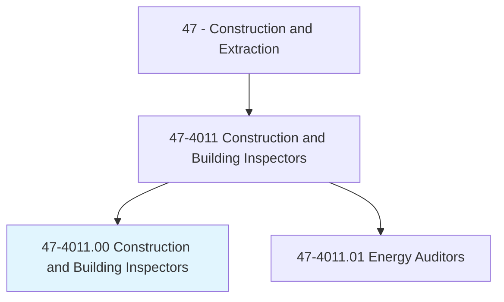
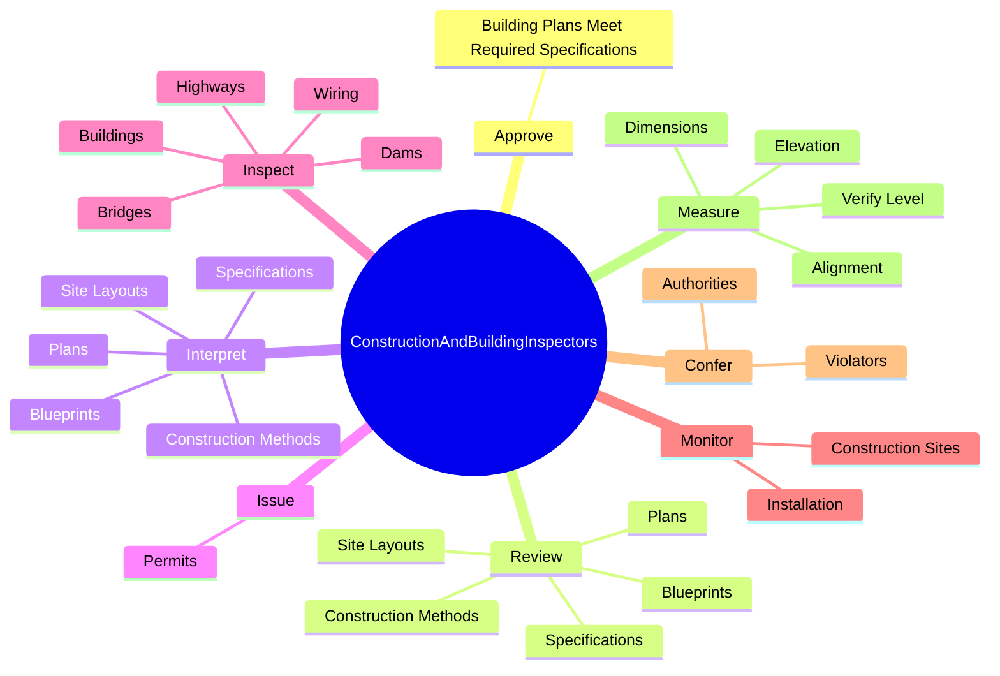
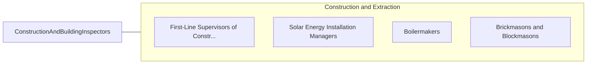

# Construction and Building Inspectors

> Inspect structures using engineering skills to determine structural soundness and compliance with specifications, building codes, and other regulations. Inspections may be general in nature or may be limited to a specific area, such as electrical systems or plumbing.

## Overview

Construction and Building Inspectors is an occupation within the Construction and Extraction category. Inspect structures using engineering skills to determine structural soundness and compliance with specifications, building codes, and other regulations. 

## Classification Hierarchy

## Key Statistics

| Metric | Value |
|--------|-------|
| SOC Code | 47-4011.00 |
| Category | [Construction and Extraction](/occupations/Construction/index) |
| Task Count | 151 |
| Source | O*NET |

## Core Tasks

### approve.BuildingPlansMeetRequiredSpecifications

Construction and Building Inspectors approve building plans meet required specifications as part of their core responsibilities.

**Actions:**
- `approve.BuildingPlansMeetRequiredSpecifications`

### review.Plans

Construction and Building Inspectors review plans as part of their core responsibilities.

**Actions:**
- `review.Plans.to.ensure.ComplianceToLegalRequirementsRegulations`
- `review.Plans.to.SafetyRegulations`
- `review.Blueprints.to.ensure.ComplianceToLegalRequirementsRegulations`
- `review.Blueprints.to.SafetyRegulations`

### interpret.Plans

Construction and Building Inspectors interpret plans as part of their core responsibilities.

**Actions:**
- `interpret.Plans.to.ensure.ComplianceToLegalRequirementsRegulations`
- `interpret.Plans.to.SafetyRegulations`
- `interpret.Blueprints.to.ensure.ComplianceToLegalRequirementsRegulations`
- `interpret.Blueprints.to.SafetyRegulations`

## Skills & Competencies

### Technical Skills
- **Construction Methods** - Advanced
- **Blueprint Reading** - Advanced
- **Safety Compliance** - Advanced

### Soft Skills
- **Communication** - Essential
- **Problem Solving** - Essential
- **Critical Thinking** - Important
- **Teamwork** - Important
- **Adaptability** - Important

## Related Occupations

## Industries

This occupation is found across multiple industries. See [Industries](/industries) for sector-specific employment data.

## Career Progression

---

*Source: O*NET 47-4011.00 - ONETOccupation*
