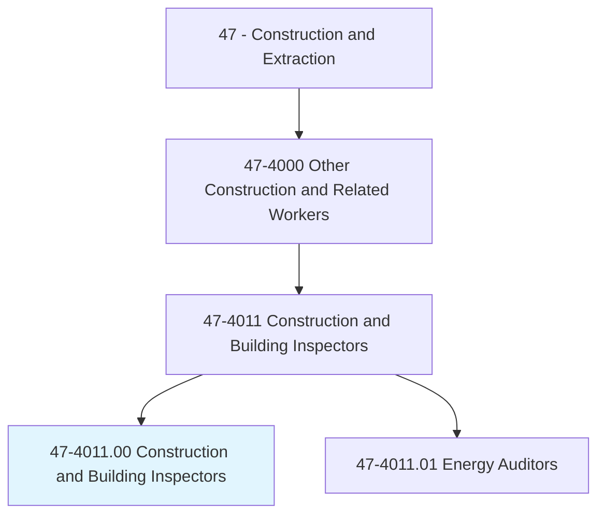
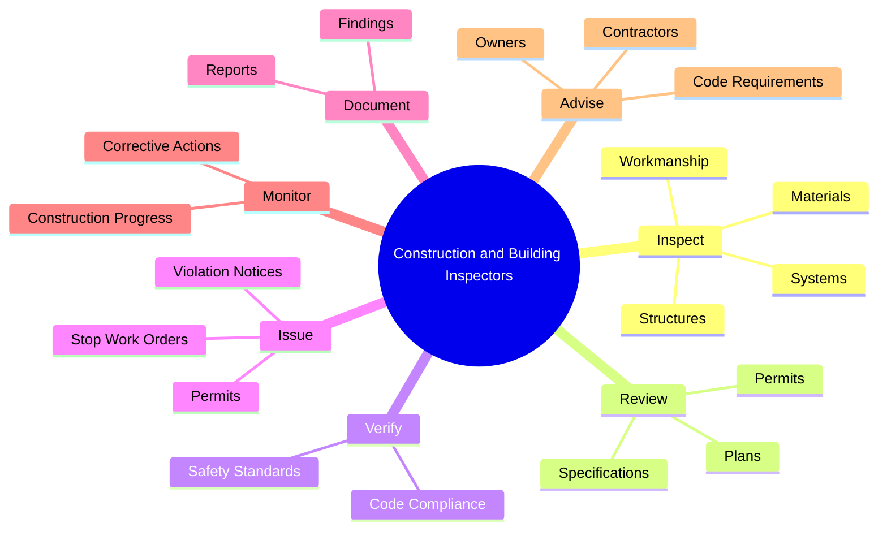
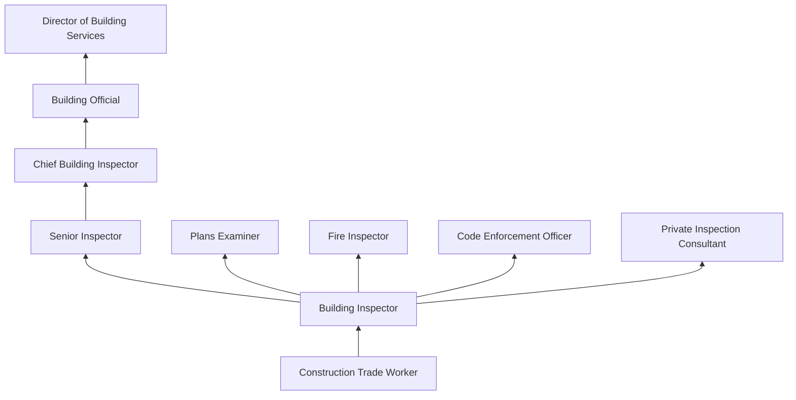
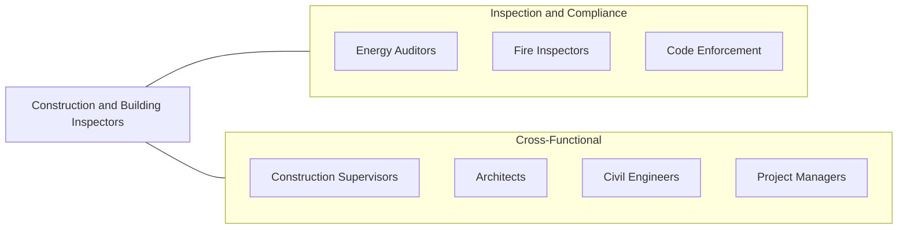

# Construction and Building Inspectors

> Inspect structures using engineering skills to determine structural soundness and compliance with specifications, building codes, and other regulations.

## Overview

Construction and Building Inspectors examine buildings, highways, streets, sewer and water systems, dams, bridges, and other structures to ensure they comply with building codes, zoning regulations, and contract specifications. They serve as the critical quality control and safety checkpoint between construction activities and public occupancy. Their findings carry legal authority, as they can issue stop-work orders, require corrections, and grant or deny occupancy permits.

Inspectors must possess broad construction knowledge spanning multiple trades and disciplines. They review plans, conduct on-site inspections at various construction phases, and document their findings in detailed reports. Specializations include building, electrical, mechanical, plumbing, fire, elevator, and accessibility inspections. Many inspectors transition into this role after years of field experience in a specific construction trade.

The role has grown increasingly complex with evolving building codes, energy efficiency requirements, accessibility standards, and sustainable construction practices. Modern inspectors use digital tools including tablets for field reporting, drone technology for roof and structure surveys, and thermal imaging for energy audits. The position carries significant responsibility, as inspection failures can result in structural collapse, fire hazards, or health risks for building occupants.

## Classification Hierarchy

## Key Statistics

| Metric | Value |
|--------|-------|
| SOC Code | 47-4011.00 |
| Job Zone | 4 (Considerable Preparation) |
| Category | [Construction and Extraction](/occupations/Construction/index) |
| Task Count | 140 |
| Median Salary | $61,600 / year |
| Employment | ~130,000 |
| Job Outlook | 1% (Little or no change) |
| Physical Demands | Medium |
| Source | O*NET |

## Core Tasks

### inspect.Structures

Inspectors examine structural elements at critical phases of construction.

**Actions:**
- `inspect.Structures.for.CodeCompliance`
- `inspect.Structures.for.StructuralSoundness`
- `inspect.Systems.for.ProperInstallation`
- `inspect.Materials.for.SpecificationCompliance`

### review.Plans

Inspectors review construction plans and specifications before and during construction.

**Actions:**
- `review.Plans.for.CodeCompliance`
- `review.Specifications.for.Standards`
- `review.Permits.for.Completeness`

### issue.ViolationNotices

Inspectors issue notices and orders when code violations are found.

**Actions:**
- `issue.ViolationNotices.to.Contractors`
- `issue.StopWorkOrders.for.SafetyViolations`
- `issue.Permits.after.ComplianceVerification`

## Skills & Competencies

### Technical Skills
- **Building Code Knowledge (IBC, IRC)** - Expert
- **Structural Engineering Principles** - Advanced
- **Blueprint and Plan Reading** - Expert
- **Building Systems (MEP)** - Advanced
- **Fire and Life Safety Codes** - Advanced
- **ADA/Accessibility Standards** - Advanced
- **Energy Code Compliance** - Advanced
- **Report Writing** - Expert

### Trade-Specific Skills
- **Multi-Discipline Inspection** - Building, electrical, plumbing, mechanical
- **Plan Review** - Pre-construction plan examination
- **Code Interpretation** - Applying codes to field conditions
- **Conflict Resolution** - Navigating contractor-inspector disputes
- **Digital Inspection Tools** - Tablets, drones, thermal imaging

### Soft Skills
- **Attention to Detail** - Critical
- **Integrity and Ethics** - Critical
- **Communication** - Critical (explaining code requirements)
- **Analytical Thinking** - Essential
- **Diplomacy** - Essential

## Education & Certifications

| Requirement | Details |
|-------------|---------|
| Typical Education | Associate's degree or equivalent experience |
| Experience | 5-10 years construction trade experience preferred |
| Continuing Education | Annual code update training required |
| Licensing | State/local licensing varies |

### Certifications
- **ICC Certified Building Inspector** - International Code Council
- **ICC Certified Plans Examiner** - Plan review credential
- **ICC Combination Inspector** - Multiple discipline certification
- **ICC Fire Inspector I/II** - Fire code inspection
- **ICC Accessibility Inspector** - ADA compliance
- **OSHA 30-Hour Construction** - Safety training
- **State-Specific Licensing** - Varies by jurisdiction

## Career Progression

## Specializations

### Building Inspection
- Structural framing and foundation
- Exterior envelope and weatherproofing
- Interior finishes and accessibility
- Residential and commercial buildings

### Electrical Inspection
- Service entrance and panels
- Branch circuit wiring
- Low voltage and communications
- NEC compliance

### Mechanical/Plumbing Inspection
- HVAC systems and ductwork
- Plumbing and drainage systems
- Gas piping and appliances
- IMC and IPC compliance

### Fire and Life Safety
- Sprinkler and suppression systems
- Fire alarm and detection
- Egress and exit paths
- Fire-rated assemblies

## Tools & Equipment

### Inspection Tools
- Tape measures and levels
- Moisture meters
- Electrical testers and meters
- Flashlights and inspection mirrors
- Digital cameras
- Thermal imaging cameras
- Drones (for roof and exterior surveys)

### Documentation Tools
- Tablets and field software
- Permit management systems
- Digital plan review tools
- Report writing software

### Reference Materials
- Building code books (IBC, IRC, NEC, IMC, IPC)
- Standard reference manuals
- Jurisdiction-specific amendments

## Safety Considerations

- **Construction Site Hazards** - Active construction exposure; PPE required at all times
- **Heights** - Roof and upper floor inspections; fall protection awareness
- **Confined Spaces** - Crawl space and utility vault inspections
- **Electrical Hazards** - Energized equipment during electrical inspections
- **Structural Instability** - Inspecting during construction phases
- **Environmental Exposure** - All-weather outdoor inspections

## Related Occupations

## Industries

- [Local Government](/industries/Government) - Primary Employment
- [State Government](/industries/Government) - High Employment
- [Engineering Services](/industries/ProfessionalServices) - Moderate Employment
- [Private Inspection Firms](/industries/ProfessionalServices) - Growing Employment

## Departments

This occupation typically works in:
- [Building Department](/departments/BuildingDepartment)
- [Code Enforcement](/departments/CodeEnforcement)
- [Planning and Development](/departments/Planning)
- [Fire Prevention](/departments/FirePrevention)
- [Quality Assurance](/departments/QualityAssurance)

---

*Source: O*NET 47-4011.00 - ONETOccupation*
