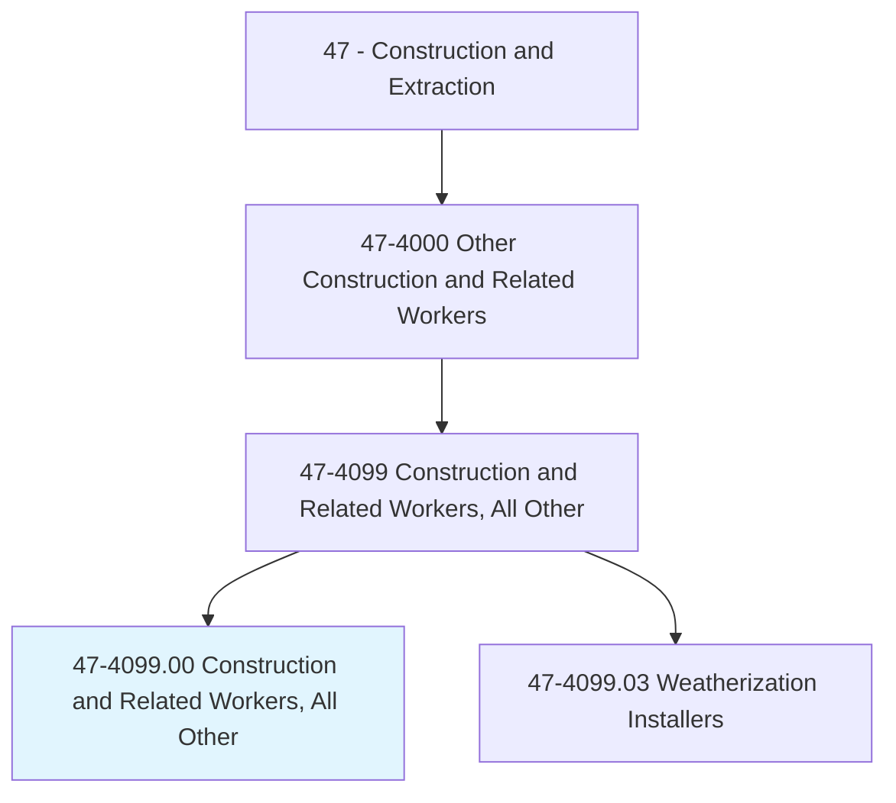
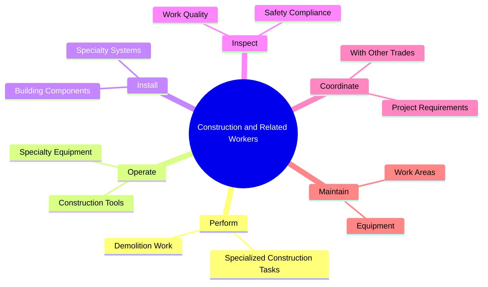
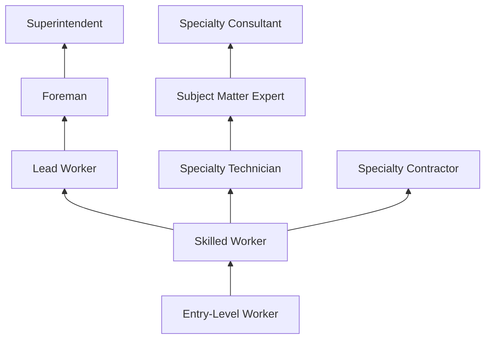
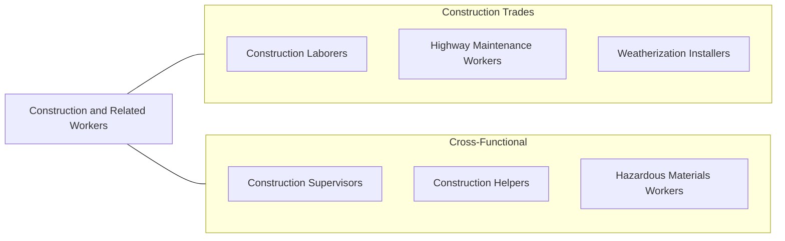

# Construction and Related Workers, All Other

> All construction and related workers not listed separately.

## Overview

Construction and Related Workers, All Other is a catch-all classification that encompasses construction trade workers whose duties do not fit neatly into other specific occupational categories. This includes workers performing specialized or emerging construction tasks that span multiple disciplines, as well as those in niche roles that have not yet been assigned their own distinct SOC code. Examples include construction divers, building movers, house raisers, and specialty demolition workers.

These workers often possess a broad range of construction skills and may shift between various tasks depending on project requirements. The classification also captures workers in newer green building specialties, retrofit technicians, and construction technology specialists whose roles have emerged alongside industry innovations. Because this category is diverse, the specific duties, work environments, and skill requirements can vary significantly from one position to another.

Despite the "all other" designation, many of these workers perform highly specialized tasks that require significant training and expertise. Their versatility makes them valuable on construction projects that require adaptive problem-solving and cross-trade capabilities.

## Classification Hierarchy

## Key Statistics

| Metric | Value |
|--------|-------|
| SOC Code | 47-4099.00 |
| Job Zone | 2-3 (Varies) |
| Category | [Construction and Extraction](/occupations/Construction/index) |
| Task Count | Variable |
| Median Salary | $42,500 / year |
| Employment | ~30,000 |
| Job Outlook | 3% (Slower than average) |
| Physical Demands | Medium to Heavy |
| Source | O*NET |

## Core Tasks

### perform.SpecializedConstructionTasks

Workers perform a wide range of specialized construction activities not covered by other classifications.

**Actions:**
- `perform.SpecializedConstructionTasks.on.ConstructionSites`
- `perform.DemolitionWork.using.SpecialtyEquipment`
- `perform.BuildingMoving.using.HydraulicSystems`

### coordinate.WithOtherTrades

Workers coordinate with other trade professionals to complete integrated construction activities.

**Actions:**
- `coordinate.WithOtherTrades.to.complete.Projects`
- `coordinate.ProjectRequirements.with.Supervisors`

## Skills & Competencies

### Technical Skills
- **General Construction Methods** - Advanced
- **Multiple Trade Knowledge** - Intermediate to Advanced
- **Equipment Operation** - Advanced
- **Blueprint Reading** - Intermediate
- **Safety Compliance** - Advanced
- **Problem Solving** - Advanced

### Trade-Specific Skills
- **Specialty Demolition** - Selective and structural demolition techniques
- **Building Moving** - House and structure relocation
- **Construction Diving** - Underwater construction and inspection
- **Green Building Techniques** - Energy retrofits and sustainable construction
- **Restoration and Retrofit** - Existing building modification

### Soft Skills
- **Adaptability** - Critical
- **Physical Stamina** - Essential
- **Problem Solving** - Essential
- **Communication** - Essential
- **Teamwork** - Essential

## Education & Certifications

| Requirement | Details |
|-------------|---------|
| Typical Education | High school diploma or equivalent |
| On-the-Job Training | Varies by specialty |
| Specialty Training | Specific to sub-discipline |

### Certifications
- **OSHA 10-Hour Construction** - Required safety certification
- **OSHA 30-Hour Construction** - Supervisory safety certification
- **Specialty-Specific Certifications** - Varies by role
- **Equipment Operation Certificates** - As required
- **First Aid/CPR** - Recommended

## Career Progression

## Specializations

### Building Movers
- Structure relocation
- Hydraulic jacking systems
- Foundation work for relocated buildings

### Construction Divers
- Underwater welding and cutting
- Bridge and dam inspections
- Marine construction support

### Specialty Demolition
- Selective interior demolition
- Implosion support work
- Hazardous structure takedown

### Green Building Specialists
- Energy retrofit installations
- Sustainable building practices
- LEED construction support

## Tools & Equipment

### General Tools
- Hand tools (full range)
- Power tools (trade-specific)
- Measuring and layout instruments
- Safety equipment (PPE)

### Specialty Equipment
- Hydraulic jacks and cribbing (building movers)
- Diving equipment (construction divers)
- Demolition equipment (specialty demo)
- Diagnostic and testing instruments

## Safety Considerations

- **Variable Hazards** - Hazards vary significantly by specialty role
- **Fall Protection** - Required for elevated work
- **Confined Space** - May apply depending on specialty
- **Heavy Equipment** - Proper operation and clearance protocols
- **Environmental Hazards** - Asbestos, lead, and other materials in renovation work
- **Underwater Hazards** - For construction diving specialties

## Related Occupations

## Industries

- [Specialty Trade Contractors](/industries/SpecialtyTrade) - Primary Employment
- [Building Construction](/industries/BuildingConstruction) - High Employment
- [Heavy and Civil Engineering](/industries/HeavyCivil) - Moderate Employment
- [Government](/industries/Government) - Moderate Employment

## Departments

This occupation typically works in:
- [Field Operations](/departments/FieldOperations)
- [Special Projects](/departments/SpecialProjects)
- [Demolition Division](/departments/Demolition)
- [Renovation Division](/departments/Renovation)

---

*Source: O*NET 47-4099.00 - ONETOccupation*
