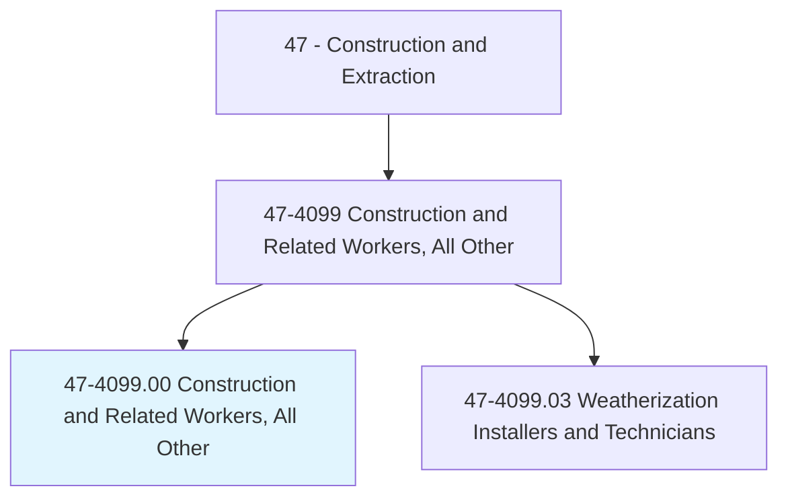
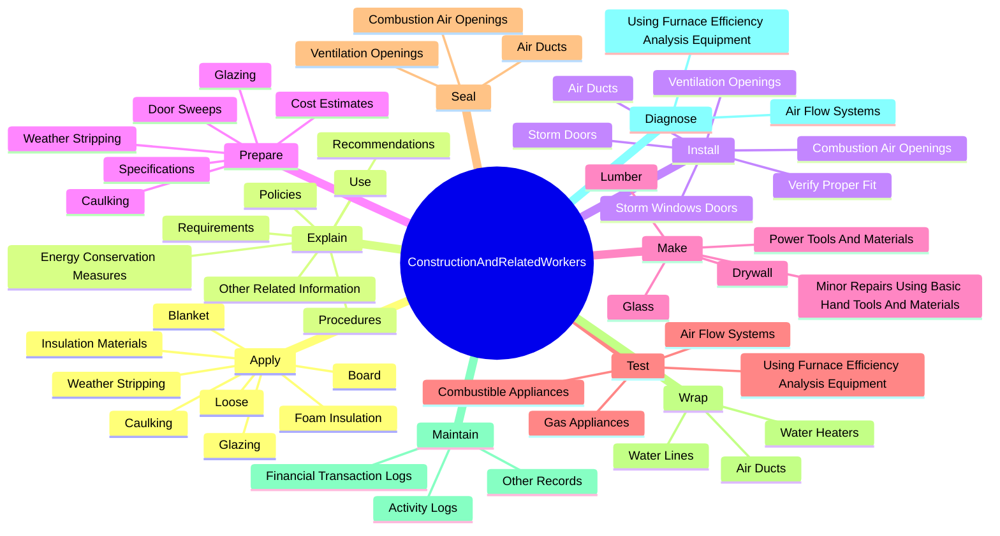
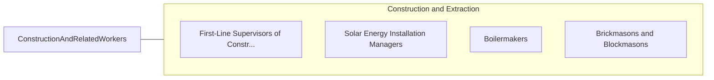

# Construction and Related Workers, All Other

> All construction and related workers not listed separately.

## Overview

Construction and Related Workers, All Other is classified under Construction and Extraction (SOC 47). All construction and related workers not listed separately.

## Classification Hierarchy

## Key Statistics

| Metric | Value |
|--------|-------|
| SOC Code | 47-4099.00 |
| Category | [Construction and Extraction](/occupations/Construction) |
| Task Count | 99 |
| Source | O*NET |

## Core Tasks

### apply.InsulationMaterials

Construction and Related Workers, All Other apply insulation materials as part of their core responsibilities.

**Actions:**
- `apply.InsulationMaterials.to.Attics`
- `apply.InsulationMaterials.to.CrawlSpaces`
- `apply.InsulationMaterials.to.Basements`
- `apply.InsulationMaterials.to.Walls`

### explain.Recommendations

Construction and Related Workers, All Other explain recommendations as part of their core responsibilities.

**Actions:**
- `explain.Recommendations.to.Residents`
- `explain.Recommendations.to.BuildingOwners`
- `explain.Policies.to.Residents`
- `explain.Policies.to.BuildingOwners`

### install.AirDucts

Construction and Related Workers, All Other install air ducts as part of their core responsibilities.

**Actions:**
- `install.AirDucts.to.Heating`
- `install.AirDucts.to.CoolingEfficiency`
- `install.CombustionAirOpenings.to.Heating`
- `install.CombustionAirOpenings.to.CoolingEfficiency`

## Skills & Competencies

### Technical Skills
- **Construction Methods** - Advanced
- **Blueprint Reading** - Advanced
- **Safety Compliance** - Advanced

### Soft Skills
- **Communication** - Essential
- **Problem Solving** - Essential
- **Critical Thinking** - Important
- **Teamwork** - Important
- **Adaptability** - Important

## Related Occupations

## Industries

This occupation is found across multiple industries. See [Industries](/industries) for sector-specific employment data.

## Career Progression

---

*Source: O*NET 47-4099.00 - ONETOccupation*
