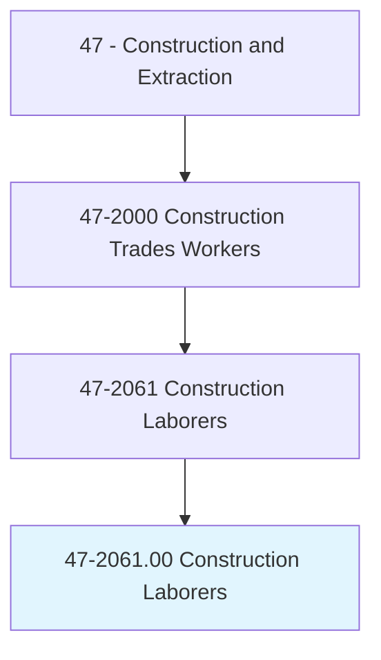
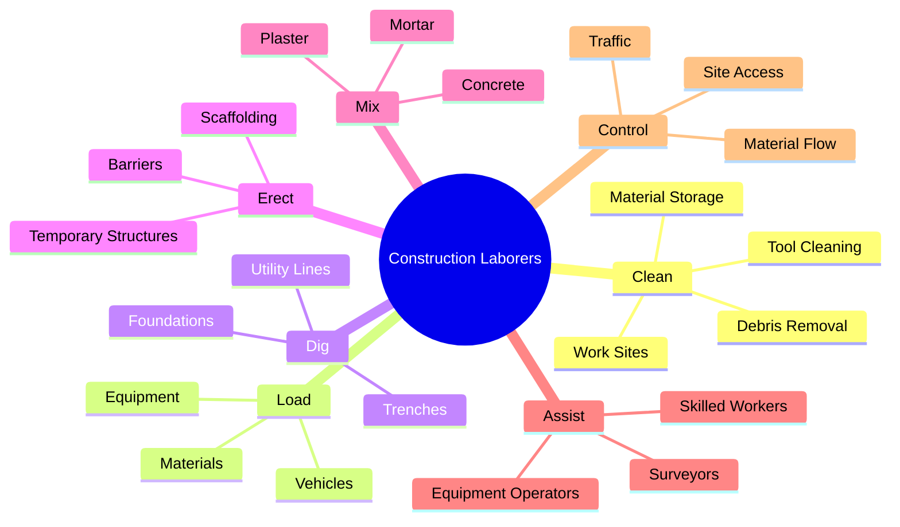
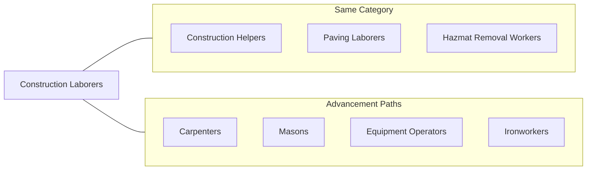
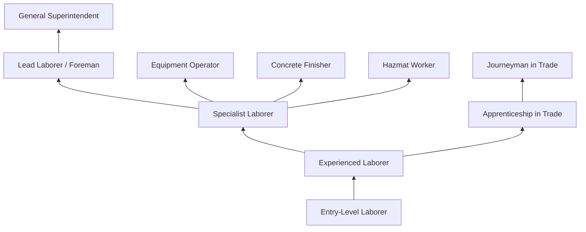

# Construction Laborers

> Perform tasks involving physical labor at construction sites. May operate hand and power tools of all types: air hammers, earth tampers, cement mixers, small mechanical hoists, surveying and measuring equipment, and a variety of other equipment and instruments. May clean and prepare sites, dig trenches, set braces to support the sides of excavations, erect scaffolding, and clean up rubble, debris, and other waste materials. May assist other craft workers.

## Overview

Construction Laborers form the backbone of the construction workforce, performing a wide variety of physically demanding tasks that support all phases of construction projects. These versatile workers handle material movement, site preparation, cleanup, and assistance to skilled tradespeople. While often considered entry-level, experienced laborers develop significant skills and may specialize in areas such as concrete work, demolition, or hazardous material handling. The occupation provides a pathway into the construction industry and opportunities for advancement into skilled trades.

## Classification Hierarchy

## Key Statistics

| Metric | Value |
|--------|-------|
| SOC Code | 47-2061.00 |
| Job Zone | 2 (Some Preparation) |
| Category | [Construction](/occupations/Construction/index) |
| Core Tasks | 15+ |
| Physical Demands | Very Heavy |
| Source | O*NET |

## Core Tasks

### clean.WorkSites

Construction laborers maintain clean and organized work areas.

**Actions:**
- `clean.ConstructionSites.of.Debris` - Remove construction waste
- `clean.Tools.after.Use` - Maintain equipment
- `remove.Rubble.from.Sites` - Clear demolished materials
- `dispose.WasteMaterials.properly` - Handle waste appropriately
- `organize.Materials.at.Sites` - Arrange supplies

### load.Materials

Construction laborers move materials and equipment around job sites.

**Actions:**
- `load.Materials.onto.Trucks` - Prepare for transport
- `unload.Materials.from.Vehicles` - Receive deliveries
- `move.Materials.to.WorkAreas` - Distribute supplies
- `stock.Materials.for.CraftWorkers` - Supply tradespeople
- `operate.Forklifts.to.Move.Materials` - Use material handling equipment

### dig.Excavations

Construction laborers perform manual excavation work.

**Actions:**
- `dig.Trenches.for.Utilities` - Create utility channels
- `dig.Foundations.for.Structures` - Excavate building foundations
- `excavate.EarthMaterials.manually` - Hand dig in tight areas
- `compact.Soil.in.Trenches` - Prepare trench bottoms
- `backfill.Trenches.after.Installation` - Replace excavated material

### erect.Structures

Construction laborers build temporary support structures.

**Actions:**
- `erect.Scaffolding.for.Workers` - Build access platforms
- `erect.Barriers.for.Safety` - Install safety fencing
- `build.Forms.for.Concrete` - Construct formwork
- `install.ShoringBraces.in.Trenches` - Support excavation walls
- `set.Barricades.for.TrafficControl` - Manage site access

### mix.Materials

Construction laborers prepare construction materials.

**Actions:**
- `mix.Concrete.using.Mixers` - Prepare concrete batches
- `mix.Mortar.for.Masons` - Supply masons
- `mix.Plaster.for.Plasterers` - Prepare wall materials
- `pour.Concrete.into.Forms` - Place concrete
- `spread.Concrete.in.Forms` - Distribute material

### assist.CraftWorkers

Construction laborers support skilled tradespeople.

**Actions:**
- `assist.Carpenters.with.Tasks` - Support wood work
- `assist.Masons.with.Materials` - Supply masonry workers
- `assist.Electricians.with.Setup` - Support electrical work
- `assist.Surveyors.with.Measurements` - Hold survey equipment
- `assist.EquipmentOperators.with.Spotting` - Guide equipment

## Specializations

### Concrete Laborer
- Concrete placement and finishing assistance
- Form work setup and tear down
- Concrete pumping assistance
- Curing and protection
- Concrete saw operation

### Demolition Laborer
- Structure demolition
- Debris removal and sorting
- Salvage operations
- Hazardous material handling
- Heavy equipment assistance

### Highway/Heavy Laborer
- Road construction support
- Traffic control
- Underground utilities
- Bridge construction assistance
- Paving operations support

### Mason Tender
- Material supply for masons
- Scaffold building
- Mortar mixing
- Material handling
- Work area preparation

### Flagging/Traffic Control
- Traffic direction
- Work zone safety
- Pedestrian control
- Emergency response
- Communication coordination

## Skills & Competencies

### Technical Skills
- **Hand Tool Proficiency** - Advanced
- **Power Tool Operation** - Intermediate
- **Safety Procedures** - Advanced
- **Material Handling** - Advanced
- **Basic Mathematics** - Intermediate
- **Equipment Operation** - Intermediate

### Soft Skills
- **Physical Stamina** - Critical
- **Work Ethic** - Critical
- **Reliability** - Critical
- **Team Coordination** - Essential
- **Following Instructions** - Essential
- **Adaptability** - Essential

## Related Occupations

## Industries

- [Construction](/industries/Construction/index) - High Employment
- [Specialty Trade Contractors](/industries/SpecialtyTrade) - High Employment
- [Heavy and Civil Construction](/industries/HeavyCivil) - High Employment
- [Government](/industries/Government) - Moderate Employment
- [Manufacturing](/industries/Manufacturing/index) - Low Employment

## Career Progression

## Training Path

| Level | Focus Areas | Duration |
|-------|-------------|----------|
| Entry | Safety orientation, basic tools, site procedures | 1-2 weeks |
| Intermediate | Equipment operation, specialized tasks | 6-12 months |
| Advanced | Leadership, specialized certifications | 1-3 years |

## Education & Training

| Requirement | Details |
|-------------|---------|
| Typical Education | No formal education required |
| On-the-Job Training | Short-term to moderate |
| Certifications | OSHA, specialized credentials |
| Advancement | May lead to apprenticeships in skilled trades |

## Certifications

- **OSHA 10-Hour Construction** - Basic safety certification (often required)
- **OSHA 30-Hour Construction** - Comprehensive safety certification
- **Flagging/Traffic Control** - State-specific certification
- **Confined Space Entry** - For specialized work
- **Forklift Operator** - Material handling certification
- **Rigging and Signaling** - Load handling certification
- **First Aid/CPR** - Emergency response certification
- **Scaffold User** - Fall protection training
- **Silica Awareness** - Health hazard training

## Safety Requirements

### Personal Protective Equipment
- Hard hat
- Safety glasses
- Steel-toed boots
- High-visibility clothing
- Work gloves
- Hearing protection
- Respiratory protection (as needed)

### Common Hazards
- Struck by objects and equipment
- Falls from heights and into excavations
- Overexertion and repetitive motion injuries
- Exposure to hazardous materials
- Electrocution
- Heat and cold stress
- Noise exposure
- Silica and dust exposure

### Required Training
- Hazard communication
- Fall protection
- Trenching and excavation safety
- Material handling
- Personal protective equipment
- Tool safety
- Heat illness prevention

## Tools & Equipment

### Hand Tools
- Shovels (various types)
- Picks and mattocks
- Wheelbarrows
- Pry bars
- Hammers
- Tape measures
- Levels
- Brooms and brushes
- Squeegees

### Power Tools
- Jackhammers
- Concrete saws
- Compactors (hand-operated)
- Pressure washers
- Generators
- Air compressors
- Concrete mixers
- Power screeds

### Equipment
- Forklifts
- Skid steers (bobcats)
- Scissor lifts
- Boom lifts
- Scaffolding systems
- Safety barriers

## Work Environment

### Physical Demands
- Heavy lifting (up to 100+ pounds)
- Standing, walking, climbing all day
- Working in trenches and excavations
- Repetitive motions
- Bending, kneeling, crouching
- Exposure to all weather conditions

### Work Conditions
- Outdoor work in all seasons
- Construction sites
- Variable start times
- Seasonal employment fluctuations
- Travel between job sites
- Physical exhaustion common
- High injury rate occupation

## Departments

This occupation typically works in:
- [General Labor Pool](/departments/GeneralLabor)
- [Concrete Division](/departments/Concrete)
- [Demolition Division](/departments/Demolition)
- [Site Work Division](/departments/SiteWork)
- [Utility Division](/departments/Utility)

## Union Affiliation

Many construction laborers are members of the Laborers' International Union of North America (LIUNA), which provides:
- Training and certification programs
- Job referral services
- Health and pension benefits
- Safety training
- Pathway to apprenticeships
- Advocacy for worker rights

## Advancement Opportunities

Construction laborers often use this position as an entry point to the construction industry with pathways to:
- Skilled trade apprenticeships (carpenter, electrician, plumber, etc.)
- Equipment operator training
- Specialized laborer positions (concrete, hazmat, demolition)
- Supervisory positions (foreman, superintendent)
- Construction management

---

*Source: O*NET 47-2061.00 - ONETOccupation*
