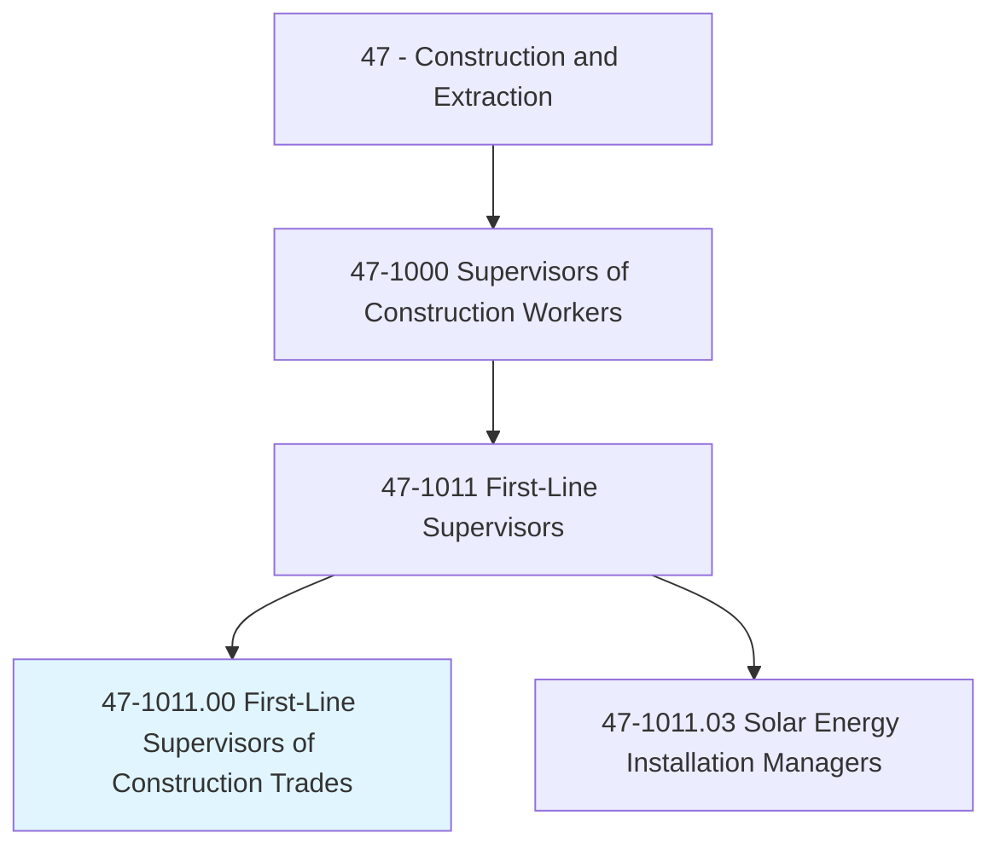
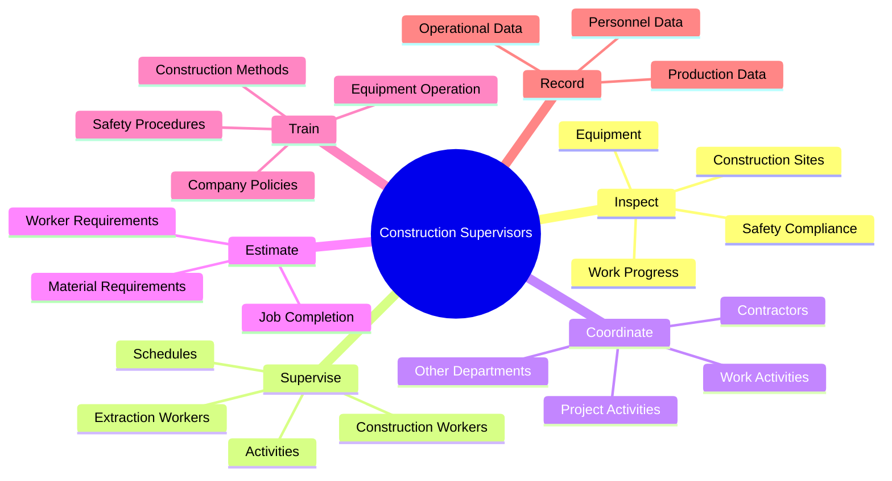
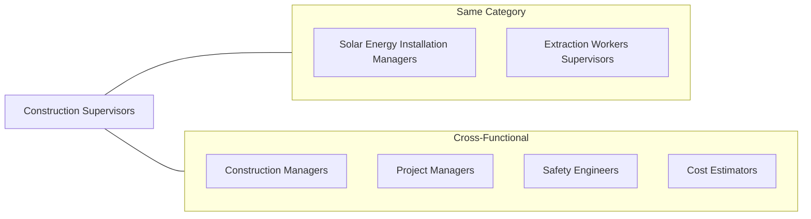
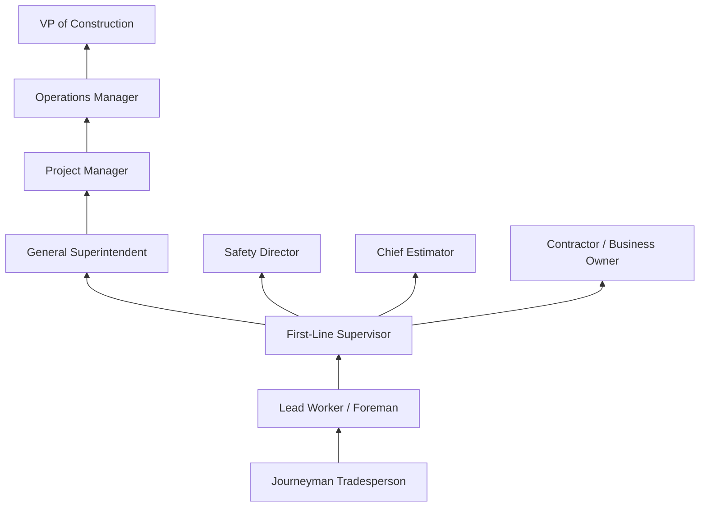

# First-Line Supervisors of Construction Trades and Extraction Workers

> Directly supervise and coordinate activities of construction or extraction workers.

## Overview

First-Line Supervisors of Construction Trades and Extraction Workers serve as the critical link between management and field workers on construction and extraction sites. They oversee crews performing a wide range of tasks including building construction, road work, excavation, and resource extraction. These supervisors are responsible for ensuring projects are completed safely, on time, and according to specifications. They must combine deep technical knowledge of construction methods with strong leadership and communication skills to effectively manage diverse work crews.

## Classification Hierarchy

## Key Statistics

| Metric | Value |
|--------|-------|
| SOC Code | 47-1011.00 |
| Job Zone | 3 (Medium Preparation) |
| Category | [Construction](/occupations/Construction/index) |
| Core Tasks | 15+ |
| Source | O*NET |

## Core Tasks

### inspect.WorkProgress

Construction Supervisors regularly inspect work to verify safety and ensure specifications are met across all project phases.

**Actions:**
- `inspect.WorkProgress.to.verify.Safety` - Ensure all work meets safety standards and OSHA requirements
- `inspect.Equipment.to.verify.Safety` - Check equipment condition and proper operation
- `inspect.ConstructionSites.to.ensure.SpecificationsAreMet` - Verify work meets blueprint and code requirements

### supervise.Activities

Supervisors directly manage the daily activities of construction and extraction crews.

**Actions:**
- `supervise.Activities.of.ConstructionWorkers` - Oversee building, framing, and finishing work
- `supervise.Activities.of.ExtractiveWorkers` - Manage excavation and resource extraction crews
- `coordinate.Activities.of.ConstructionWorkers` - Synchronize tasks across different trades
- `schedule.Activities.of.ConstructionWorkers` - Plan daily and weekly work assignments

### assign.Work

Supervisors match workers to tasks based on skills, materials, and project requirements.

**Actions:**
- `assign.Work.to.Employees` - Distribute tasks based on worker capabilities
- `assign.Work.to.BasedOnMaterial` - Allocate assignments based on available materials
- `assign.Work.to.WorkerRequirementsOfSpecificJobs` - Match skilled workers to specialized tasks

### estimate.Requirements

Supervisors calculate materials and labor needed to complete construction jobs.

**Actions:**
- `estimate.MaterialRequirements.to.complete.Jobs` - Calculate lumber, concrete, and other supplies
- `estimate.WorkerRequirements.to.complete.Jobs` - Determine crew sizes for project phases

### train.Workers

Supervisors ensure workers have the knowledge and skills to perform tasks safely and effectively.

**Actions:**
- `train.Workers.in.ConstructionMethods` - Teach proper building techniques
- `train.Workers.in.Operation.of.Equipment` - Instruct on safe equipment use
- `train.Workers.in.SafetyProcedures` - Conduct safety training sessions
- `train.Workers.in.CompanyPolicies` - Orient workers on company rules

### confer.TechnicalPersonnel

Supervisors communicate with various stakeholders to resolve issues and coordinate activities.

**Actions:**
- `confer.TechnicalPersonnel.to.resolve.Problems` - Work with engineers on technical challenges
- `confer.OtherDepartments.to.coordinate.Activities` - Align with procurement, scheduling teams
- `confer.Contractors.to.coordinate.Activities` - Synchronize subcontractor work

## Skills & Competencies

### Technical Skills
- **Blueprint Reading** - Advanced
- **Construction Methods** - Expert
- **Safety Regulations** - Expert
- **Equipment Operation** - Advanced
- **Cost Estimation** - Advanced
- **Scheduling** - Advanced

### Soft Skills
- **Leadership** - Critical
- **Communication** - Critical
- **Problem Solving** - Essential
- **Decision Making** - Essential
- **Conflict Resolution** - Important
- **Time Management** - Essential

## Related Occupations

## Industry Variations

### Residential Construction
- Focus on homebuilding crews (framers, roofers, finish carpenters)
- Smaller crew sizes (5-15 workers)
- Multiple concurrent job sites
- Direct homeowner communication

### Commercial Construction
- Larger crews across multiple trades
- Complex coordination with subcontractors
- Strict scheduling requirements
- Extensive documentation and reporting

### Heavy/Civil Construction
- Infrastructure projects (roads, bridges, utilities)
- Heavy equipment coordination
- Environmental compliance focus
- Public sector contract requirements

### Extraction Industries
- Mining and quarrying operations
- Oil and gas extraction
- Environmental and safety emphasis
- Shift-based supervision

## Industries

- [Construction](/industries/Construction/index) - High Employment
- [Mining and Extraction](/industries/Mining/index) - High Employment
- Oil and Gas - Moderate Employment
- [Utilities](/industries/Utilities/index) - Moderate Employment
- [Government](/industries/PublicAdministration) - Moderate Employment

## Career Progression

## Education & Training

| Requirement | Details |
|-------------|---------|
| Typical Education | High school diploma; some college or trade school preferred |
| Work Experience | 5+ years as journeyman in construction trade |
| On-the-Job Training | 1-2 years supervisory training |
| Certifications | OSHA 30-hour, First Aid/CPR, trade-specific certifications |

## Departments

This occupation typically works in:
- Field Operations
- Project Management
- Safety
- Quality Control

## Variants

### Solar Energy Installation Managers
A specialized variant focusing on photovoltaic and solar thermal system installations.
- [Solar Energy Installation Managers](./SolarEnergyInstallationManagers.mdx) - 47-1011.03

---

*Source: O*NET 47-1011.00 - ONETOccupation*
