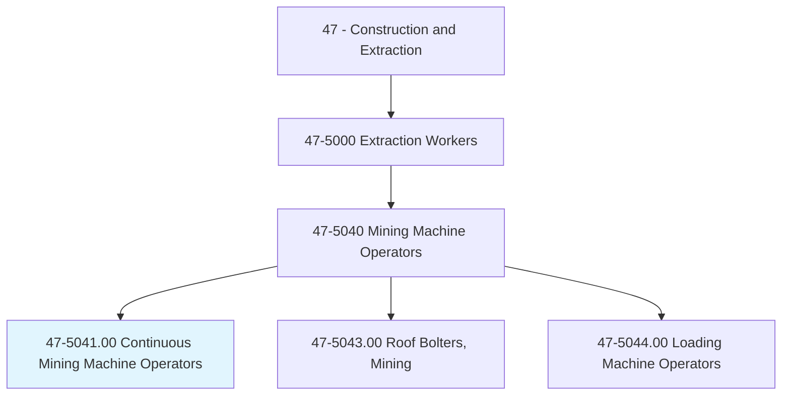
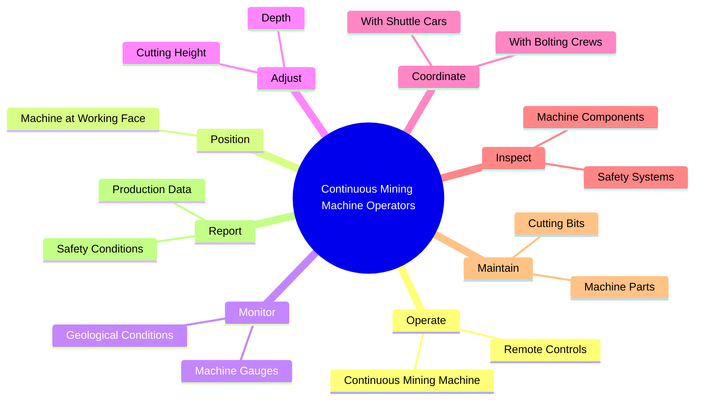
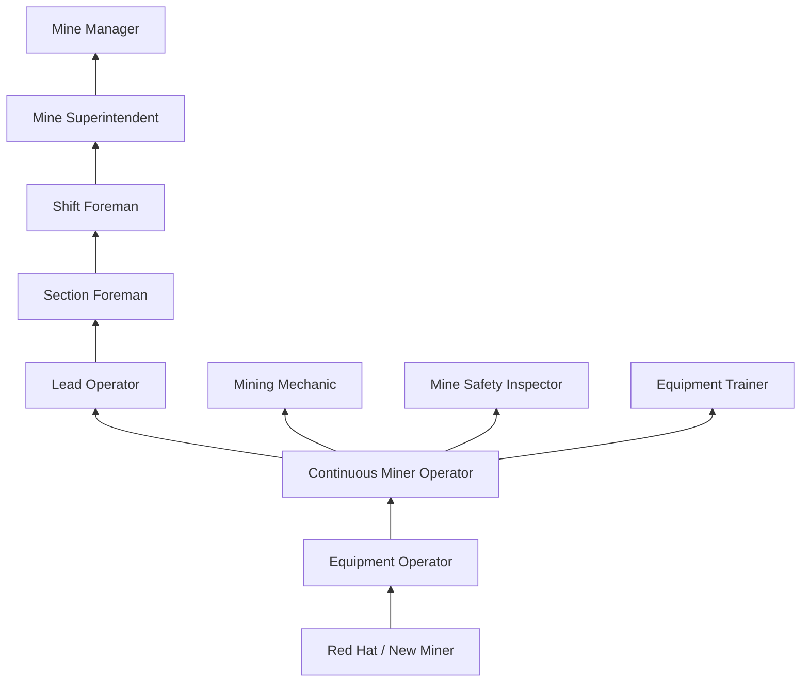
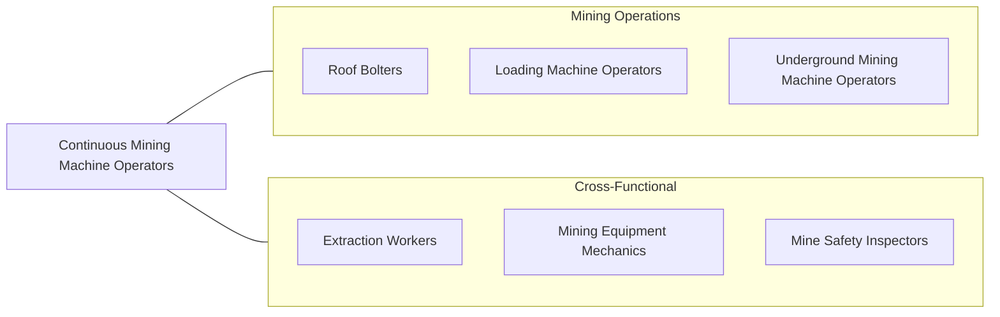

# Continuous Mining Machine Operators

> Operate self-propelled mining machines that rip coal, metal and nonmetal ores, rock, stone, or sand from the mine face and load it onto conveyors, shuttle cars, or trucks in a continuous operation.

## Overview

Continuous Mining Machine Operators run large, powerful machines that extract material from underground mine faces in a single, continuous operation. Unlike older drill-and-blast methods, continuous miners use rotating cutting drums studded with tungsten carbide bits to rip material directly from the face, then load it onto conveyors or shuttle cars for transport to the surface. This method dramatically increased extraction efficiency and changed the nature of underground mining.

These operators work in confined underground environments where they must manage complex machinery while maintaining awareness of roof conditions, ventilation, and geological hazards. The machines they operate can weigh over 100 tons and generate tremendous cutting forces. Operators must read geological conditions, adjust cutting patterns, and coordinate with bolting crews, shuttle car operators, and section foremen to maintain safe and productive operations.

The role demands mechanical aptitude, spatial awareness, and the ability to make quick decisions in hazardous conditions. Continuous miners operate in low-visibility, confined spaces with constant noise, dust, and the ever-present risk of roof collapse, methane accumulation, and equipment malfunction. Despite extensive safety regulations and modern monitoring systems, underground mining remains one of the most dangerous occupations.

## Classification Hierarchy

## Key Statistics

| Metric | Value |
|--------|-------|
| SOC Code | 47-5041.00 |
| Job Zone | 2 (Some Preparation) |
| Category | [Construction and Extraction](/occupations/Construction/index) |
| Task Count | 98 |
| Median Salary | $53,600 / year |
| Employment | ~8,000 |
| Job Outlook | -9% (Decline) |
| Physical Demands | Heavy |
| Source | O*NET |

## Core Tasks

### operate.ContinuousMiningMachine

Operators control continuous mining machines to extract material from the mine face.

**Actions:**
- `operate.ContinuousMiningMachine.at.WorkingFace`
- `operate.RemoteControls.to.position.Machine`
- `operate.CuttingDrum.to.extract.Material`

### monitor.MachineGauges

Operators monitor machine performance and geological conditions during extraction.

**Actions:**
- `monitor.MachineGauges.for.Performance`
- `monitor.GeologicalConditions.for.Safety`
- `monitor.MethaneDetectors.for.GasLevels`

## Skills & Competencies

### Technical Skills
- **Continuous Miner Operation** - Expert
- **Remote Control Systems** - Expert
- **Geological Reading** - Advanced
- **Machine Maintenance** - Advanced
- **Ventilation Awareness** - Advanced
- **Roof/Ground Control** - Advanced
- **Electrical Systems Knowledge** - Intermediate
- **Hydraulic Systems** - Intermediate

### Trade-Specific Skills
- **Cutting Bit Replacement** - Selecting and replacing worn bits
- **Tramming** - Moving machines underground
- **Methane Monitoring** - Gas detection and response
- **Mine Communication** - Radio and signal protocols
- **Emergency Response** - Mine rescue procedures

### Soft Skills
- **Situational Awareness** - Critical
- **Quick Decision Making** - Critical
- **Physical Stamina** - Critical
- **Communication** - Essential
- **Teamwork** - Essential

## Education & Certifications

| Requirement | Details |
|-------------|---------|
| Typical Education | High school diploma or equivalent |
| On-the-Job Training | 6-12 months |
| MSHA Training | 40-hour new miner + 8-hour annual refresher |
| State Licensing | Required in most mining states |

### Certifications
- **MSHA New Miner Training (Part 48)** - Mandatory 40-hour training
- **MSHA Annual Refresher** - 8-hour annual requirement
- **State Mining License/Certification** - Required (varies by state)
- **Electrical Certification** - For underground electrical work
- **First Aid/CPR** - Required
- **Mine Rescue Team Training** - Voluntary but valued

## Career Progression

## Specializations

### Coal Mining
- Room-and-pillar mining
- Longwall panel development
- Retreat mining operations

### Hard Rock Mining
- Metal ore extraction
- Potash and salt mining
- Aggregate mining

### Specialty Operations
- Remote-operated mining
- Automated cutting systems
- Thin-seam mining

## Tools & Equipment

### Primary Equipment
- Continuous mining machines (Joy, Sandvik, Komatsu)
- Remote control units (radio and tethered)
- Methane monitors (on-board and personal)
- Dust suppression systems

### Support Equipment
- Shuttle cars and ram cars
- Roof bolting machines
- Ventilation curtains and fans
- Communication systems

### Personal Equipment
- Self-contained self-rescuer (SCSR)
- Cap lamp and hard hat
- Methane detector (personal)
- Steel-toed rubber boots
- Hearing protection

## Safety Considerations

- **Roof/Ground Falls** - Leading cause of mining fatalities; continuous monitoring required
- **Methane and Gas Accumulation** - Explosive atmosphere risk; constant monitoring
- **Coal Dust Explosion** - Rock dusting and dust suppression required
- **Equipment Entanglement** - Rotating cutting heads; lockout/tagout procedures
- **Noise-Induced Hearing Loss** - Constant high noise levels underground
- **Respirable Dust** - Black lung disease risk; dust monitoring and suppression
- **Electrical Hazards** - High-voltage equipment in wet conditions
- **Confined Space** - Limited escape routes; emergency evacuation plans

## Related Occupations

## Industries

- [Coal Mining](/industries/CoalMining) - Primary Employment
- [Metal Ore Mining](/industries/MetalMining) - Moderate Employment
- [Nonmetallic Mineral Mining](/industries/MineralMining) - Moderate Employment
- [Salt and Potash Mining](/industries/SaltMining) - Specialty Employment

## Departments

This occupation typically works in:
- [Underground Operations](/departments/UndergroundOps)
- [Production](/departments/Production)
- [Equipment Maintenance](/departments/Maintenance)
- [Safety](/departments/Safety)

---

*Source: O*NET 47-5041.00 - ONETOccupation*
