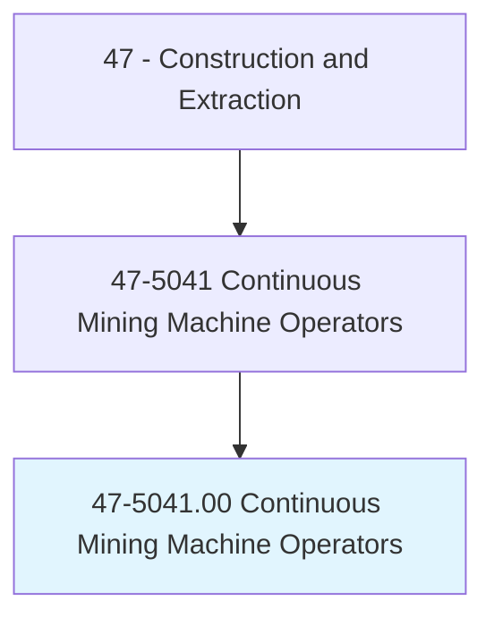
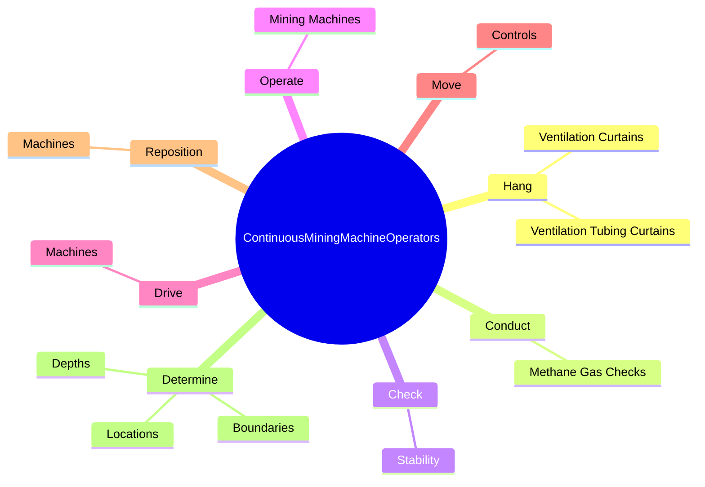
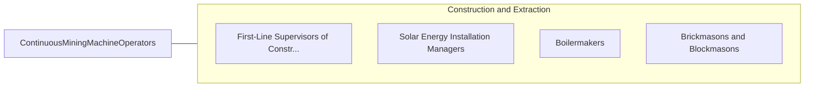

# Continuous Mining Machine Operators

> Operate self-propelled mining machines that rip coal, metal and nonmetal ores, rock, stone, or sand from the mine face and load it onto conveyors, shuttle cars, or trucks in a continuous operation.

## Overview

Continuous Mining Machine Operators is classified under Construction and Extraction (SOC 47). Operate self-propelled mining machines that rip coal, metal and nonmetal ores, rock, stone, or sand from the mine face and load it onto conveyors, shuttle cars, or trucks in a continuous operation.

## Classification Hierarchy

## Key Statistics

| Metric | Value |
|--------|-------|
| SOC Code | 47-5041.00 |
| Category | [Construction and Extraction](/occupations/Construction) |
| Task Count | 42 |
| Source | O*NET |

## Core Tasks

### hang.VentilationTubingCurtains

Continuous Mining Machine Operators hang ventilation tubing curtains as part of their core responsibilities.

**Actions:**
- `hang.VentilationTubingCurtains.to.ensure.MiningFaceAreaIsKeptProperlyVentilated`
- `hang.VentilationCurtains.to.ensure.MiningFaceAreaIsKeptProperlyVentilated`

### conduct.MethaneGasChecks

Continuous Mining Machine Operators conduct methane gas checks as part of their core responsibilities.

**Actions:**
- `conduct.MethaneGasChecks.to.ensure.BreathingQualityOfAir`

### check.Stability

Continuous Mining Machine Operators check stability as part of their core responsibilities.

**Actions:**
- `check.Stability.of.RoofSupportSystemsBeforeMiningFaceAreas`
- `check.Stability.of.RibSupportSystemsBeforeMiningFaceAreas`

## Skills & Competencies

### Technical Skills
- **Construction Methods** - Advanced
- **Blueprint Reading** - Advanced
- **Safety Compliance** - Advanced

### Soft Skills
- **Communication** - Essential
- **Problem Solving** - Essential
- **Critical Thinking** - Important
- **Teamwork** - Important
- **Adaptability** - Important

## Related Occupations

## Industries

This occupation is found across multiple industries. See [Industries](/industries) for sector-specific employment data.

## Career Progression

---

*Source: O*NET 47-5041.00 - ONETOccupation*
