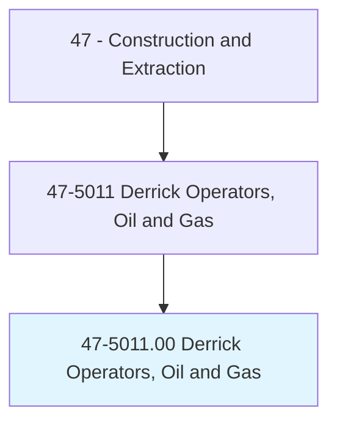
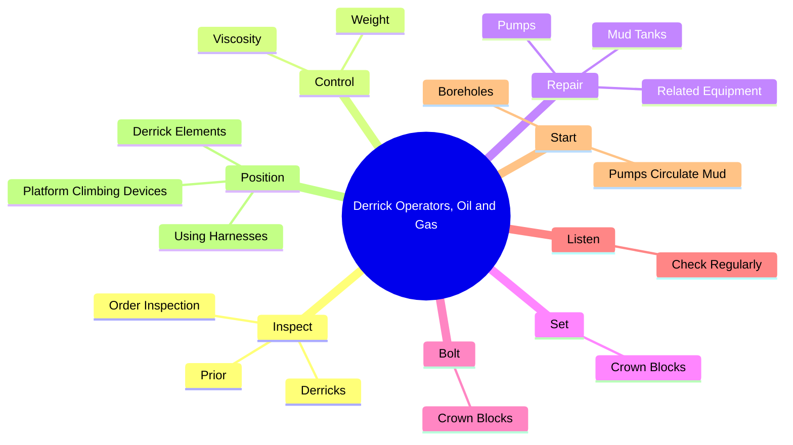
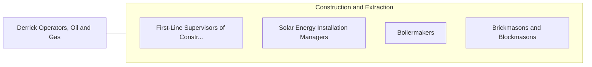

# Derrick Operators, Oil and Gas

> Rig derrick equipment and operate pumps to circulate mud or fluid through drill hole.

## Overview

Derrick Operators, Oil and Gas is classified under Construction and Extraction (SOC 47). Rig derrick equipment and operate pumps to circulate mud or fluid through drill hole.

## Classification Hierarchy

## Key Statistics

| Metric | Value |
|--------|-------|
| SOC Code | 47-5011.00 |
| Category | [Construction and Extraction](/occupations/Construction) |
| Task Count | 41 |
| Source | O*NET |

## Core Tasks

### inspect.Derricks

Derrick Operators, Oil and Gas inspect derricks as part of their core responsibilities.

**Actions:**
- `inspect.Derricks.to.BeingRaised`
- `inspect.Derricks.to.lowered`
- `inspect.OrderInspection.to.BeingRaised`
- `inspect.OrderInspection.to.lowered`

### control.Viscosity

Derrick Operators, Oil and Gas control viscosity as part of their core responsibilities.

**Actions:**
- `control.Viscosity.of.DrillingFluid`
- `control.Weight.of.DrillingFluid`

### repair.Pumps

Derrick Operators, Oil and Gas repair pumps as part of their core responsibilities.

**Actions:**
- `repair.Pumps`
- `repair.MudTanks`
- `repair.RelatedEquipment`

## Skills & Competencies

### Technical Skills
- **Construction Methods** - Advanced
- **Blueprint Reading** - Advanced
- **Safety Compliance** - Advanced

### Soft Skills
- **Communication** - Essential
- **Problem Solving** - Essential
- **Critical Thinking** - Important
- **Teamwork** - Important
- **Adaptability** - Important

## Related Occupations

## Industries

This occupation is found across multiple industries. See [Industries](/industries) for sector-specific employment data.

## Career Progression

---

*Source: O*NET 47-5011.00 - ONETOccupation*
