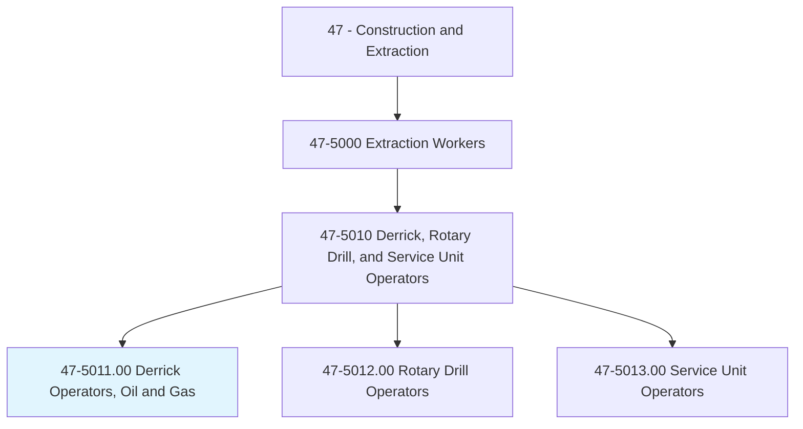
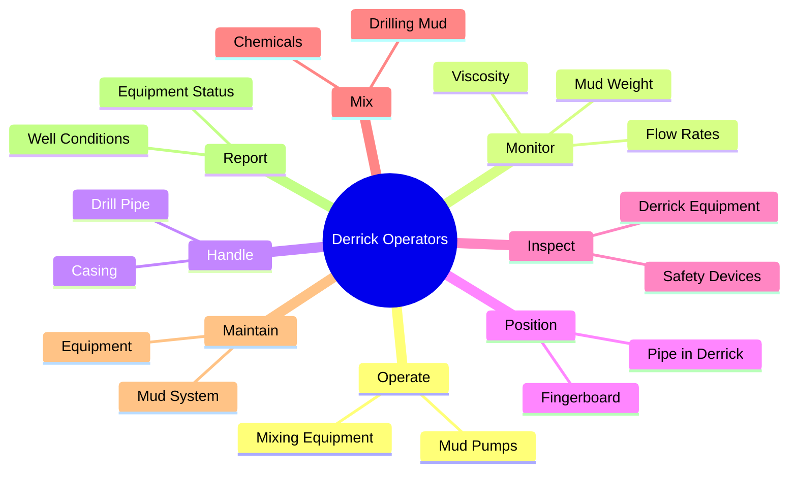
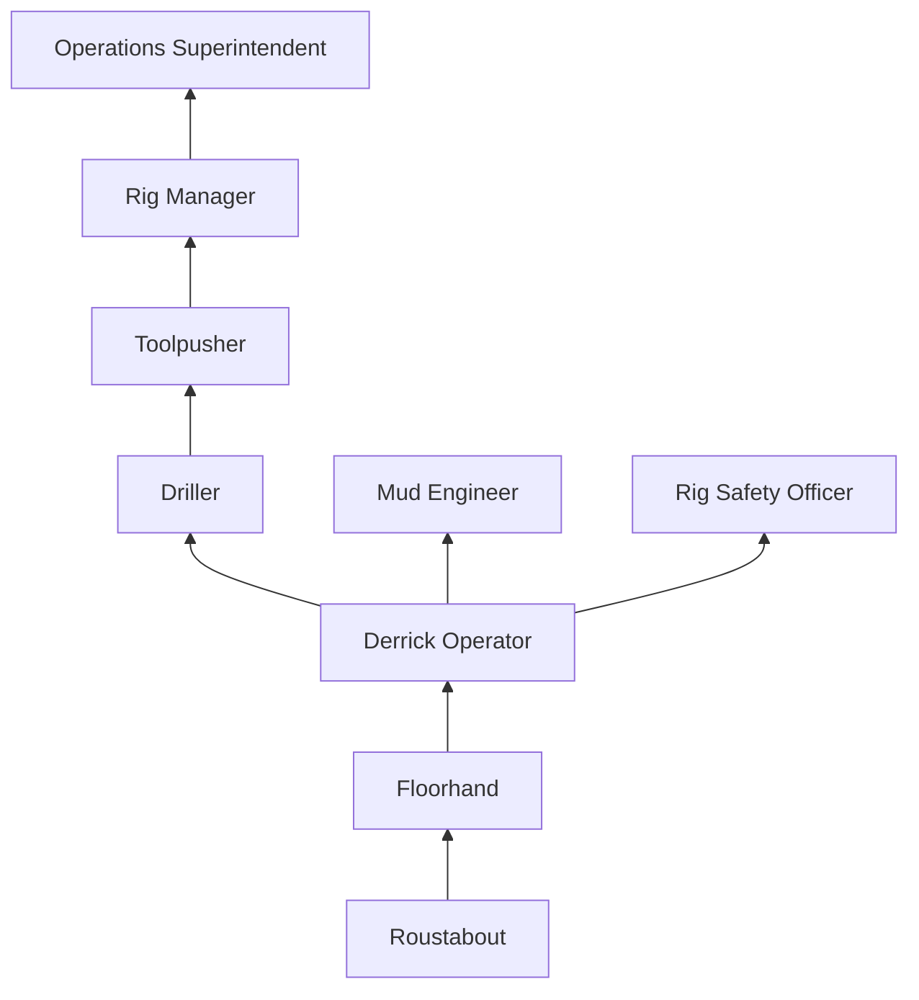
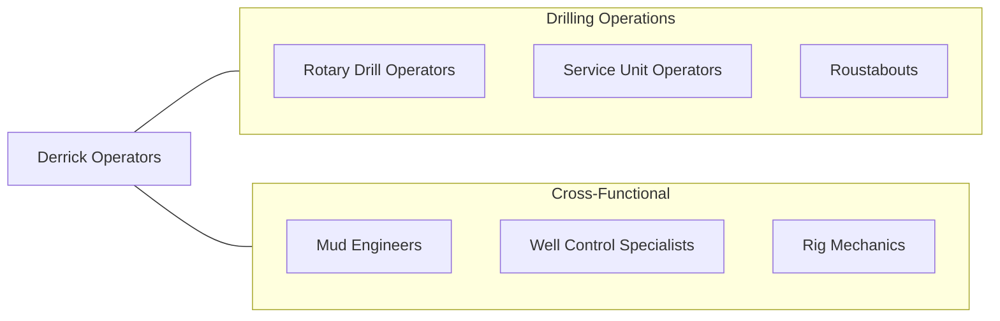

# Derrick Operators, Oil and Gas

> Rig derrick equipment and operate pumps to circulate mud through drill hole.

## Overview

Derrick Operators work on oil and gas drilling rigs, positioned high on the derrick (the tall structure above the rig floor) where they handle the upper end of drill pipe strings during drilling, tripping, and casing operations. They are responsible for racking pipe in the derrick, operating mud pumps, and monitoring the mud system that lubricates the drill bit, removes cuttings, and maintains wellbore pressure. This is one of the most physically demanding and dangerous positions on a drilling rig.

Working at heights of 90 feet or more on the monkeyboard platform, derrick operators guide drill pipe sections into and out of the fingerboard while the drawworks raises and lowers the drill string. They must maintain balance and coordination while handling heavy pipe in all weather conditions, including wind, rain, ice, and extreme heat. Modern rigs are increasingly adopting automated pipe handling systems, but many operations still require manual derrick work.

Derrick operators also serve as the primary operators of the mud system, monitoring mud weight, viscosity, and flow rates. The drilling fluid system is critical to well control: maintaining proper mud weight prevents blowouts, and the derrick operator's vigilance in monitoring returns is essential to early kick detection. This dual responsibility of pipe handling and mud system management makes the derrick operator one of the most skilled positions on the rig floor crew.

## Classification Hierarchy

## Key Statistics

| Metric | Value |
|--------|-------|
| SOC Code | 47-5011.00 |
| Job Zone | 2 (Some Preparation) |
| Category | [Construction and Extraction](/occupations/Construction/index) |
| Task Count | 72 |
| Median Salary | $46,800 / year |
| Employment | ~16,000 |
| Job Outlook | -3% (Decline) |
| Physical Demands | Very Heavy |
| Source | O*NET |

## Core Tasks

### operate.MudPumps

Derrick Operators manage the drilling fluid circulation system.

**Actions:**
- `operate.MudPumps.to.circulate.DrillingFluid`
- `operate.MixingEquipment.to.prepare.DrillingMud`
- `operate.ShakerScreens.to.remove.Cuttings`

### handle.DrillPipe

Derrick Operators handle pipe from the monkeyboard platform during tripping operations.

**Actions:**
- `handle.DrillPipe.on.Monkeyboard`
- `handle.Casing.during.CasingOperations`
- `position.Pipe.in.Fingerboard`

## Skills & Competencies

### Technical Skills
- **Drilling Fluid Systems** - Expert
- **Pipe Handling** - Expert
- **Well Control Awareness** - Advanced
- **Pump Operations** - Advanced
- **Derrick Equipment** - Expert
- **Mud Chemistry Basics** - Intermediate
- **Hydraulic Systems** - Intermediate

### Trade-Specific Skills
- **Monkeyboard Work** - Working at height on derrick platform
- **Mud Weight Monitoring** - Continuous wellbore pressure management
- **Kick Detection** - Recognizing early signs of well control events
- **Pipe Racking** - Efficient and safe pipe handling in the derrick
- **Cold/Hot Weather Operations** - Rig operations in extreme conditions

### Soft Skills
- **Physical Stamina** - Critical
- **Heights Comfort** - Critical
- **Situational Awareness** - Critical
- **Teamwork** - Critical
- **Communication** - Essential

## Education & Certifications

| Requirement | Details |
|-------------|---------|
| Typical Education | High school diploma or equivalent |
| On-the-Job Training | 6-12 months as floorhand first |
| Well Control Training | Required |
| Rig-Specific Training | Company-provided |

### Certifications
- **IADC WellSharp** - Well control certification (formerly WellCAP)
- **SafeLand/SafeGulf** - Orientation safety training
- **H2S Alive** - Hydrogen sulfide awareness
- **First Aid/CPR** - Required
- **OSHA 10-Hour General Industry** - Safety certification
- **Fall Protection Certification** - Required for derrick work
- **Rig Pass** - IADC accredited training

## Career Progression

## Specializations

### Land Drilling
- Conventional land rigs
- Pad drilling operations
- Remote location operations

### Offshore Drilling
- Jack-up rigs
- Semi-submersible platforms
- Drillships

### Directional and Horizontal
- Extended-reach drilling support
- Managed pressure drilling
- Complex well profiles

## Tools & Equipment

### Derrick Equipment
- Monkeyboard and safety harness
- Fingerboard (pipe racking system)
- Safety climbing devices
- Wind walls and enclosures

### Mud System Equipment
- Mud pumps (triplex)
- Shale shakers
- Mud mixers and hoppers
- Mud balance and viscosity cups
- Degassers and desanders

### Personal Equipment
- Full body harness and lanyard
- Hard hat with chin strap
- Steel-toed boots (slip-resistant)
- Fire-retardant coveralls (FRC)
- Safety glasses and hearing protection

## Safety Considerations

- **Falls from Height** - Working 90+ feet up; full fall arrest required at all times
- **Caught-Between Hazards** - Pipe handling in tight spaces
- **Well Control Events** - Blowout risk; kick detection vigilance
- **H2S Exposure** - Hydrogen sulfide gas (immediately dangerous to life)
- **Extreme Weather** - Wind, ice, heat exposure on exposed platform
- **Fatigue** - 12-hour shifts, 14-21 day rotations
- **Noise** - Constant rig noise; hearing protection mandatory
- **Struck-By Hazards** - Falling objects from derrick; exclusion zones

## Related Occupations

## Industries

- [Oil and Gas Extraction](/industries/OilGasExtraction) - Primary Employment
- [Drilling Oil and Gas Wells](/industries/DrillingServices) - Primary Employment
- [Support Activities for Mining](/industries/MiningSupport) - Moderate Employment

## Departments

This occupation typically works in:
- [Drilling Operations](/departments/DrillingOps)
- [Rig Crew](/departments/RigCrew)
- [Mud Systems](/departments/MudSystems)
- [Safety](/departments/Safety)

---

*Source: O*NET 47-5011.00 - ONETOccupation*
