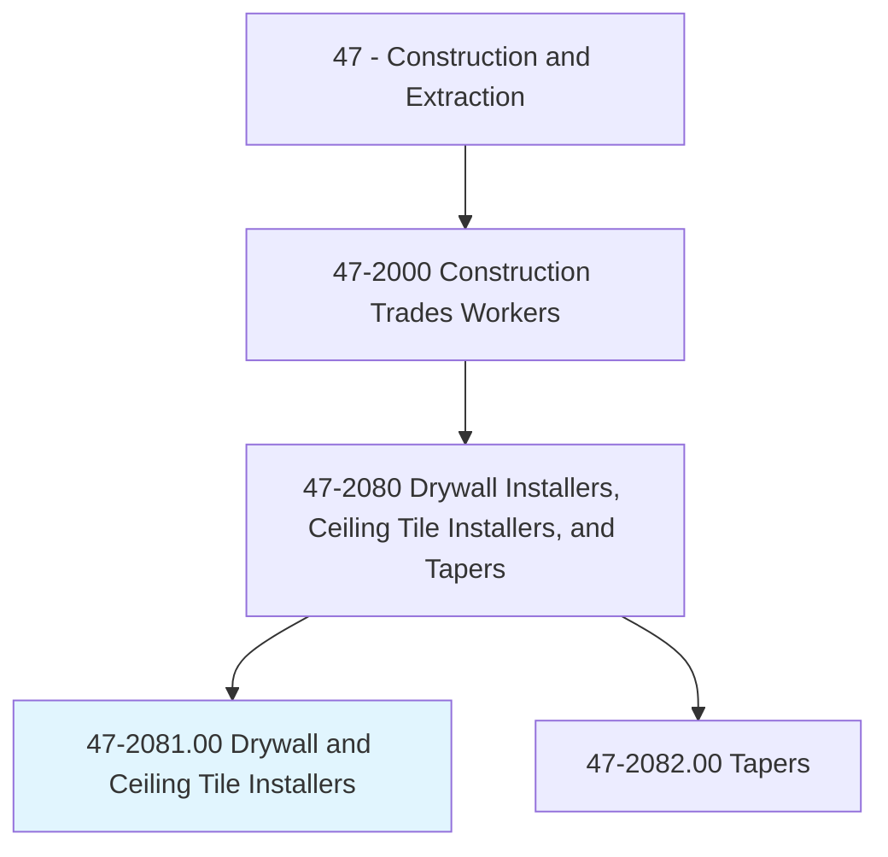
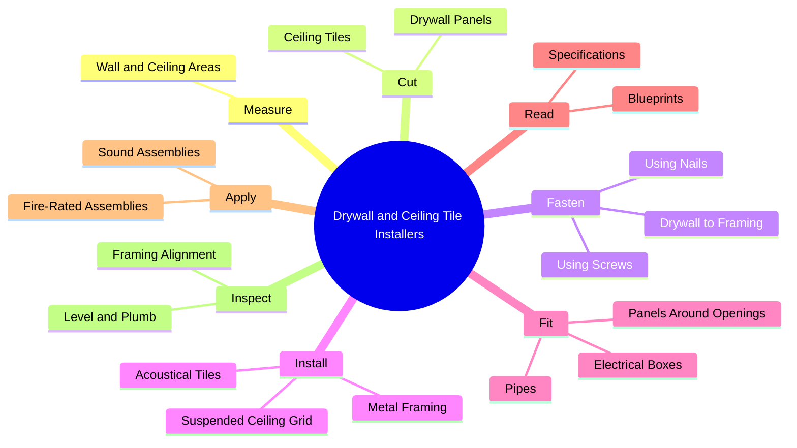
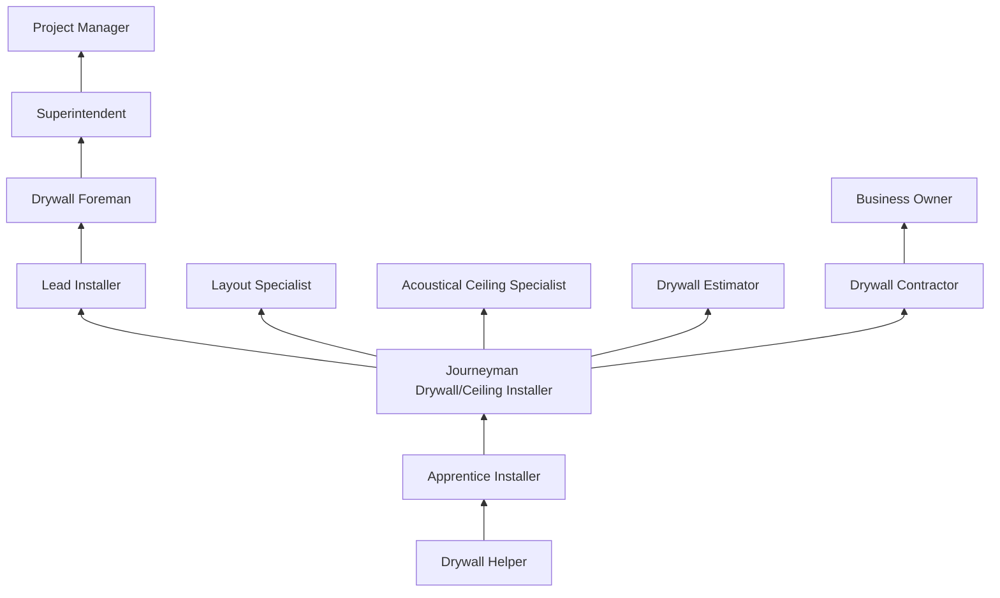
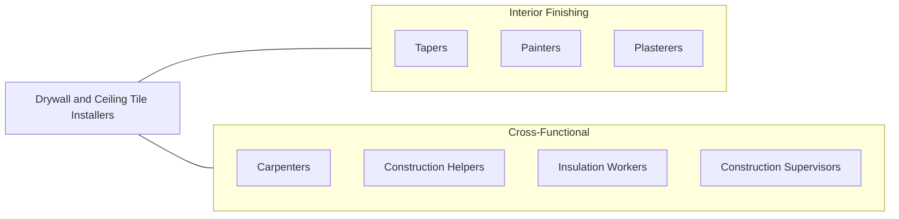

# Drywall and Ceiling Tile Installers

> Apply plasterboard or other wallboard to ceilings or interior walls of buildings. Apply or mount acoustical tiles or blocks, strips, or sheets of shock-absorbing materials to ceilings and walls of buildings to reduce or reflect sound. Materials may be of decorative quality. Includes lathers who fasten wooden, metal, or rockboard lath to walls, ceilings or partitions of buildings to provide support base for plaster, fire-proofing, or acoustical material.

## Overview

Drywall and Ceiling Tile Installers are construction trade workers who fasten wallboard panels to interior frameworks of buildings and install suspended ceiling systems. Drywall installation is one of the highest-volume interior trades, as virtually every commercial and residential building uses gypsum board for walls and ceilings. The work involves measuring, cutting, and securing large panels (typically 4x8 or 4x12 feet) to wood or metal framing.

The trade encompasses several related specialties: drywall hangers who mount wallboard, ceiling tile installers who create suspended acoustical ceiling systems, and lathers who install metal framing and substrate systems for various wall and ceiling treatments. Each specialty requires distinct skills and techniques. Drywall hangers must lift and position heavy boards overhead, while ceiling tile installers work with precision grid systems that must be perfectly level and square.

Modern drywall installation has expanded beyond standard gypsum board to include moisture-resistant, fire-rated, impact-resistant, and sound-attenuating specialty panels. Ceiling systems now include integrated lighting, HVAC, and technology components. The trade requires understanding of fire-rated assemblies, sound transmission ratings (STC), and building code requirements for various wall and ceiling assemblies.

## Classification Hierarchy

## Key Statistics

| Metric | Value |
|--------|-------|
| SOC Code | 47-2081.00 |
| Job Zone | 2 (Some Preparation) |
| Category | [Construction and Extraction](/occupations/Construction/index) |
| Task Count | 135 |
| Median Salary | $49,700 / year |
| Employment | ~100,000 |
| Job Outlook | 2% (Slower than average) |
| Physical Demands | Heavy |
| Source | O*NET |

## Core Tasks

### fasten.DrywallToFraming

Installers secure gypsum wallboard to structural framing using fasteners.

**Actions:**
- `fasten.Drywall.to.WoodFraming.using.Screws`
- `fasten.Drywall.to.MetalStuds.using.Screws`
- `fasten.Drywall.to.Ceilings.using.ScrewGuns`

### install.SuspendedCeilingGrid

Installers create level grid systems for acoustical ceiling tile.

**Actions:**
- `install.SuspendedCeilingGrid.using.LaserLevel`
- `install.AcousticalTiles.in.GridSystem`
- `install.MainRunners.and.CrossTees`

### cut.DrywallPanels

Installers measure and cut gypsum panels to fit spaces and navigate obstacles.

**Actions:**
- `cut.DrywallPanels.to.fit.Dimensions`
- `cut.DrywallPanels.around.ElectricalBoxes`
- `cut.CeilingTiles.to.fit.GridPattern`

## Skills & Competencies

### Technical Skills
- **Drywall Hanging** - Expert
- **Suspended Ceiling Systems** - Expert
- **Metal Stud Framing** - Advanced
- **Blueprint Reading** - Intermediate
- **Fire-Rated Assembly Knowledge** - Advanced
- **Layout and Measurement** - Expert
- **Power Tool Operation** - Expert
- **Acoustical Design Basics** - Intermediate

### Trade-Specific Skills
- **Board Lifting and Positioning** - Manual and mechanical methods
- **Specialty Board Installation** - Fire-rated, moisture-resistant, impact-resistant
- **Curved Wall Construction** - Flexible drywall and framing
- **Ceiling Grid Layout** - Complex patterns and soffits
- **Access Panel and Hatch Installation** - Fire-rated and non-rated

### Soft Skills
- **Physical Stamina** - Critical
- **Teamwork** - Critical (panel lifting requires partners)
- **Attention to Detail** - Essential
- **Problem Solving** - Essential
- **Time Management** - Essential

## Education & Certifications

| Requirement | Details |
|-------------|---------|
| Typical Education | High school diploma or equivalent |
| Apprenticeship | 3-4 year apprenticeship (Carpenters Union or UBC) |
| On-the-Job Training | 4,000-6,000 hours |
| Classroom Training | 144+ hours/year during apprenticeship |

### Certifications
- **OSHA 10-Hour Construction** - Required safety certification
- **OSHA 30-Hour Construction** - Supervisory certification
- **Scaffold User Certification** - Required for elevated work
- **Aerial Lift Certification** - For scissor lifts and boom lifts
- **AWCI/CISCA Certifications** - Industry association credentials
- **Fire-Rated Assembly Training** - UL/GA certified assemblies

## Career Progression

## Specializations

### Residential Drywall
- Single-family and multi-family hanging
- Standard and specialty boards
- Garage and basement finishing

### Commercial Drywall
- Metal stud framing and board hanging
- Multi-story building interiors
- Fire-rated and sound-rated assemblies
- Shaft wall systems

### Acoustical Ceilings
- Suspended grid systems (2x2, 2x4)
- Direct-mount ceiling tiles
- Specialty ceilings (wood, metal, fabric)
- Cloud and floating ceiling features

### Specialty Applications
- Curved and radius walls
- Demountable partition systems
- Clean room construction
- Theater and studio acoustics

## Tools & Equipment

### Hand Tools
- T-squares and drywall squares
- Utility knives and blades
- Drywall saws (jab saws)
- Rasp and surform tools
- Measuring tapes and chalk lines
- Levels and plumb bobs
- Snips (aviation, straight)

### Power Tools
- Screw guns (drywall-specific)
- Routers (drywall cutout tools)
- Circular saws (for cement board)
- Laser levels (rotary)
- Powder-actuated tools

### Equipment
- Drywall lifts (panel jacks)
- Stilts
- Scaffolding and baker scaffolds
- Scissor lifts
- Material carts and panel carriers

## Safety Considerations

- **Overhead Lifting** - Ceiling work requires lifting heavy boards overhead; mechanical lifts reduce strain
- **Repetitive Motion** - Screw driving and cutting; ergonomic tool selection
- **Dust Exposure** - Cutting and sanding gypsum; respiratory protection
- **Falls** - Working on stilts, scaffolds, and lifts; proper fall protection
- **Struck-By Hazards** - Falling panels during installation
- **Eye Injuries** - Dust, debris, and overhead work; safety glasses required
- **Silica Exposure** - Cutting cement board and specialty panels; OSHA compliance

## Related Occupations

## Industries

- [Drywall and Insulation Contractors](/industries/SpecialtyTrade) - Primary Employment
- [Commercial Building Construction](/industries/CommercialConstruction) - High Employment
- [Residential Building Construction](/industries/ResidentialConstruction) - High Employment
- [Building Finishing Contractors](/industries/FinishingContractors) - High Employment

## Departments

This occupation typically works in:
- [Field Operations](/departments/FieldOperations)
- [Drywall Division](/departments/Drywall)
- [Acoustical Ceilings Division](/departments/Ceilings)
- [Estimating](/departments/Estimating)

---

*Source: O*NET 47-2081.00 - ONETOccupation*
