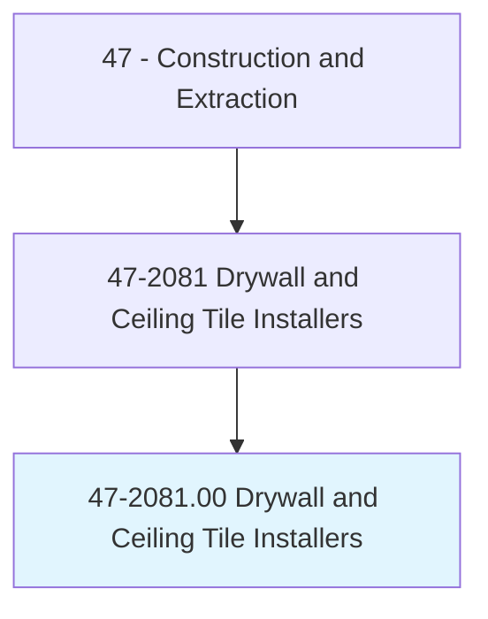
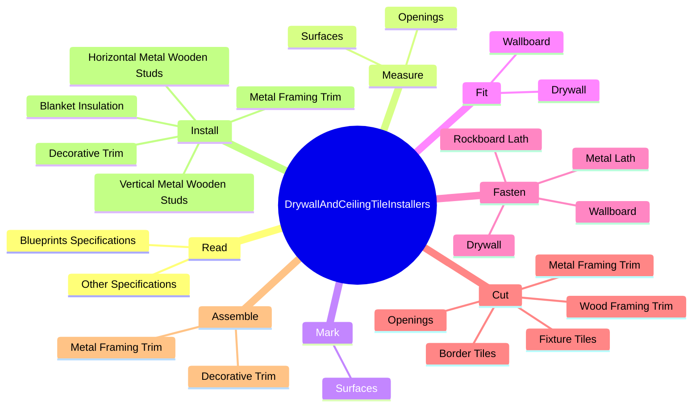
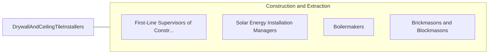

# Drywall and Ceiling Tile Installers

> Apply plasterboard or other wallboard to ceilings or interior walls of buildings. Apply or mount acoustical tiles or blocks, strips, or sheets of shock-absorbing materials to ceilings and walls of buildings to reduce or reflect sound. Materials may be of decorative quality. Includes lathers who fasten wooden, metal, or rockboard lath to walls, ceilings, or partitions of buildings to provide support base for plaster, fireproofing, or acoustical material.

## Overview

Drywall and Ceiling Tile Installers is an occupation within the Construction and Extraction category. Apply plasterboard or other wallboard to ceilings or interior walls of buildings. Apply or mount acoustical tiles or blocks, strips, or sheets of shock-absorbing materials to ceilings and walls of buildings to reduce or reflect sound.

## Classification Hierarchy

## Key Statistics

| Metric | Value |
|--------|-------|
| SOC Code | 47-2081.00 |
| Category | [Construction and Extraction](/occupations/Construction/index) |
| Task Count | 173 |
| Source | O*NET |

## Core Tasks

### read.BlueprintsSpecifications

Drywall and Ceiling Tile Installers read blueprints specifications as part of their core responsibilities.

**Actions:**
- `read.BlueprintsSpecifications.to.determine.MethodsOfInstallation`
- `read.BlueprintsSpecifications.to.work.Procedures`
- `read.BlueprintsSpecifications.to.MaterialRequirements`
- `read.BlueprintsSpecifications.to.ToolRequirements`

### measure.Surfaces

Drywall and Ceiling Tile Installers measure surfaces as part of their core responsibilities.

**Actions:**
- `measure.Surfaces.to.lay.OutWork`
- `measure.Surfaces.to.AccordingToBlueprints`
- `measure.Surfaces.to.Drawings`
- `measure.Surfaces.to.UsingTapeMeasures`

### mark.Surfaces

Drywall and Ceiling Tile Installers mark surfaces as part of their core responsibilities.

**Actions:**
- `mark.Surfaces.to.lay.OutWork`
- `mark.Surfaces.to.AccordingToBlueprints`
- `mark.Surfaces.to.Drawings`
- `mark.Surfaces.to.UsingTapeMeasures`

## Skills & Competencies

### Technical Skills
- **Construction Methods** - Advanced
- **Blueprint Reading** - Advanced
- **Safety Compliance** - Advanced

### Soft Skills
- **Communication** - Essential
- **Problem Solving** - Essential
- **Critical Thinking** - Important
- **Teamwork** - Important
- **Adaptability** - Important

## Related Occupations

## Industries

This occupation is found across multiple industries. See [Industries](/industries) for sector-specific employment data.

## Career Progression

---

*Source: O*NET 47-2081.00 - ONETOccupation*
