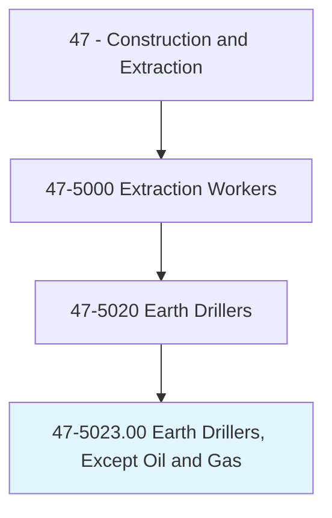
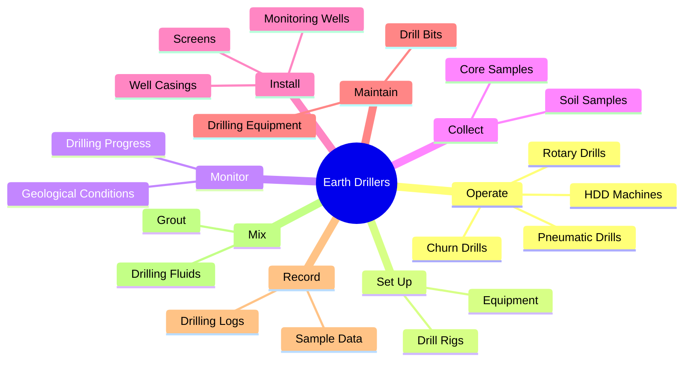
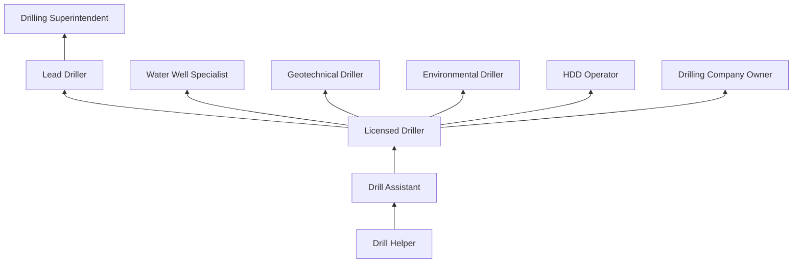
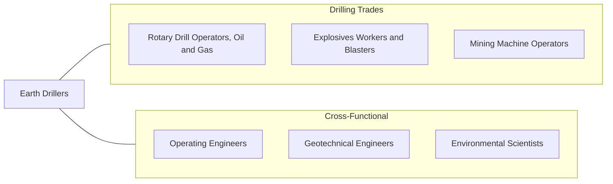

# Earth Drillers, Except Oil and Gas

> Operate a variety of drills such as rotary, churn, and pneumatic to tap sub-surface water and salt deposits, to remove core samples during mineral exploration or soil testing, and to facilitate the use of explosives in mining or construction. Includes horizontal and earth boring machine operators.

## Overview

Earth Drillers operate drilling equipment used in a wide range of applications beyond oil and gas extraction. Their work spans water well drilling, environmental monitoring well installation, geotechnical soil investigation, mineral exploration core drilling, foundation drilling, horizontal directional drilling (HDD), and blasthole drilling for construction and mining. Each application requires different equipment, techniques, and geological knowledge.

Water well drillers are among the most common specialists in this occupation, using rotary, cable tool, or air hammer rigs to access underground aquifers. Geotechnical drillers collect soil and rock samples that engineers use to design foundations, retaining walls, and earth-retention systems. Environmental drillers install monitoring wells and remediation systems at contaminated sites, working under strict regulatory protocols. Horizontal directional drillers install underground utilities without open-cut excavation.

The trade requires a strong understanding of geology, hydrogeology, and subsurface conditions. Drillers must read geological formations through feel, sound, and drilling performance, adjusting techniques as they encounter different soil and rock types. The work involves operating and maintaining complex machinery in remote locations, often under difficult terrain and weather conditions.

## Classification Hierarchy

## Key Statistics

| Metric | Value |
|--------|-------|
| SOC Code | 47-5023.00 |
| Job Zone | 2 (Some Preparation) |
| Category | [Construction and Extraction](/occupations/Construction/index) |
| Task Count | 105 |
| Median Salary | $48,800 / year |
| Employment | ~20,000 |
| Job Outlook | 6% (Faster than average) |
| Physical Demands | Heavy |
| Source | O*NET |

## Core Tasks

### operate.RotaryDrills

Earth Drillers operate various drilling rigs suited to specific applications.

**Actions:**
- `operate.RotaryDrills.to.tap.SubsurfaceWater`
- `operate.ChurnDrills.to.remove.CoreSamples`
- `operate.PneumaticDrills.to.facilitate.Blasting`
- `operate.HDDMachines.to.install.Utilities`

### collect.CoreSamples

Drillers collect and catalog geological samples for analysis.

**Actions:**
- `collect.CoreSamples.during.MineralExploration`
- `collect.SoilSamples.for.GeotechnicalAnalysis`
- `collect.WaterSamples.for.QualityTesting`

## Skills & Competencies

### Technical Skills
- **Drill Rig Operation** - Expert
- **Geology and Hydrogeology** - Advanced
- **Well Completion Techniques** - Expert
- **Sample Collection** - Advanced
- **Equipment Maintenance** - Advanced
- **Drilling Fluid Management** - Advanced
- **Blueprint and Survey Reading** - Intermediate
- **CDL Driving** - Required for rig transport

### Trade-Specific Skills
- **Water Well Drilling** - Rotary, cable tool, air methods
- **Geotechnical Drilling** - SPT, Shelby tube, rock coring
- **Environmental Drilling** - Monitoring well installation, regulatory compliance
- **HDD Operations** - Horizontal directional drilling for utility installation
- **Foundation Drilling** - Caisson and micropile drilling

### Soft Skills
- **Mechanical Aptitude** - Critical
- **Problem Solving** - Essential
- **Physical Stamina** - Critical
- **Independence** - Essential (remote site work)
- **Communication** - Essential

## Education & Certifications

| Requirement | Details |
|-------------|---------|
| Typical Education | High school diploma or equivalent |
| On-the-Job Training | 1-2 years |
| State Licensing | Required in most states (water well drillers) |
| CDL | Class A or B commercial driver's license |

### Certifications
- **State Well Driller License** - Required for water well drilling
- **NGWA Certified Driller** - National Ground Water Association
- **OSHA 10-Hour Construction** - Safety certification
- **OSHA 40-Hour HAZWOPER** - For environmental drilling
- **CDL Class A/B** - Commercial vehicle operation
- **First Aid/CPR** - Required
- **Confined Space Entry** - For well and shaft work

## Career Progression

## Specializations

### Water Well Drilling
- Residential and municipal wells
- Irrigation wells
- Geothermal wells
- Well rehabilitation and redevelopment

### Geotechnical Investigation
- Soil boring and sampling
- Rock core drilling
- Foundation design support
- Slope stability investigation

### Environmental Drilling
- Monitoring well installation
- Soil and groundwater remediation
- Phase II site assessments
- Regulatory compliance drilling

### Horizontal Directional Drilling
- Utility crossings (roads, rivers)
- Fiber optic and telecommunications
- Water and sewer installations
- Pipeline installations

## Tools & Equipment

### Drilling Equipment
- Rotary drill rigs (truck-mounted, track-mounted)
- Cable tool (percussion) rigs
- Air rotary rigs
- HDD machines (Vermeer, Ditch Witch)
- Sonic drill rigs
- Auger drill rigs

### Downhole Tools
- Drill bits (tricone, drag, PDC, diamond core)
- Drill rods and casing
- Split spoon and Shelby tube samplers
- Well screens and casings
- Grout and bentonite

### Support Equipment
- Mud pumps and mixing tanks
- Air compressors
- Water trucks
- Crane trucks for rig setup
- Logging and testing instruments

## Safety Considerations

- **Caught-In/Between Hazards** - Rotating drill strings; lockout/tagout procedures
- **Struck-By Hazards** - Overhead equipment, falling tools
- **Electrical Hazards** - Overhead power lines near drill rigs
- **Noise** - High noise levels from drilling operations; hearing protection
- **Silica Dust** - Dry drilling operations; respiratory protection
- **Confined Space** - Well and shaft entry
- **Unstable Ground** - Rig setup on soft or sloped terrain
- **Chemical Exposure** - Drilling fluids, contaminated soils (environmental drilling)

## Related Occupations

## Industries

- [Water Well Drilling](/industries/WaterWellDrilling) - Primary Employment
- [Geotechnical Engineering Services](/industries/EngineeringServices) - High Employment
- [Environmental Remediation](/industries/EnvironmentalServices) - Moderate Employment
- [Foundation and Utility Construction](/industries/SpecialtyTrade) - Moderate Employment
- [Mining Support Services](/industries/MiningSupport) - Moderate Employment

## Departments

This occupation typically works in:
- [Drilling Operations](/departments/DrillingOps)
- [Field Operations](/departments/FieldOperations)
- [Geotechnical Division](/departments/Geotechnical)
- [Environmental Division](/departments/Environmental)

---

*Source: O*NET 47-5023.00 - ONETOccupation*
