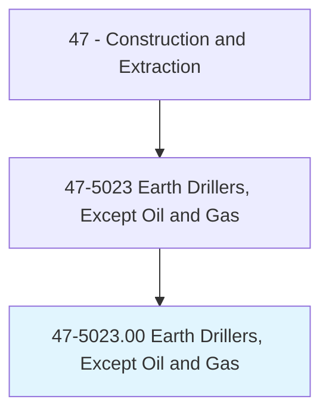
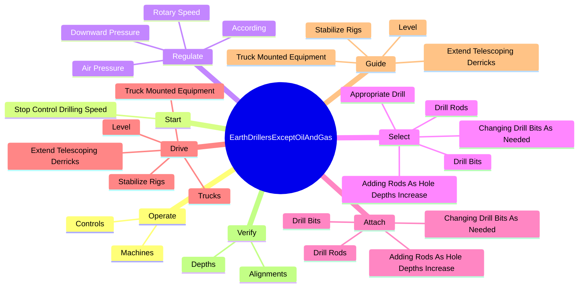
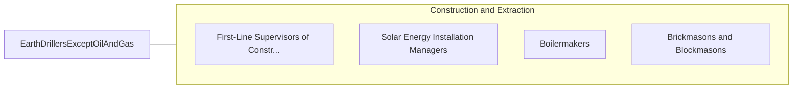

# Earth Drillers, Except Oil and Gas

> Operate a variety of drills such as rotary, churn, and pneumatic to tap subsurface water and salt deposits, to remove core samples during mineral exploration or soil testing, and to facilitate the use of explosives in mining or construction. Includes horizontal and earth boring machine operators.

## Overview

Earth Drillers, Except Oil and Gas is an occupation within the Construction and Extraction category. Operate a variety of drills such as rotary, churn, and pneumatic to tap subsurface water and salt deposits, to remove core samples during mineral exploration or soil testing, and to facilitate the use of explosives in mining or construction. 

## Classification Hierarchy

## Key Statistics

| Metric | Value |
|--------|-------|
| SOC Code | 47-5023.00 |
| Category | [Construction and Extraction](/occupations/Construction) |
| Task Count | 117 |
| Source | O*NET |

## Core Tasks

### operate.Controls

Earth Drillers, Except Oil and Gas operate controls as part of their core responsibilities.

**Actions:**
- `operate.Controls.to.stabilize.MachinesPositionAlignDrills`
- `operate.Controls.to.ToPositionAlignDrills`
- `operate.Machines.to.flush.EarthCuttingsBlowDustFromHoles`
- `operate.Machines.to.ToBlowDustFromHoles`

### start.StopControlDrillingSpeed

Earth Drillers, Except Oil and Gas start stop control drilling speed as part of their core responsibilities.

**Actions:**
- `start.StopControlDrillingSpeed.of.MachinesInsertion.of.CasingsIntoHoles`

### regulate.AirPressure

Earth Drillers, Except Oil and Gas regulate air pressure as part of their core responsibilities.

**Actions:**
- `regulate.AirPressure.to.type.OfRockBeingDrilled`
- `regulate.AirPressure.to.ConcreteBeingDrilled`
- `regulate.RotarySpeed.to.type.OfRockBeingDrilled`
- `regulate.RotarySpeed.to.ConcreteBeingDrilled`

## Skills & Competencies

### Technical Skills
- **Construction Methods** - Advanced
- **Blueprint Reading** - Advanced
- **Safety Compliance** - Advanced

### Soft Skills
- **Communication** - Essential
- **Problem Solving** - Essential
- **Critical Thinking** - Important
- **Teamwork** - Important
- **Adaptability** - Important

## Related Occupations

## Industries

This occupation is found across multiple industries. See [Industries](/industries) for sector-specific employment data.

## Career Progression

---

*Source: O*NET 47-5023.00 - ONETOccupation*
