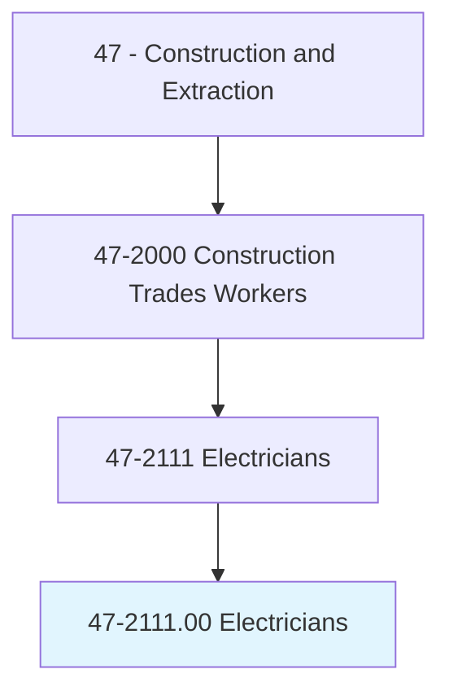
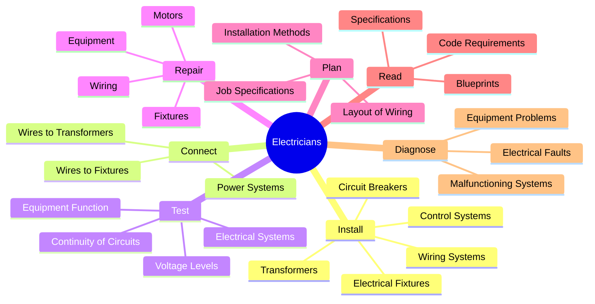
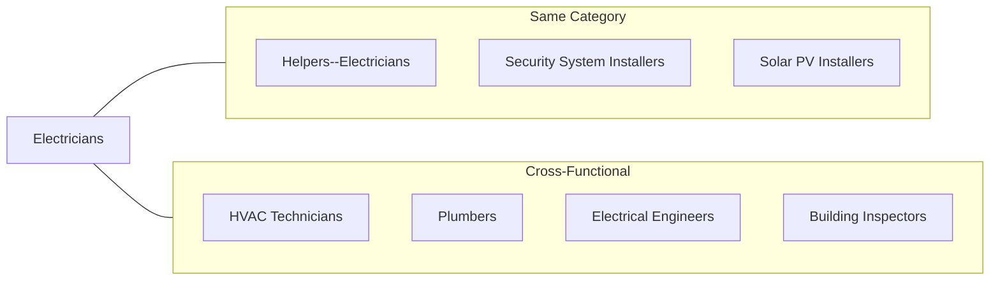
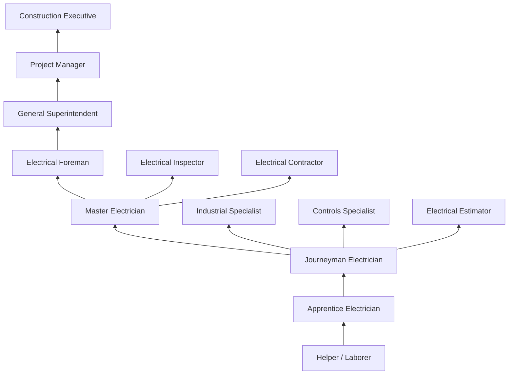

# Electricians

> Install, maintain, and repair electrical wiring, equipment, and fixtures. Ensure that work is in accordance with relevant codes. May install or service street lights, intercom systems, or electrical control systems.

## Overview

Electricians are highly skilled tradespeople responsible for the installation, maintenance, and repair of electrical systems in residential, commercial, and industrial settings. This critical occupation requires extensive knowledge of electrical theory, building codes, and safety practices. Electricians work with everything from basic lighting circuits to complex industrial control systems, making them essential to modern construction and infrastructure maintenance. The occupation demands precision, problem-solving ability, and a strong commitment to safety due to the inherent hazards of working with electricity.

## Classification Hierarchy

## Key Statistics

| Metric | Value |
|--------|-------|
| SOC Code | 47-2111.00 |
| Job Zone | 3 (Medium Preparation) |
| Category | [Construction](/occupations/Construction/index) |
| Core Tasks | 15+ |
| Physical Demands | Moderate to Heavy |
| Licensing | Required in most jurisdictions |
| Source | O*NET |

## Core Tasks

### install.WiringSystems

Electricians install and connect electrical wiring throughout buildings and structures.

**Actions:**
- `install.Wiring.in.Buildings` - Run electrical wire through conduit and walls
- `install.ElectricalFixtures.in.Buildings` - Mount lights, outlets, and switches
- `install.ControlSystems.for.Equipment` - Wire automation and control panels
- `install.CircuitBreakers.in.Panels` - Set up electrical protection devices
- `install.Transformers.for.PowerDistribution` - Connect power transformation equipment

### connect.Wires

Electricians make connections between electrical components to create functioning circuits.

**Actions:**
- `connect.Wires.to.Fixtures` - Terminate wires at outlets and fixtures
- `connect.Wires.to.CircuitBreakers` - Make panel connections
- `connect.Wires.to.Transformers` - Complete power distribution circuits
- `splice.Wires.in.JunctionBoxes` - Join wires using approved methods

### test.ElectricalSystems

Electricians verify proper function and safety of electrical installations.

**Actions:**
- `test.ElectricalSystems.for.Continuity` - Verify complete circuits
- `test.Circuits.for.VoltageLevel` - Measure electrical potential
- `test.Equipment.for.ProperFunction` - Confirm operational status
- `use.TestingEquipment.to.Diagnose.Problems` - Employ meters and analyzers

### repair.ElectricalEquipment

Electricians troubleshoot and fix electrical problems in existing systems.

**Actions:**
- `repair.Wiring.in.Buildings` - Fix damaged or faulty wiring
- `repair.ElectricalEquipment.to.RestoreFunction` - Return equipment to service
- `replace.DefectiveComponents.in.Systems` - Swap out failed parts
- `repair.Motors.for.IndustrialEquipment` - Service rotating machinery

### plan.ElectricalLayout

Electricians plan the arrangement of electrical systems based on specifications.

**Actions:**
- `plan.Layout.of.ElectricalWiring` - Design wire routing
- `plan.Installation.using.Specifications` - Follow engineering designs
- `determine.MaterialRequirements.for.Jobs` - Calculate wire, conduit, devices needed

### read.Blueprints

Electricians interpret technical drawings and code requirements.

**Actions:**
- `read.Blueprints.to.determine.Locations` - Identify fixture and equipment positions
- `read.Specifications.to.understand.Requirements` - Follow design criteria
- `follow.ElectricalCode.for.Compliance` - Ensure NEC adherence

## Specializations

### Residential Electrician
- Home wiring and service upgrades
- Lighting and outlet installation
- Appliance circuit installation
- Smart home and automation systems
- Generator installation

### Commercial Electrician
- Office and retail building wiring
- Commercial lighting systems
- Fire alarm and security systems
- HVAC electrical connections
- Tenant improvements

### Industrial Electrician
- Motor control systems
- PLC programming and installation
- High-voltage distribution
- Industrial machinery wiring
- Process control systems

### Low-Voltage Technician
- Data and communication cabling
- Security and access control
- Audio-visual systems
- Fire alarm systems
- Nurse call systems

### Lineman / Outside Electrician
- Power distribution lines
- Transformer installation
- Substation work
- Overhead and underground utilities
- Street lighting

## Skills & Competencies

### Technical Skills
- **Electrical Theory** - Expert
- **National Electrical Code (NEC)** - Expert
- **Blueprint Reading** - Expert
- **Circuit Analysis** - Expert
- **Testing and Troubleshooting** - Expert
- **Motor Controls** - Advanced
- **PLC Systems** - Advanced (Industrial)
- **Mathematics** - Advanced

### Soft Skills
- **Attention to Detail** - Critical
- **Problem Solving** - Critical
- **Safety Awareness** - Critical
- **Communication** - Essential
- **Customer Service** - Important
- **Time Management** - Essential

## Related Occupations

## Industries

- [Construction](/industries/Construction/index) - High Employment
- [Specialty Trade Contractors](/industries/SpecialtyTrade) - High Employment
- [Self-Employed](/industries/SelfEmployed) - High Employment
- [Manufacturing](/industries/Manufacturing/index) - Moderate Employment
- [Government](/industries/Government) - Moderate Employment
- [Utilities](/industries/Utilities/index) - Moderate Employment

## Career Progression

## Apprenticeship Path

| Year | Focus Areas | Hours |
|------|-------------|-------|
| Year 1 | Safety, electrical theory, basic wiring, hand tools | 2,000 OJT + 144 classroom |
| Year 2 | Residential wiring, NEC basics, testing procedures | 2,000 OJT + 144 classroom |
| Year 3 | Commercial wiring, motor controls, transformers | 2,000 OJT + 144 classroom |
| Year 4 | Industrial systems, advanced controls, code mastery | 2,000 OJT + 144 classroom |
| Year 5 | Specialized systems, project leadership, exam prep | 2,000 OJT + 144 classroom |

**Total Program**: 4-5 years (8,000-10,000 hours on-the-job training + 576-720 hours classroom instruction)

## Education & Training

| Requirement | Details |
|-------------|---------|
| Typical Education | High school diploma or equivalent |
| Apprenticeship | 4-5 year state-approved program |
| Licensing | Journeyman and Master licenses required |
| Continuing Education | Required for license renewal |

## Licensing Requirements

### Journeyman License
- Completion of approved apprenticeship or equivalent experience
- Passing score on journeyman examination
- Minimum 8,000 hours of supervised work experience
- Demonstrates competency in residential and commercial work

### Master License
- Valid journeyman license for minimum period (typically 2-4 years)
- Passing score on master electrician examination
- Additional work experience (varies by jurisdiction)
- Enables independent contracting and supervision of apprentices

### Electrical Contractor License
- Master electrician license
- Business registration and insurance
- Bond requirements (varies by jurisdiction)
- Enables bidding and performing electrical work

## Certifications

- **State Journeyman License** - Required in most states
- **State Master Electrician License** - Advanced credential
- **OSHA 10-Hour Construction** - Basic safety certification
- **OSHA 30-Hour Construction** - Comprehensive safety certification
- **NFPA 70E Arc Flash Safety** - Electrical safety certification
- **BICSI Installer** - Low-voltage/data cabling
- **NICET Fire Alarm** - Fire alarm systems
- **NABCEP Solar PV Installer** - Solar photovoltaic systems
- **First Aid/CPR/AED** - Emergency response certification

## Safety Requirements

### Personal Protective Equipment
- Safety glasses with side shields
- Hard hat (on construction sites)
- Insulated gloves (voltage-rated)
- Steel-toed boots
- Arc flash rated clothing
- Hearing protection

### Electrical Safety Practices
- Lock-out/tag-out (LOTO) procedures
- Arc flash hazard analysis
- Personal protective equipment selection
- Approach boundaries (Limited, Restricted, Prohibited)
- De-energization and verification
- Grounding and bonding

### Common Hazards
- Electric shock and electrocution
- Arc flash and arc blast
- Falls from ladders and scaffolds
- Burns from hot equipment
- Cuts from tools and materials
- Working in confined spaces

### Required Training
- NFPA 70E electrical safety
- Lock-out/tag-out procedures
- Fall protection
- Ladder safety
- CPR and first aid
- Hazard communication

## Tools & Equipment

### Hand Tools
- Wire strippers
- Lineman's pliers
- Needle-nose pliers
- Side cutters / Diagonal cutters
- Screwdrivers (multiple types)
- Nut drivers
- Cable cutters
- Fish tape
- Conduit benders
- Voltage testers

### Power Tools
- Drill / Impact driver
- Rotary hammer
- Reciprocating saw
- Band saw (portable)
- Hole saw kit
- Knockout punch set
- Threading machine (for conduit)

### Testing Equipment
- Digital multimeter
- Clamp meter
- Circuit tracer
- Megohmmeter (insulation tester)
- Phase rotation meter
- Oscilloscope (advanced)
- Thermal imaging camera

## Code Compliance

### National Electrical Code (NEC)
- NFPA 70 - National Electrical Code
- Updated every three years
- Adopted by states with possible amendments
- Covers wiring methods, equipment, installations

### Related Codes and Standards
- NFPA 70E - Electrical Safety in the Workplace
- NFPA 72 - National Fire Alarm Code
- IEEE Standards for industrial applications
- Local building codes and amendments
- Utility company specifications

## Work Environment

### Physical Demands
- Standing, kneeling, crouching for extended periods
- Working in confined spaces
- Climbing ladders and working at heights
- Lifting materials up to 50 pounds
- Fine motor skills for detailed work

### Work Conditions
- Indoor and outdoor work environments
- Construction sites (new work)
- Occupied buildings (maintenance/repair)
- Industrial facilities
- Variable weather conditions
- Evening/weekend work for emergencies

## Departments

This occupation typically works in:
- [Field Operations](/departments/FieldOperations)
- [Service Department](/departments/Service)
- [Industrial Division](/departments/IndustrialDivision)
- [Low-Voltage Division](/departments/LowVoltage)

## Union Affiliation

Many electricians are members of the International Brotherhood of Electrical Workers (IBEW), which provides:
- Apprenticeship training programs (JATC)
- Job referral services through hiring halls
- Health and pension benefits
- Continuing education and code update training
- Safety training programs
- Jurisdictional representation

---

*Source: O*NET 47-2111.00 - ONETOccupation*
