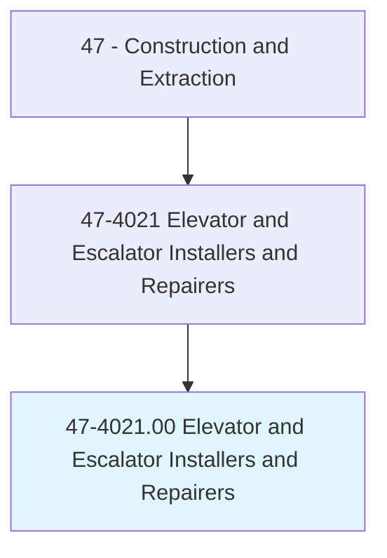
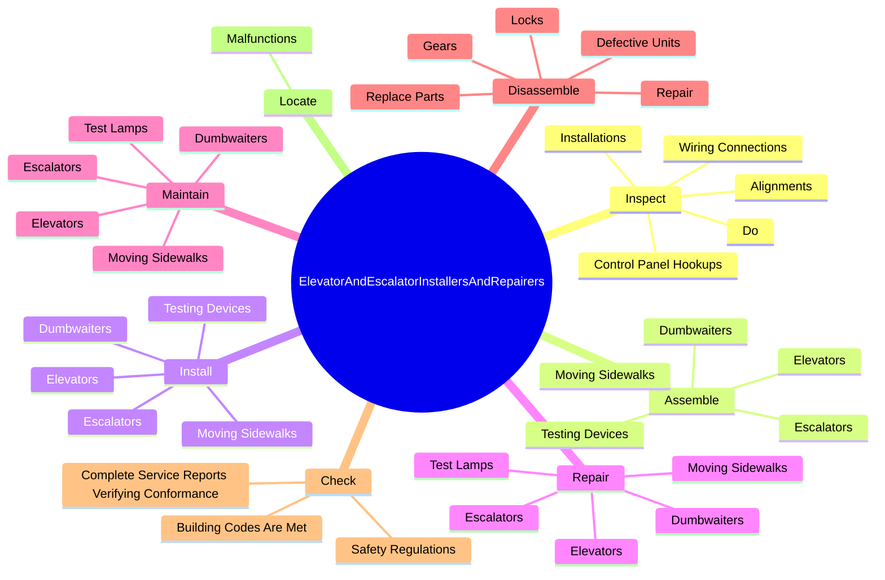
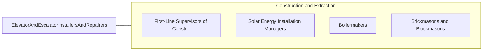

# Elevator and Escalator Installers and Repairers

> Assemble, install, repair, or maintain electric or hydraulic freight or passenger elevators, escalators, or dumbwaiters.

## Overview

Elevator and Escalator Installers and Repairers is classified under Construction and Extraction (SOC 47). Assemble, install, repair, or maintain electric or hydraulic freight or passenger elevators, escalators, or dumbwaiters.

## Classification Hierarchy

## Key Statistics

| Metric | Value |
|--------|-------|
| SOC Code | 47-4021.00 |
| Category | [Construction and Extraction](/occupations/Construction) |
| Task Count | 110 |
| Source | O*NET |

## Core Tasks

### inspect.WiringConnections

Elevator and Escalator Installers and Repairers inspect wiring connections as part of their core responsibilities.

**Actions:**
- `inspect.WiringConnections.of.Cars.to.ensure.EquipmentWillOperateProperly`
- `inspect.WiringConnections.of.Hoistways.to.ensure.EquipmentWillOperateProperly`
- `inspect.ControlPanelHookups.of.Cars.to.ensure.EquipmentWillOperateProperly`
- `inspect.ControlPanelHookups.of.Hoistways.to.ensure.EquipmentWillOperateProperly`

### assemble.Elevators

Elevator and Escalator Installers and Repairers assemble elevators as part of their core responsibilities.

**Actions:**
- `assemble.Elevators`
- `assemble.Escalators`
- `assemble.MovingSidewalks`
- `assemble.Dumbwaiters`

### install.Elevators

Elevator and Escalator Installers and Repairers install elevators as part of their core responsibilities.

**Actions:**
- `install.Elevators`
- `install.Escalators`
- `install.MovingSidewalks`
- `install.Dumbwaiters`

## Skills & Competencies

### Technical Skills
- **Construction Methods** - Advanced
- **Blueprint Reading** - Advanced
- **Safety Compliance** - Advanced

### Soft Skills
- **Communication** - Essential
- **Problem Solving** - Essential
- **Critical Thinking** - Important
- **Teamwork** - Important
- **Adaptability** - Important

## Related Occupations

## Industries

This occupation is found across multiple industries. See [Industries](/industries) for sector-specific employment data.

## Career Progression

---

*Source: O*NET 47-4021.00 - ONETOccupation*
