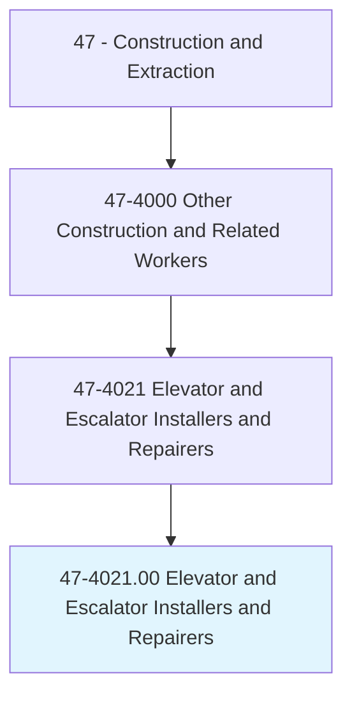
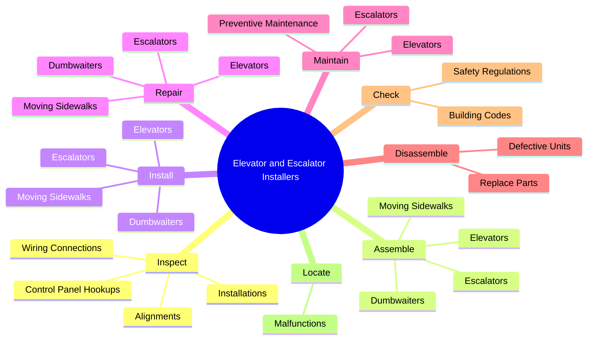
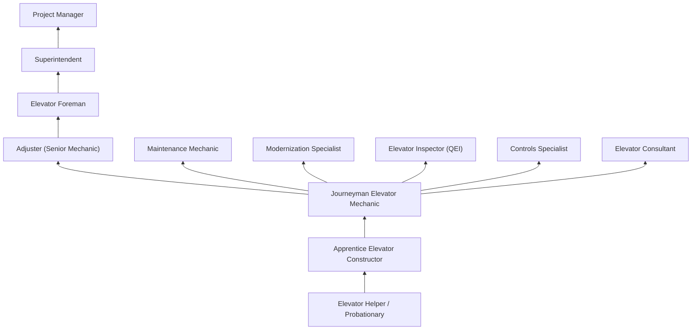
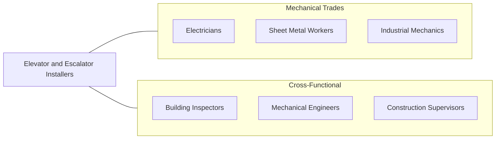

# Elevator and Escalator Installers and Repairers

> Assemble, install, repair, or maintain electric or hydraulic freight or passenger elevators, escalators, or dumbwaiters.

## Overview

Elevator and Escalator Installers and Repairers (commonly called elevator constructors or elevator mechanics) assemble, install, maintain, and repair elevators, escalators, moving walkways, and dumbwaiters. This is one of the most highly skilled and well-compensated construction trades, requiring deep knowledge of electrical systems, electronics, hydraulics, mechanics, and computer controls. Modern elevator systems are complex electromechanical machines governed by sophisticated software and safety systems.

The trade encompasses two primary branches: construction (new installation) and maintenance/repair. Construction mechanics assemble and install new elevator systems from the ground up, including hoistway work, machine room equipment, car assembly, door operators, and control systems. Maintenance mechanics keep existing systems running safely and efficiently, performing scheduled inspections, adjustments, and emergency repairs. Both specialties require working in hoistways (elevator shafts), machine rooms, and on top of elevator cars.

Elevator work is among the most dangerous construction trades due to the combination of heights, confined spaces, electrical hazards, and moving machinery. The trade is heavily regulated, with strict licensing requirements in most jurisdictions and mandatory compliance with ASME A17.1 safety codes. The International Union of Elevator Constructors (IUEC) represents most elevator mechanics, and the apprenticeship is one of the longest and most competitive in the construction industry.

## Classification Hierarchy

## Key Statistics

| Metric | Value |
|--------|-------|
| SOC Code | 47-4021.00 |
| Job Zone | 4 (Considerable Preparation) |
| Category | [Construction and Extraction](/occupations/Construction/index) |
| Task Count | 110 |
| Median Salary | $97,800 / year |
| Employment | ~33,000 |
| Job Outlook | 3% (Slower than average) |
| Physical Demands | Heavy |
| Source | O*NET |

## Core Tasks

### inspect.WiringConnections

Elevator mechanics inspect electrical and control systems to ensure safe operation.

**Actions:**
- `inspect.WiringConnections.of.Cars.to.ensure.EquipmentWillOperateProperly`
- `inspect.WiringConnections.of.Hoistways.to.ensure.EquipmentWillOperateProperly`
- `inspect.ControlPanelHookups.of.Cars.to.ensure.EquipmentWillOperateProperly`
- `inspect.ControlPanelHookups.of.Hoistways.to.ensure.EquipmentWillOperateProperly`

### assemble.Elevators

Elevator constructors assemble complete elevator systems from components.

**Actions:**
- `assemble.Elevators`
- `assemble.Escalators`
- `assemble.MovingSidewalks`
- `assemble.Dumbwaiters`

### install.Elevators

Elevator constructors install vertical transportation systems in buildings.

**Actions:**
- `install.Elevators`
- `install.Escalators`
- `install.MovingSidewalks`
- `install.Dumbwaiters`

## Skills & Competencies

### Technical Skills
- **Electrical Systems (AC/DC)** - Expert
- **Electronics and PLC Programming** - Advanced
- **Hydraulic Systems** - Expert
- **Mechanical Systems** - Expert
- **Blueprint Reading** - Advanced
- **Welding** - Intermediate
- **Computer Control Systems** - Advanced
- **Code Compliance (ASME A17.1)** - Expert

### Trade-Specific Skills
- **Traction Elevator Systems** - Geared and gearless machines
- **Hydraulic Elevator Systems** - Jack assemblies and power units
- **Escalator and Moving Walk Systems** - Step chains, handrails, drives
- **Door Operator Systems** - Car and hoistway door mechanisms
- **Destination Dispatch** - Modern traffic management systems
- **Modernization** - Upgrading existing systems to current codes

### Soft Skills
- **Problem Solving** - Critical
- **Mechanical Aptitude** - Critical
- **Attention to Detail** - Critical
- **Safety Consciousness** - Critical
- **Communication** - Essential

## Education & Certifications

| Requirement | Details |
|-------------|---------|
| Typical Education | High school diploma with math and physics |
| Apprenticeship | 4-year IUEC apprenticeship (extremely competitive) |
| On-the-Job Training | 8,000 hours |
| Classroom Training | 144+ hours/year |
| Continuing Education | Required for code updates |

### Certifications
- **IUEC Journeyman Card** - Union certification
- **State/Local Elevator Mechanic License** - Required in most jurisdictions
- **Certified Elevator Technician (CET)** - NAEC certification
- **QEI (Qualified Elevator Inspector)** - For inspection specialization
- **OSHA 10/30-Hour Construction** - Safety certification
- **Welding Certification** - For structural elevator work
- **First Aid/CPR** - Required

## Career Progression

## Specializations

### New Construction
- Traction elevator installation (high-rise)
- Hydraulic elevator installation (low-rise)
- Escalator and moving walk installation
- Machine-room-less (MRL) systems

### Maintenance and Repair
- Scheduled preventive maintenance
- Emergency callback service
- Component replacement
- Performance optimization

### Modernization
- Controller and drive upgrades
- Car interior renovation
- Safety code compliance upgrades
- Destination dispatch conversion

### Inspection
- Acceptance testing (new installations)
- Periodic safety inspections
- Witness testing
- Code consultation

## Tools & Equipment

### Hand Tools
- Multimeters and megohmmeters
- Wire strippers and crimpers
- Wrenches (combination, socket, torque)
- Screwdrivers and nut drivers
- Levels and plumb bobs
- Tap and die sets

### Power Tools
- Impact wrenches (pneumatic and battery)
- Drills and hammer drills
- Portable band saws
- Grinders
- Welding equipment

### Specialty Tools
- Rail alignment tools
- Rope gauges and calipers
- Door operator analyzers
- Elevator code and speed test equipment
- Oscilloscopes and logic analyzers

### Safety Equipment
- Full body harness and rope grab
- Hard hat and safety glasses
- Lock-out/tag-out devices
- Voltage detectors
- Confined space equipment

## Safety Considerations

- **Falls** - Working in open hoistways; fall arrest systems mandatory
- **Electrical Shock** - High-voltage equipment; lockout/tagout strictly enforced
- **Caught-In/Between** - Moving cars, counterweights, and machinery
- **Confined Spaces** - Hoistway pits and machine rooms
- **Overhead Hazards** - Working below suspended loads
- **Ergonomic Hazards** - Awkward positions in tight spaces
- **Exposure to Heights** - Top-of-car riding and hoistway work

## Related Occupations

## Industries

- [Elevator and Escalator Contractors](/industries/SpecialtyTrade) - Primary Employment
- [Building Equipment Contractors](/industries/BuildingEquipment) - High Employment
- [Commercial Building Construction](/industries/CommercialConstruction) - Moderate Employment
- [Building Maintenance](/industries/BuildingMaintenance) - Moderate Employment

## Departments

This occupation typically works in:
- [Elevator Construction](/departments/ElevatorConstruction)
- [Elevator Maintenance](/departments/ElevatorMaintenance)
- [Modernization Division](/departments/Modernization)
- [Service and Repair](/departments/ServiceRepair)

---

*Source: O*NET 47-4021.00 - ONETOccupation*
