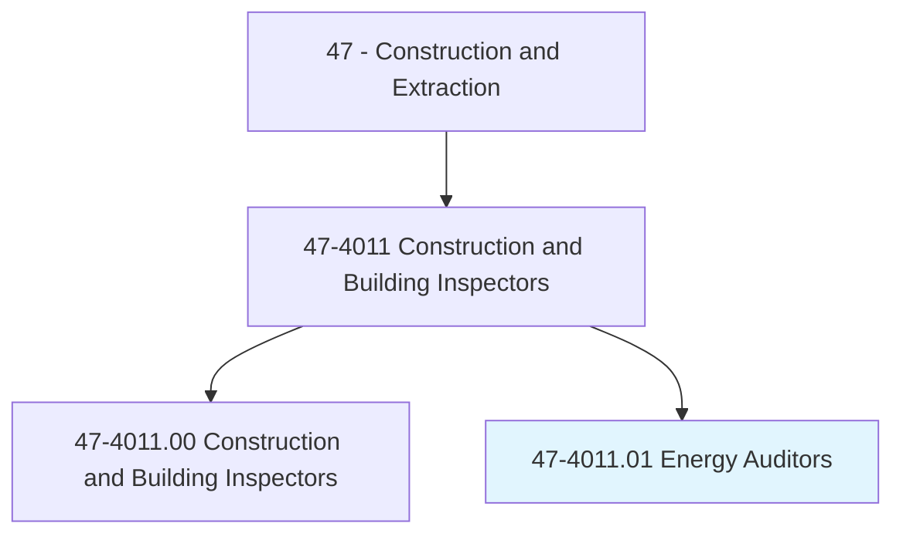
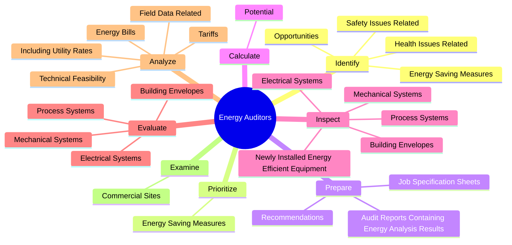
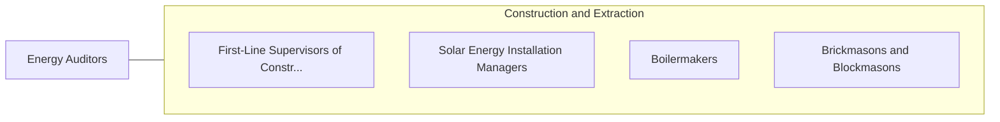

# Energy Auditors

> Conduct energy audits of buildings, building systems, or process systems. May also conduct investment grade audits of buildings or systems.

## Overview

Energy Auditors is a specialized variant within the Construction and Extraction category. Conduct energy audits of buildings, building systems, or process systems. 

## Classification Hierarchy

## Key Statistics

| Metric | Value |
|--------|-------|
| SOC Code | 47-4011.01 |
| Category | [Construction and Extraction](/occupations/Construction/index) |
| Task Count | 73 |
| Source | O*NET |

## Core Tasks

### identify.EnergySavingMeasures

Energy Auditors identify energy saving measures as part of their core responsibilities.

**Actions:**
- `identify.EnergySavingMeasures`
- `identify.HealthIssuesRelated.to.planned.WeatherizationProjects`
- `identify.SafetyIssuesRelated.to.planned.WeatherizationProjects`
- `identify.Opportunities.to.improve.Operation`

### prioritize.EnergySavingMeasures

Energy Auditors prioritize energy saving measures as part of their core responsibilities.

**Actions:**
- `prioritize.EnergySavingMeasures`

### prepare.AuditReportsContainingEnergyAnalysisResults

Energy Auditors prepare audit reports containing energy analysis results as part of their core responsibilities.

**Actions:**
- `prepare.AuditReportsContainingEnergyAnalysisResults.for.EnergyCostSavings`
- `prepare.Recommendations.for.EnergyCostSavings`
- `prepare.JobSpecificationSheets.for.HomeEnergyImprovements`
- `prepare.JobSpecificationSheets.for.AtticInsulation`

## Skills & Competencies

### Technical Skills
- **Construction Methods** - Advanced
- **Blueprint Reading** - Advanced
- **Safety Compliance** - Advanced

### Soft Skills
- **Communication** - Essential
- **Problem Solving** - Essential
- **Critical Thinking** - Important
- **Teamwork** - Important
- **Adaptability** - Important

## Related Occupations

## Industries

This occupation is found across multiple industries. See [Industries](/industries) for sector-specific employment data.

## Career Progression

---

*Source: O*NET 47-4011.01 - ONETOccupation*
