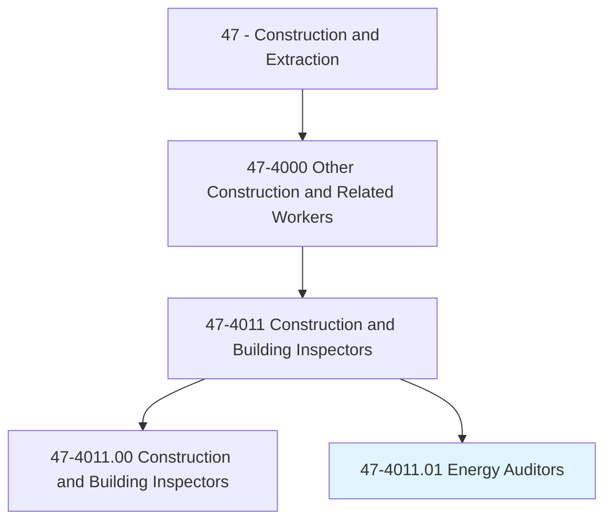
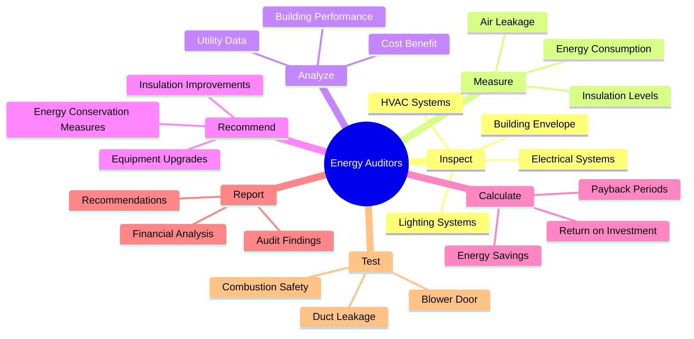
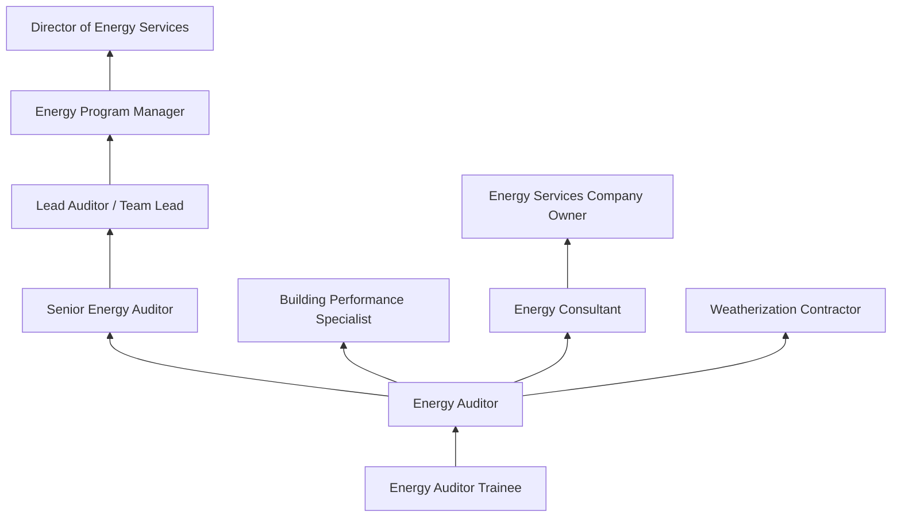
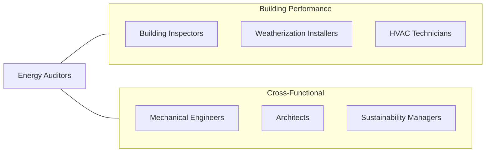

# Energy Auditors

> Conduct energy audits of buildings, building systems, or process systems. May also conduct investment grade audits of buildings or systems.

## Overview

Energy Auditors evaluate buildings and systems to identify energy inefficiencies and recommend improvements that reduce energy consumption and costs. This occupation has grown significantly with increased focus on sustainability, rising energy costs, and government energy efficiency mandates. Auditors use specialized diagnostic equipment to measure building performance, analyze utility data, and model the financial return of proposed energy conservation measures.

The work combines technical building science with financial analysis. Auditors must understand HVAC systems, building envelope construction, lighting systems, electrical distribution, and renewable energy technologies. They conduct on-site inspections using blower doors, infrared cameras, combustion analyzers, and light meters to quantify energy losses. Their reports include detailed cost-benefit analyses of recommended improvements, often serving as the basis for financing decisions and utility incentive applications.

Energy auditing spans residential, commercial, and industrial sectors, each with distinct protocols and complexity levels. Residential auditors typically follow BPI or RESNET standards, while commercial auditors perform ASHRAE-level audits ranging from walk-through assessments (Level I) to comprehensive investment-grade analyses (Level III). The field is closely tied to weatherization programs, green building certifications, and building performance benchmarking requirements.

## Classification Hierarchy

## Key Statistics

| Metric | Value |
|--------|-------|
| SOC Code | 47-4011.01 |
| Job Zone | 4 (Considerable Preparation) |
| Category | [Construction and Extraction](/occupations/Construction/index) |
| Task Count | 95 |
| Median Salary | $62,400 / year |
| Employment | ~15,000 |
| Job Outlook | 6% (Faster than average) |
| Physical Demands | Light to Medium |
| Source | O*NET |

## Core Tasks

### inspect.BuildingEnvelope

Energy Auditors evaluate building shell components for energy performance.

**Actions:**
- `inspect.BuildingEnvelope.for.AirLeakage`
- `inspect.HVACSystems.for.Efficiency`
- `inspect.LightingSystems.for.EnergyWaste`
- `inspect.ElectricalSystems.for.PowerQuality`

### analyze.UtilityData

Energy Auditors analyze historical energy usage patterns to identify opportunities.

**Actions:**
- `analyze.UtilityData.to.identify.BaselineConsumption`
- `analyze.BuildingPerformance.using.EnergyModels`
- `analyze.CostBenefit.of.ProposedMeasures`

## Skills & Competencies

### Technical Skills
- **Building Science** - Expert
- **HVAC Systems Knowledge** - Advanced
- **Thermal Imaging Analysis** - Expert
- **Blower Door Testing** - Expert
- **Energy Modeling Software** - Advanced
- **Electrical Systems** - Intermediate
- **Building Code Knowledge** - Advanced
- **Financial Analysis** - Advanced

### Trade-Specific Skills
- **ASHRAE Audit Procedures** - Level I, II, and III audit protocols
- **Building Envelope Diagnostics** - Air sealing, insulation, moisture
- **Utility Rate Analysis** - Understanding tariff structures
- **Renewable Energy Assessment** - Solar, geothermal feasibility
- **Benchmarking** - ENERGY STAR Portfolio Manager, local requirements

### Soft Skills
- **Analytical Thinking** - Critical
- **Report Writing** - Critical
- **Communication** - Essential (translating technical findings for clients)
- **Attention to Detail** - Essential
- **Client Relations** - Essential

## Education & Certifications

| Requirement | Details |
|-------------|---------|
| Typical Education | Associate's or Bachelor's degree |
| Fields of Study | Building science, engineering, environmental science |
| Continuing Education | Required for certification maintenance |

### Certifications
- **BPI Building Analyst** - Residential energy auditing
- **BPI Envelope Professional** - Building envelope specialist
- **RESNET HERS Rater** - Home energy rating system
- **CEM (Certified Energy Manager)** - AEE certification
- **CEA (Certified Energy Auditor)** - AEE certification
- **ASHRAE BEAP** - Building Energy Assessment Professional
- **LEED Green Associate/AP** - Green building credential
- **OSHA 10-Hour Construction** - Safety certification

## Career Progression

## Specializations

### Residential Auditing
- Single-family home assessments
- Weatherization program audits
- HERS ratings for new construction
- Home performance contracting

### Commercial Auditing
- ASHRAE Level I-III audits
- Retro-commissioning
- Benchmarking and disclosure compliance
- Utility incentive program support

### Industrial Auditing
- Process energy analysis
- Motor and compressed air systems
- Steam and thermal systems
- DOE Industrial Assessment Center work

### Renewable Energy Assessment
- Solar feasibility studies
- Geothermal system evaluation
- Combined heat and power (CHP) analysis

## Tools & Equipment

### Diagnostic Tools
- Blower door systems (Minneapolis, Retrotec)
- Infrared thermal cameras
- Duct blaster / duct leakage testing
- Combustion analyzers
- Light meters (lux and foot-candle)
- Power loggers and energy meters
- Moisture meters
- Data loggers (temperature, humidity, CO2)

### Software Tools
- Energy modeling software (eQUEST, EnergyPlus)
- ENERGY STAR Portfolio Manager
- Weatherization Assistant (NEAT/MHEA)
- REM/Rate (residential modeling)
- Financial analysis spreadsheets

### Personal Equipment
- Laptop/tablet for field data collection
- Digital camera
- Measuring tools (laser distance, tape)
- PPE (hard hat, safety glasses for site visits)

## Safety Considerations

- **Attic and Crawl Space Hazards** - Confined spaces, heat, insulation exposure
- **Electrical Exposure** - Testing near electrical panels and systems
- **Rooftop Access** - Fall protection for roof inspections
- **Combustion Gas Exposure** - Carbon monoxide during furnace testing
- **Asbestos and Lead** - Potential exposure in older buildings
- **Heat Stress** - Attic inspections in summer conditions

## Related Occupations

## Industries

- [Energy Consulting Services](/industries/Scientific) - Primary Employment
- [Utility Companies](/industries/Utilities) - High Employment
- [Government (Weatherization Programs)](/industries/PublicAdministration) - High Employment
- [Engineering Services](/industries/EngineeringServices) - Moderate Employment
- [Property Management](/industries/RealEstate) - Growing Employment

## Departments

This occupation typically works in:
- Energy Services
- Building Performance
- Sustainability
- [Facilities Management](/departments/Operations)

---

*Source: O*NET 47-4011.01 - ONETOccupation*
