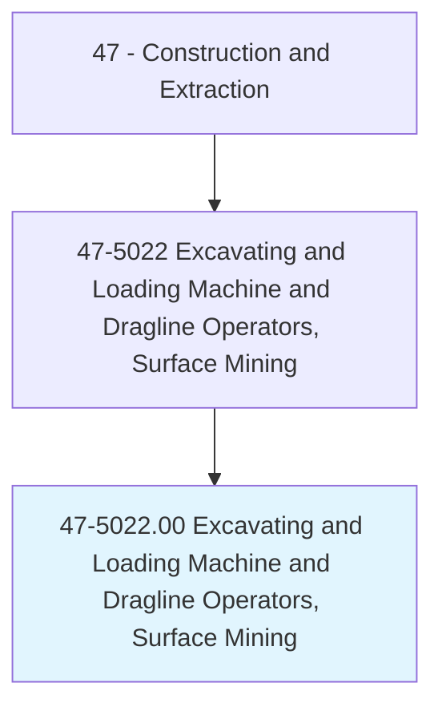
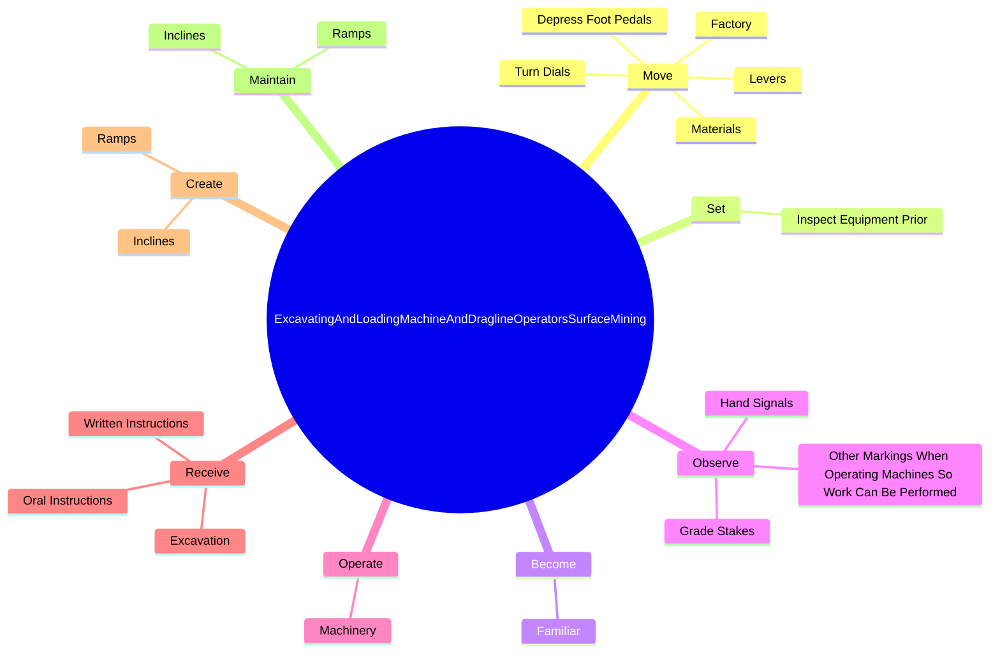
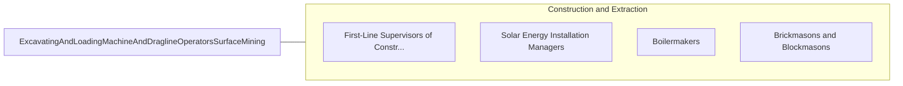

# Excavating and Loading Machine and Dragline Operators, Surface Mining

> Operate or tend machinery at surface mining site, equipped with scoops, shovels, or buckets to excavate and load loose materials.

## Overview

Excavating and Loading Machine and Dragline Operators, Surface Mining is classified under Construction and Extraction (SOC 47). Operate or tend machinery at surface mining site, equipped with scoops, shovels, or buckets to excavate and load loose materials.

## Classification Hierarchy

## Key Statistics

| Metric | Value |
|--------|-------|
| SOC Code | 47-5022.00 |
| Category | [Construction and Extraction](/occupations/Construction/index) |
| Task Count | 77 |
| Source | O*NET |

## Core Tasks

### move.Levers

Excavating and Loading Machine and Dragline Operators, Surface Mining move levers as part of their core responsibilities.

**Actions:**
- `move.Levers.to.operate.PowerMachinery`
- `move.Levers.to.PowerShovels`
- `move.Levers.to.StrippingShovels`
- `move.Levers.to.ScraperLoaders`

### set.InspectEquipmentPrior

Excavating and Loading Machine and Dragline Operators, Surface Mining set inspect equipment prior as part of their core responsibilities.

**Actions:**
- `set.InspectEquipmentPrior.to.Operation`

### become.Familiar

Excavating and Loading Machine and Dragline Operators, Surface Mining become familiar as part of their core responsibilities.

**Actions:**
- `become.Familiar.with.DiggingPlans`
- `become.Familiar.with.MachineCapabilities`
- `become.Familiar.with.Limitations`
- `become.Familiar.with.Efficient`

## Skills & Competencies

### Technical Skills
- **Construction Methods** - Advanced
- **Blueprint Reading** - Advanced
- **Safety Compliance** - Advanced

### Soft Skills
- **Communication** - Essential
- **Problem Solving** - Essential
- **Critical Thinking** - Important
- **Teamwork** - Important
- **Adaptability** - Important

## Related Occupations

## Industries

This occupation is found across multiple industries. See [Industries](/industries) for sector-specific employment data.

## Career Progression

---

*Source: O*NET 47-5022.00 - ONETOccupation*
