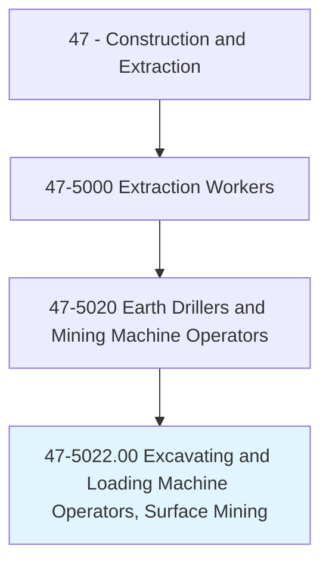
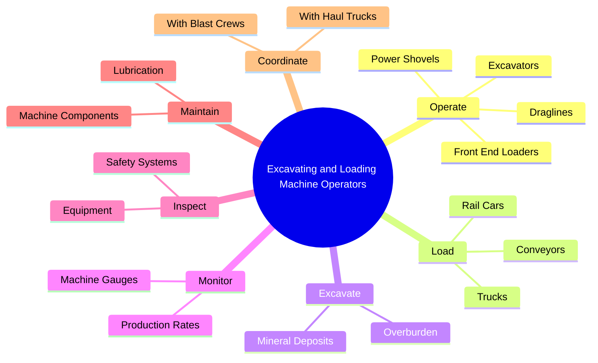
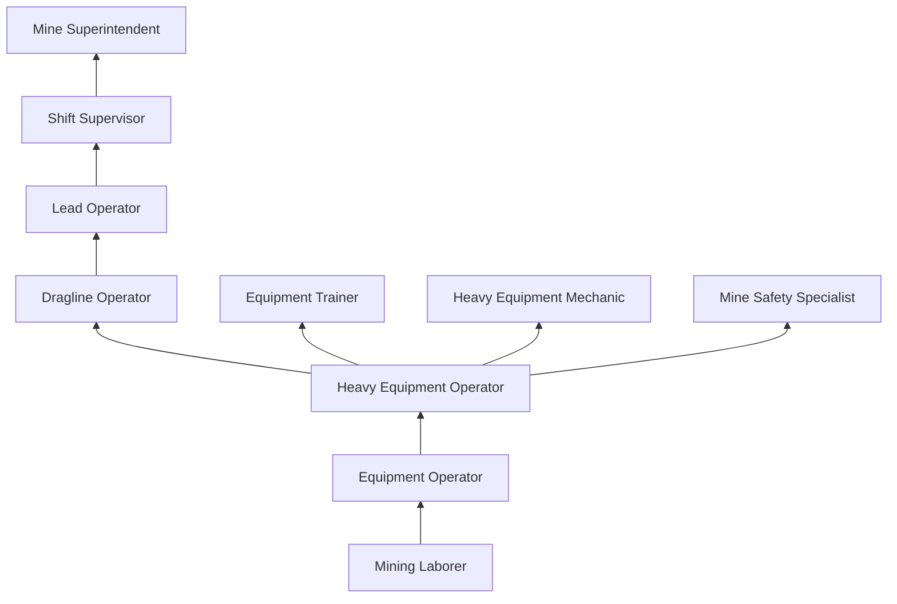
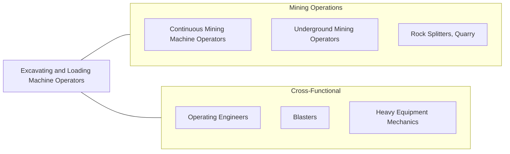

# Excavating and Loading Machine and Dragline Operators, Surface Mining

> Operate or tend machinery equipped with scoops, shovels, or buckets, to excavate and load loose materials in surface mining.

## Overview

Excavating and Loading Machine and Dragline Operators in surface mining operate some of the largest mobile machines on earth. Draglines can weigh over 8,000 tons with boom lengths exceeding 300 feet and bucket capacities of 100+ cubic yards. These operators remove overburden (the soil and rock covering mineral deposits) and load extracted minerals onto trucks, conveyors, or rail cars. Their work is essential to open-pit mining, strip mining, and quarry operations.

Surface mining operations require precise excavation to maximize mineral recovery while minimizing waste. Operators must understand geological formations, bench heights, pit slopes, and blasting patterns. They coordinate closely with drill and blast crews, haul truck operators, and mine engineers to execute the mine plan efficiently and safely. Modern equipment increasingly features GPS-guided controls, automated loading sequences, and real-time production monitoring.

The work environment involves operating heavy equipment in large, open-pit settings with significant dust, noise, and weather exposure. Operators work rotating shifts to maintain 24/7 mining operations. Despite the controlled cab environment, the role requires constant alertness due to the massive scale of equipment and the hazards inherent in surface mining, including unstable highwalls, haul road traffic, and blasting activities.

## Classification Hierarchy

## Key Statistics

| Metric | Value |
|--------|-------|
| SOC Code | 47-5022.00 |
| Job Zone | 2 (Some Preparation) |
| Category | [Construction and Extraction](/occupations/Construction/index) |
| Task Count | 88 |
| Median Salary | $49,500 / year |
| Employment | ~35,000 |
| Job Outlook | -4% (Decline) |
| Physical Demands | Medium |
| Source | O*NET |

## Core Tasks

### operate.Draglines

Operators control massive dragline excavators to remove overburden in surface mining.

**Actions:**
- `operate.Draglines.to.remove.Overburden`
- `operate.PowerShovels.to.load.Material`
- `operate.FrontEndLoaders.to.load.Trucks`
- `operate.Excavators.to.excavate.MineralDeposits`

### load.Trucks

Operators load extracted material into haul vehicles for transport.

**Actions:**
- `load.Trucks.with.ExcavatedMaterial`
- `load.Conveyors.with.ProcessedMaterial`
- `load.RailCars.with.MinedProducts`

## Skills & Competencies

### Technical Skills
- **Heavy Equipment Operation** - Expert
- **Dragline Operation** - Expert
- **Power Shovel Operation** - Expert
- **Mining Methods** - Advanced
- **Equipment Maintenance** - Advanced
- **GPS and Machine Guidance** - Advanced
- **Geology Basics** - Intermediate

### Trade-Specific Skills
- **Bench Management** - Maintaining proper bench heights and slopes
- **Swing and Spot Loading** - Efficient truck loading patterns
- **Dragline Walking** - Moving dragline between positions
- **Highwall Management** - Maintaining safe excavation slopes
- **Production Optimization** - Maximizing tons per hour

### Soft Skills
- **Spatial Awareness** - Critical
- **Concentration** - Critical (long shifts operating heavy equipment)
- **Communication** - Essential (radio coordination)
- **Safety Consciousness** - Critical
- **Mechanical Aptitude** - Essential

## Education & Certifications

| Requirement | Details |
|-------------|---------|
| Typical Education | High school diploma or equivalent |
| On-the-Job Training | 6-12 months |
| MSHA Training | 24-hour new miner + 8-hour annual refresher |
| Equipment-Specific Training | Company-provided |

### Certifications
- **MSHA New Miner Training (Part 46)** - Mandatory 24-hour training
- **MSHA Annual Refresher** - 8-hour annual requirement
- **Equipment-Specific Certification** - For each machine type operated
- **First Aid/CPR** - Required
- **CDL (if applicable)** - For equipment transport

## Career Progression

## Specializations

### Dragline Operations
- Walking dragline operation
- Overburden removal
- Reclamation work

### Shovel and Excavator
- Electric rope shovel operation
- Hydraulic excavator operation
- Loading operations

### Front-End Loader
- Wheel loader operation
- Stockpile management
- Plant feed operations

## Tools & Equipment

### Primary Equipment
- Walking draglines (Caterpillar, P&H, Bucyrus)
- Electric rope shovels
- Hydraulic mining excavators (Cat, Liebherr, Hitachi)
- Front-end loaders (Cat 994, Komatsu WA1200)

### Technology Systems
- GPS machine guidance (Trimble, Leica)
- Fleet management systems (Modular, Wenco)
- Collision avoidance systems
- Real-time production monitoring

### Personal Equipment
- Hard hat with ear protection
- Safety glasses and dust mask
- Steel-toed boots
- High-visibility vest
- Communication radio

## Safety Considerations

- **Highwall Collapse** - Unstable slopes in open pit; exclusion zones enforced
- **Haul Road Traffic** - Massive haul trucks with limited visibility
- **Equipment Rollover** - Uneven terrain and bench edges
- **Electrical Hazards** - High-voltage electric shovels and draglines
- **Dust Exposure** - Silica and mineral dust; cab filtration systems
- **Noise** - Engine and mechanical noise; hearing protection
- **Fatigue** - Extended shift operations; fatigue monitoring systems
- **Blasting Proximity** - Coordination with blast schedules

## Related Occupations

## Industries

- [Coal Mining](/industries/CoalMining) - Primary Employment
- Metal Ore Mining - High Employment
- Stone Mining and Quarrying - High Employment
- Sand and Gravel Mining - Moderate Employment

## Departments

This occupation typically works in:
- Mining Operations
- Production
- Equipment Division
- Safety

---

*Source: O*NET 47-5022.00 - ONETOccupation*
