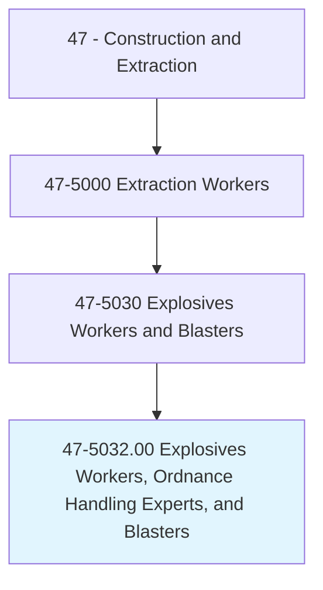
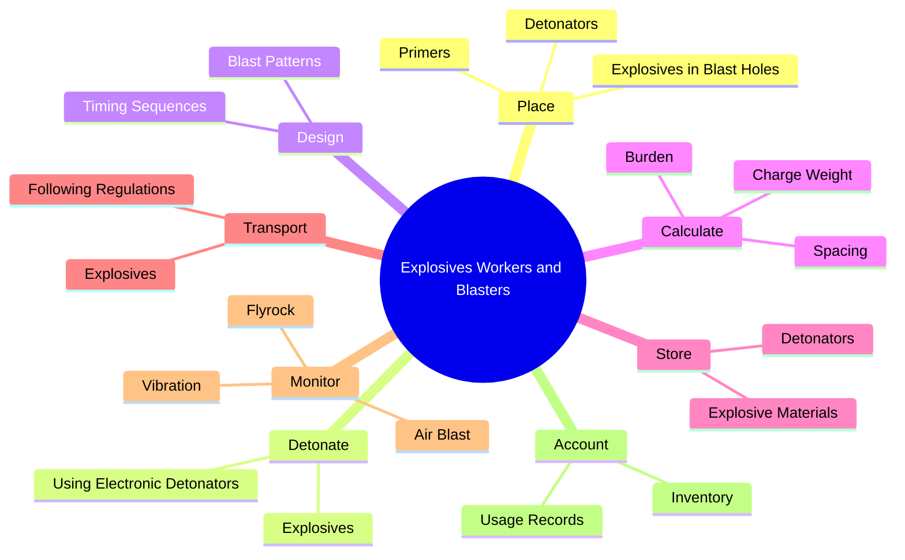
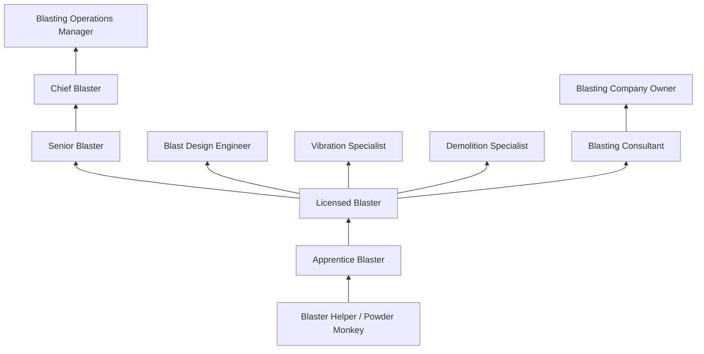
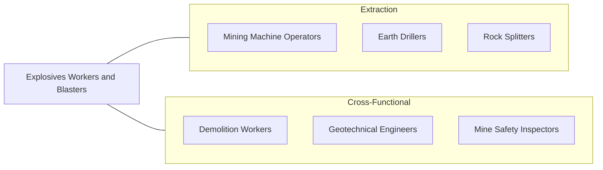

# Explosives Workers, Ordnance Handling Experts, and Blasters

> Place and detonate explosives to demolish structures or to loosen, remove, or displace earth, rock, or other materials. May perform specialized handling, storage, and accounting procedures.

## Overview

Explosives Workers, Ordnance Handling Experts, and Blasters are highly specialized professionals who handle, store, transport, place, and detonate explosive materials for mining, quarrying, construction, and demolition purposes. This occupation demands exceptional safety discipline, deep knowledge of explosives chemistry and physics, and precise calculation skills. A single error can result in catastrophic consequences, making this one of the most safety-critical occupations in the construction and extraction industries.

Blasters in mining and quarrying drill patterns and load blast holes with explosives to fragment rock for excavation. Construction blasters use controlled detonation to remove rock, demolish structures, or create trenches and tunnels. The work requires understanding geology, rock mechanics, blast design, vibration control, and environmental impact mitigation. Modern blasting employs electronic detonators with millisecond-precision timing, GPS-guided drill patterns, and computer modeling to optimize fragmentation while minimizing flyrock, vibration, and noise.

Ordnance handling experts work with military explosives, ammunition, and pyrotechnics, performing disposal, storage, and accountability functions. All explosives workers must comply with extensive federal (ATF, MSHA, OSHA) and state regulations governing licensing, storage, transportation, and use of explosive materials. The occupation requires specialized training, licensing, and a clean background check due to the sensitive nature of the materials.

## Classification Hierarchy

## Key Statistics

| Metric | Value |
|--------|-------|
| SOC Code | 47-5032.00 |
| Job Zone | 3 (Medium Preparation) |
| Category | [Construction and Extraction](/occupations/Construction/index) |
| Task Count | 92 |
| Median Salary | $52,400 / year |
| Employment | ~6,500 |
| Job Outlook | 2% (Slower than average) |
| Physical Demands | Medium to Heavy |
| Source | O*NET |

## Core Tasks

### place.Explosives

Blasters load blast holes with precisely calculated charges of explosives.

**Actions:**
- `place.Explosives.in.BlastHoles`
- `place.Detonators.in.PrimerCharges`
- `place.StemMaterial.in.BlastHoles`

### design.BlastPatterns

Blasters design drill and blast patterns to achieve specified fragmentation.

**Actions:**
- `design.BlastPatterns.for.OptimalFragmentation`
- `design.TimingSequences.for.ControlledDetonation`
- `calculate.ChargeWeight.based.on.GeologicalConditions`

## Skills & Competencies

### Technical Skills
- **Explosives Chemistry and Physics** - Expert
- **Blast Design** - Expert
- **Vibration Monitoring and Control** - Expert
- **Rock Mechanics** - Advanced
- **Detonation Systems** - Expert
- **Blast Modeling Software** - Advanced
- **Federal Regulations (ATF, MSHA)** - Expert
- **Mathematics** - Advanced

### Trade-Specific Skills
- **Electronic Detonator Systems** - Programming and firing
- **Seismograph Operation** - Blast vibration monitoring
- **Blast Damage Assessment** - Pre and post-blast surveys
- **Magazine Storage** - Proper explosive material storage
- **Inventory and Accountability** - Strict tracking of all materials
- **Misfire Procedures** - Safe handling of failed detonations

### Soft Skills
- **Safety Discipline** - Critical
- **Attention to Detail** - Critical
- **Mathematical Precision** - Critical
- **Communication** - Essential
- **Calm Under Pressure** - Essential

## Education & Certifications

| Requirement | Details |
|-------------|---------|
| Typical Education | High school diploma; some college preferred |
| On-the-Job Training | 1-2 years under licensed blaster |
| State Licensing | Blaster's license required in most states |
| Federal Permits | ATF Federal Explosives License |
| Background Check | Required by ATF |

### Certifications
- **State Blaster's License** - Required (varies by state and type)
- **ATF Federal Explosives License/Permit** - Required for possession
- **MSHA New Miner Training** - For mining blasters
- **ISEE Certified Blaster** - International Society of Explosives Engineers
- **OSHA 10/30-Hour Construction** - Safety certification
- **First Aid/CPR** - Required
- **CDL with HazMat Endorsement** - For explosives transport

## Career Progression

## Specializations

### Surface Mining Blasting
- Open pit production blasting
- Quarry blasting
- Overburden removal
- Cast blasting

### Underground Mining Blasting
- Heading and stope blasting
- Shaft sinking
- Controlled blasting techniques

### Construction Blasting
- Rock excavation for foundations
- Pipeline and utility trenching
- Road and highway construction
- Controlled urban blasting

### Demolition Blasting
- Building implosion
- Bridge and structure demolition
- Chimney and tower felling
- Selective structural removal

## Tools & Equipment

### Blasting Equipment
- Electronic detonators and blasting machines
- Non-electric detonation systems (shock tube)
- Loading poles and tamping rods
- Blast hole logging tools
- Stemming materials

### Monitoring Equipment
- Seismographs (vibration monitoring)
- Air overpressure monitors
- Flyrock cameras
- GPS survey equipment
- Blast modeling software

### Safety Equipment
- Blast warning sirens
- Guard stations and barrier systems
- Blast mats and flyrock barriers
- Two-way radios
- Personal protective equipment

## Safety Considerations

- **Premature Detonation** - Strict handling and wiring protocols; electronic detonators reduce risk
- **Flyrock** - Guard zone establishment and blast mat deployment
- **Misfires** - Detailed misfire investigation procedures; mandatory wait periods
- **Magazine Safety** - Proper storage, separation distances, security
- **Transportation Hazards** - DOT HazMat regulations for explosives transport
- **Ground Vibration** - Damage to structures; seismograph monitoring required
- **Lightning Hazards** - Suspension of operations during electrical storms
- **Toxic Fumes** - Post-blast gases (CO, NOx); ventilation before re-entry

## Related Occupations

## Industries

- [Mining (Coal, Metal, Nonmetal)](/industries/Mining) - Primary Employment
- Stone Quarrying - High Employment
- Highway and Heavy Construction - Moderate Employment
- Demolition Contractors - Specialty Employment
- Military/Defense - Specialty Employment

## Departments

This occupation typically works in:
- Drilling and Blasting
- Mining Operations
- Demolition Division
- Safety

---

*Source: O*NET 47-5032.00 - ONETOccupation*
