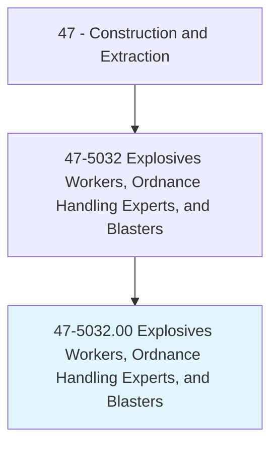
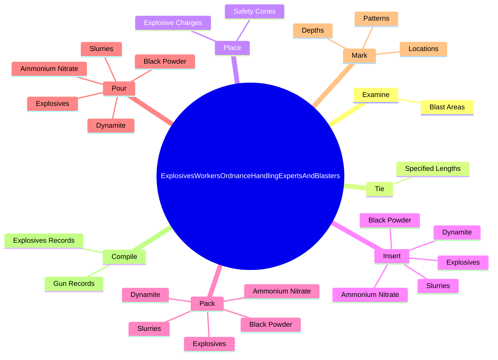
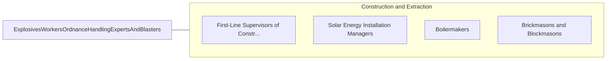

# Explosives Workers, Ordnance Handling Experts, and Blasters

> Place and detonate explosives to demolish structures or to loosen, remove, or displace earth, rock, or other materials. May perform specialized handling, storage, and accounting procedures.

## Overview

Explosives Workers, Ordnance Handling Experts, and Blasters is an occupation within the Construction and Extraction category. Place and detonate explosives to demolish structures or to loosen, remove, or displace earth, rock, or other materials. 

## Classification Hierarchy

## Key Statistics

| Metric | Value |
|--------|-------|
| SOC Code | 47-5032.00 |
| Category | [Construction and Extraction](/occupations/Construction/index) |
| Task Count | 143 |
| Source | O*NET |

## Core Tasks

### examine.BlastAreas

Explosives Workers, Ordnance Handling Experts, and Blasters examine blast areas as part of their core responsibilities.

**Actions:**
- `examine.BlastAreas.to.determine.AmountsOfExplosiveChargesNeededToEnsureSafetyLawsAreObserved`
- `examine.BlastAreas.to.KindsOfExplosiveChargesNeededToEnsureSafetyLawsAreObserved`

### tie.SpecifiedLengths

Explosives Workers, Ordnance Handling Experts, and Blasters tie specified lengths as part of their core responsibilities.

**Actions:**
- `tie.SpecifiedLengths.of.DelayingFusesIntoPatternsInOrder.to.time.SequencesOfExplosions`

### place.SafetyCones

Explosives Workers, Ordnance Handling Experts, and Blasters place safety cones as part of their core responsibilities.

**Actions:**
- `place.SafetyCones.around.BlastAreas.to.alert.OtherWorkersOfDangerZones`
- `place.SafetyCones.around.BlastAreasToSignalWorkersAsNecessaryToEnsureTheyClearBlastSitesPri`
- `place.SafetyCones.around.BlastAreasToToExplosions`
- `place.ExplosiveCharges.in.HolesSpots`

## Skills & Competencies

### Technical Skills
- **Construction Methods** - Advanced
- **Blueprint Reading** - Advanced
- **Safety Compliance** - Advanced

### Soft Skills
- **Communication** - Essential
- **Problem Solving** - Essential
- **Critical Thinking** - Important
- **Teamwork** - Important
- **Adaptability** - Important

## Related Occupations

## Industries

This occupation is found across multiple industries. See [Industries](/industries) for sector-specific employment data.

## Career Progression

---

*Source: O*NET 47-5032.00 - ONETOccupation*
