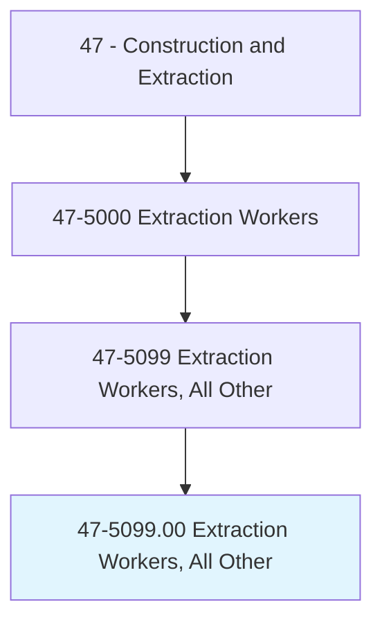
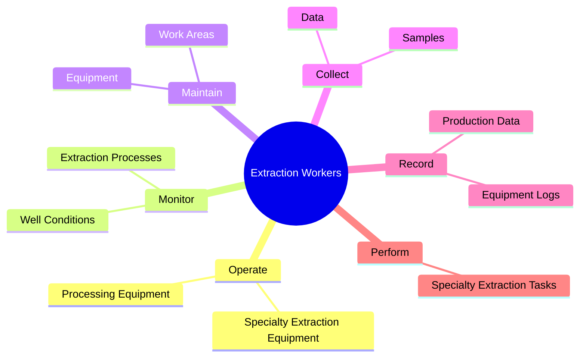
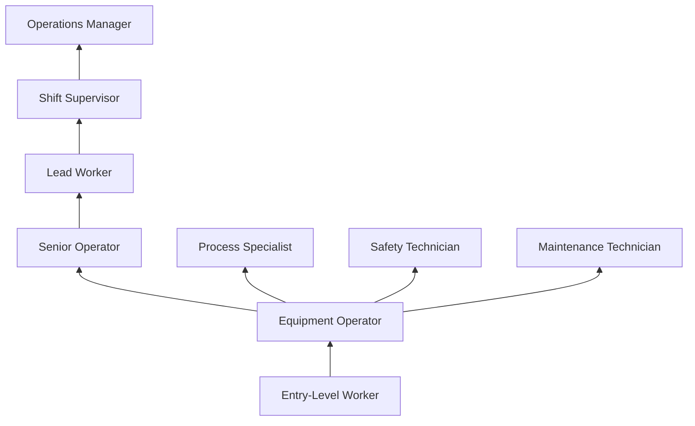
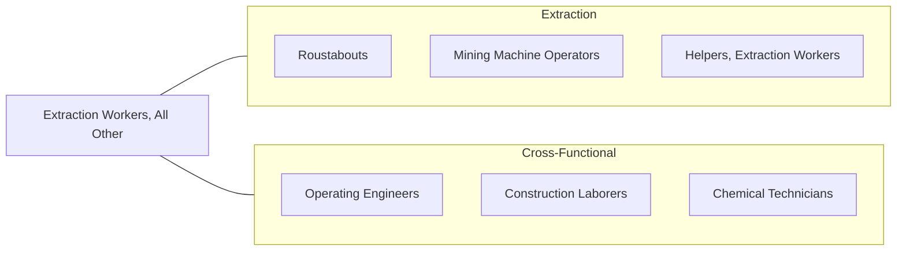

# Extraction Workers, All Other

> All extraction workers not listed separately.

## Overview

Extraction Workers, All Other is a residual classification encompassing workers in the mining and extraction industry whose specific duties do not align with other defined extraction occupations. This includes specialty roles such as well tenders, mining sampling technicians, brine well operators, solution mining workers, and other niche positions within the broader extraction sector. These workers support the extraction of minerals, petroleum, natural gas, and other subsurface resources through specialized tasks.

Many workers in this category perform support functions critical to extraction operations but that span multiple equipment types or operational phases. They may tend wells between service visits, operate specialized processing equipment at mine sites, perform geological sampling and logging, or manage fluid handling systems. The work environments range from surface mining operations and oil fields to underground mines and processing facilities.

As extraction technologies evolve, this category captures emerging roles related to rare earth mineral extraction, lithium mining for battery production, carbon capture and sequestration, and other new resource recovery methods. Workers in these roles often develop highly specialized skills specific to their particular extraction process.

## Classification Hierarchy

## Key Statistics

| Metric | Value |
|--------|-------|
| SOC Code | 47-5099.00 |
| Job Zone | 2 (Some Preparation) |
| Category | [Construction and Extraction](/occupations/Construction/index) |
| Task Count | Variable |
| Median Salary | $45,200 / year |
| Employment | ~8,000 |
| Job Outlook | -2% (Decline) |
| Physical Demands | Medium to Heavy |
| Source | O*NET |

## Core Tasks

### operate.SpecialtyExtractionEquipment

Workers operate specialized equipment for resource extraction.

**Actions:**
- `operate.SpecialtyExtractionEquipment.at.MiningSites`
- `operate.ProcessingEquipment.for.MineralRecovery`
- `monitor.WellConditions.for.ProductionOptimization`

## Skills & Competencies

### Technical Skills
- **Extraction Equipment Operation** - Advanced
- **Process Monitoring** - Advanced
- **Equipment Maintenance** - Advanced
- **Safety Compliance** - Advanced
- **Sampling and Testing** - Intermediate
- **Record Keeping** - Intermediate

### Trade-Specific Skills
- **Solution Mining** - In-situ extraction techniques
- **Well Tending** - Monitoring and maintaining extraction wells
- **Mineral Sampling** - Collection and documentation procedures
- **Fluid Handling** - Brine, slurry, and chemical management

### Soft Skills
- **Reliability** - Critical
- **Attention to Detail** - Essential
- **Physical Stamina** - Essential
- **Communication** - Important
- **Adaptability** - Essential

## Education & Certifications

| Requirement | Details |
|-------------|---------|
| Typical Education | High school diploma or equivalent |
| On-the-Job Training | 3-12 months |
| MSHA Training | Required for mining operations |

### Certifications
- **MSHA New Miner Training** - Part 46 (surface) or Part 48 (underground)
- **MSHA Annual Refresher** - 8-hour annual requirement
- **OSHA 10-Hour General Industry** - Safety certification
- **First Aid/CPR** - Required
- **Hazmat Awareness** - For chemical handling roles

## Career Progression

## Specializations

### Well Tending
- Production well monitoring
- Wellhead maintenance
- Flow rate management

### Solution Mining
- In-situ leaching operations
- Brine well operations
- Evaporation pond management

### Sampling and Testing
- Geological sampling
- Ore grade testing
- Environmental monitoring

## Tools & Equipment

### Equipment
- Specialty extraction equipment (role-dependent)
- Pumps and compressors
- Monitoring instruments
- Sampling tools and containers
- PPE (hard hat, safety glasses, hearing protection, boots)

## Safety Considerations

- **Chemical Exposure** - Extraction chemicals and process fluids
- **Confined Spaces** - Equipment and process vessel entry
- **Heavy Equipment** - Working near mobile mining equipment
- **Environmental Hazards** - Dust, noise, weather exposure
- **Fall Hazards** - Elevated equipment and platforms

## Related Occupations

## Industries

- [Mining (Coal, Metal, Nonmetal)](/industries/Mining) - Primary Employment
- Oil and Gas Extraction - Moderate Employment
- [Support Activities for Mining](/industries/MiningSupport) - High Employment

## Departments

This occupation typically works in:
- Mining Operations
- Production
- [Maintenance](/departments/Operations)
- Safety

---

*Source: O*NET 47-5099.00 - ONETOccupation*
