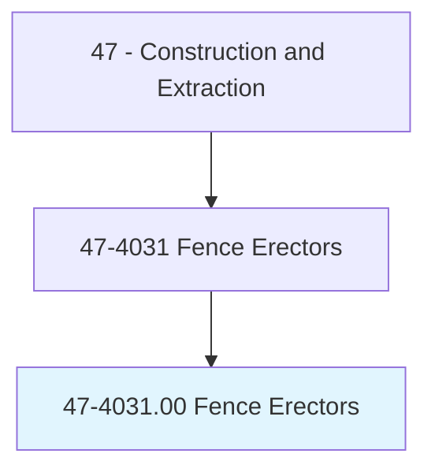
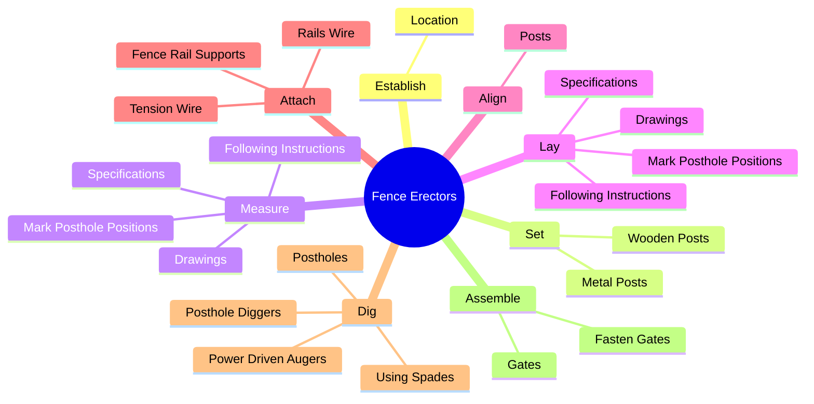
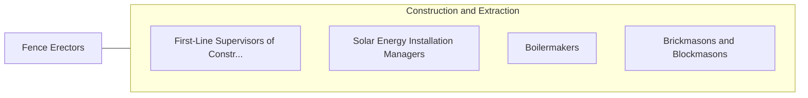

# Fence Erectors

> Erect and repair fences and fence gates, using hand and power tools.

## Overview

Fence Erectors is classified under Construction and Extraction (SOC 47). Erect and repair fences and fence gates, using hand and power tools.

## Classification Hierarchy

## Key Statistics

| Metric | Value |
|--------|-------|
| SOC Code | 47-4031.00 |
| Category | [Construction and Extraction](/occupations/Construction/index) |
| Task Count | 82 |
| Source | O*NET |

## Core Tasks

### establish.Location

Fence Erectors establish location as part of their core responsibilities.

**Actions:**
- `establish.Location.for.Fence`
- `establish.Location.for.GatherInformationNeeded.to.ensure.ThereAreElectricCables`
- `establish.Location.for.WaterLines.in.Area`

### set.MetalPosts

Fence Erectors set metal posts as part of their core responsibilities.

**Actions:**
- `set.MetalPosts.in.UprightPositions.in.Postholes`
- `set.WoodenPosts.in.UprightPositions.in.Postholes`

### measure.MarkPostholePositions

Fence Erectors measure mark posthole positions as part of their core responsibilities.

**Actions:**
- `measure.MarkPostholePositions`
- `measure.FollowingInstructions`
- `measure.Drawings`
- `measure.Specifications`

## Skills & Competencies

### Technical Skills
- **Construction Methods** - Advanced
- **Blueprint Reading** - Advanced
- **Safety Compliance** - Advanced

### Soft Skills
- **Communication** - Essential
- **Problem Solving** - Essential
- **Critical Thinking** - Important
- **Teamwork** - Important
- **Adaptability** - Important

## Related Occupations

## Industries

This occupation is found across multiple industries. See [Industries](/industries) for sector-specific employment data.

## Career Progression

---

*Source: O*NET 47-4031.00 - ONETOccupation*
