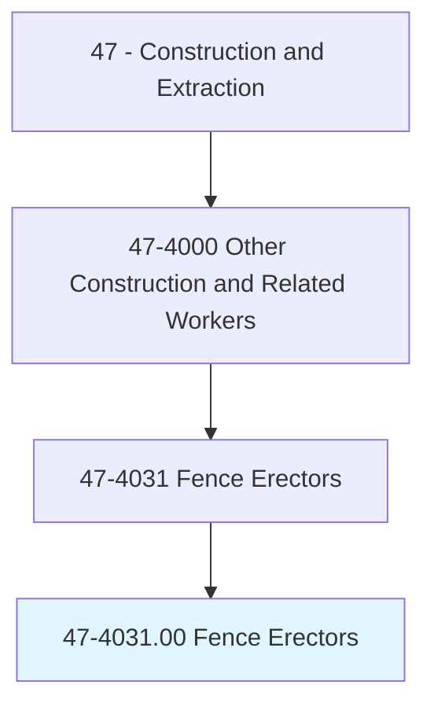
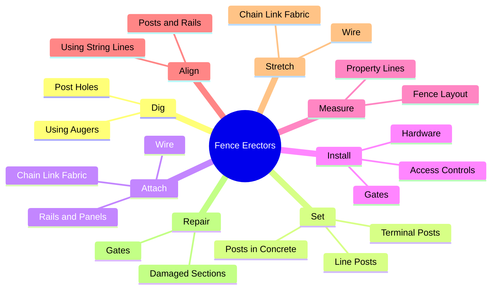
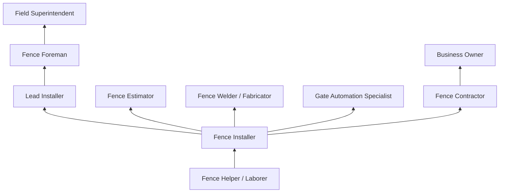
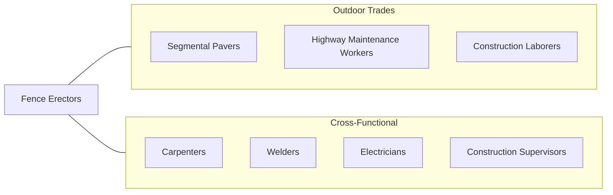

# Fence Erectors

> Erect and repair fences and fence gates, using hand and power tools.

## Overview

Fence Erectors install and repair metal, wood, vinyl, chain-link, and composite fencing for residential, commercial, agricultural, industrial, and security applications. The trade encompasses a wide range of fencing systems, from simple residential picket fences to sophisticated high-security perimeter systems with electronic access control, anti-climb features, and intrusion detection integration. Fence erectors must understand soil conditions, property boundaries, zoning setback requirements, and local building codes.

The work requires a combination of carpentry, metalworking, concrete, and equipment operation skills. Fence erectors dig post holes, set posts in concrete or driven foundations, attach rails and panels, install gates and hardware, and ensure proper alignment and level across varying terrain. In agricultural settings, they install miles of barbed wire, high-tensile wire, or electric fencing across rugged landscapes. In commercial and industrial settings, they install ornamental iron, crash-rated barriers, and security fencing.

Modern fencing has expanded to include automated gate systems, access control integration, sound barrier walls, and specialty sports enclosures. Fence erectors increasingly work with power augers, skid steers, and GPS layout tools. The trade offers strong entrepreneurship opportunities, as many experienced erectors start their own fencing businesses.

## Classification Hierarchy

## Key Statistics

| Metric | Value |
|--------|-------|
| SOC Code | 47-4031.00 |
| Job Zone | 2 (Some Preparation) |
| Category | [Construction and Extraction](/occupations/Construction/index) |
| Task Count | 78 |
| Median Salary | $40,700 / year |
| Employment | ~32,000 |
| Job Outlook | 6% (Faster than average) |
| Physical Demands | Heavy |
| Source | O*NET |

## Core Tasks

### dig.PostHoles

Fence Erectors excavate post holes to the required depth and diameter.

**Actions:**
- `dig.PostHoles.using.PowerAuger`
- `dig.PostHoles.using.ManualDigger`
- `dig.PostHoles.to.SpecifiedDepth`

### set.Posts

Fence Erectors set posts plumb in concrete or driven foundations.

**Actions:**
- `set.Posts.in.Concrete`
- `set.TerminalPosts.at.Corners.and.Ends`
- `set.LinePosts.at.SpecifiedSpacing`

### install.Gates

Fence Erectors install gates with proper swing clearance and hardware.

**Actions:**
- `install.Gates.with.Hinges`
- `install.Gates.with.Latches`
- `install.AutomaticGateOperators`

## Skills & Competencies

### Technical Skills
- **Fence Layout and Measurement** - Expert
- **Post Setting and Concrete** - Expert
- **Chain Link Installation** - Expert
- **Wood Fence Construction** - Expert
- **Welding (MIG, Stick)** - Intermediate to Advanced
- **Gate and Hardware Installation** - Expert
- **Equipment Operation (Auger, Skid Steer)** - Advanced
- **Property Survey Reading** - Intermediate

### Trade-Specific Skills
- **Chain Link Stretching** - Proper tensioning and banding
- **Ornamental Iron** - Welding and installation
- **High-Security Fencing** - Anti-climb, razor wire, crash-rated
- **Agricultural Fencing** - High-tensile, barbed, electric
- **Vinyl and Composite** - Modern material systems
- **Gate Automation** - Operators, access control, safety devices

### Soft Skills
- **Physical Stamina** - Critical
- **Customer Service** - Essential (residential work)
- **Problem Solving** - Essential (terrain challenges)
- **Teamwork** - Essential
- **Independence** - Important (small crew operations)

## Education & Certifications

| Requirement | Details |
|-------------|---------|
| Typical Education | High school diploma or equivalent |
| On-the-Job Training | 6-12 months |
| Apprenticeship | Available through some programs |

### Certifications
- **OSHA 10-Hour Construction** - Safety certification
- **AFA Certified Fence Professional** - American Fence Association
- **AFA Certified Fence Installer** - Installer credential
- **Gate Operator Installer (UL 325)** - Automated gate safety
- **Welding Certification** - For ornamental and industrial fencing
- **CDL (if applicable)** - For equipment transport
- **First Aid/CPR** - Recommended

## Career Progression

## Specializations

### Residential Fencing
- Wood privacy and picket fences
- Vinyl and composite fencing
- Ornamental aluminum and iron
- Chain link with privacy slats

### Commercial and Industrial
- Security fencing (chain link with barbed wire)
- Crash-rated barriers and bollards
- Ornamental perimeter fencing
- Dumpster enclosures and screening

### Agricultural
- Barbed wire and high-tensile
- Electric fencing
- Post and rail (horse fencing)
- Game and wildlife fencing

### Specialty Applications
- Sports courts and backstops
- Noise barrier walls
- Highway guardrail and barriers
- Temporary construction fencing

## Tools & Equipment

### Hand Tools
- Post hole diggers (manual)
- Fence stretchers and come-alongs
- Wire cutters and pliers
- Levels and string lines
- Banding tools
- Tape measures
- Wrenches and socket sets

### Power Tools
- Power augers (one-man and two-man)
- Skid steers with auger attachments
- Concrete mixers
- Impact drivers and drills
- Reciprocating saws
- Welders (MIG, stick)

### Equipment
- Trucks and trailers
- Pipe cutters and benders
- Chain link stretching bars
- Post drivers (pneumatic)
- Trenching machines

## Safety Considerations

- **Underground Utilities** - Call before you dig (811); utility location required
- **Heavy Lifting** - Post and panel handling; proper techniques
- **Power Tool Injuries** - Auger and saw operation; proper guarding
- **Concrete Burns** - Setting posts; skin protection
- **Wire Cuts** - Sharp wire ends; cut-resistant gloves
- **Heat and Sun Exposure** - Outdoor work; hydration and shade breaks
- **Traffic Hazards** - Working near roadways; traffic control plans
- **Trench and Excavation** - Post hole cave-in risk; soil stability

## Related Occupations

## Industries

- [Fence Contractors](/industries/SpecialtyTrade) - Primary Employment
- [Residential Building Construction](/industries/ResidentialConstruction) - High Employment
- [Commercial Construction](/industries/CommercialConstruction) - Moderate Employment
- [Government and Public Works](/industries/Government) - Moderate Employment
- [Agricultural Support](/industries/Agriculture) - Moderate Employment

## Departments

This occupation typically works in:
- [Field Operations](/departments/FieldOperations)
- [Fencing Division](/departments/Fencing)
- [Estimating and Sales](/departments/Estimating)
- [Gate Automation](/departments/GateAutomation)

---

*Source: O*NET 47-4031.00 - ONETOccupation*
