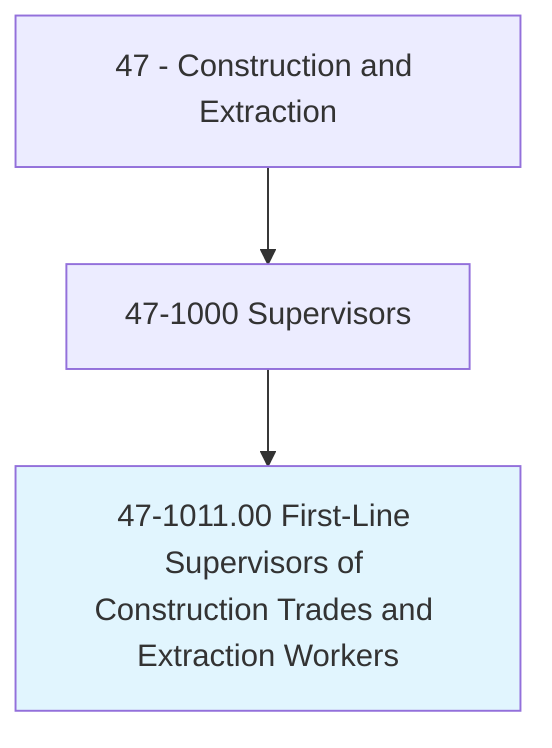
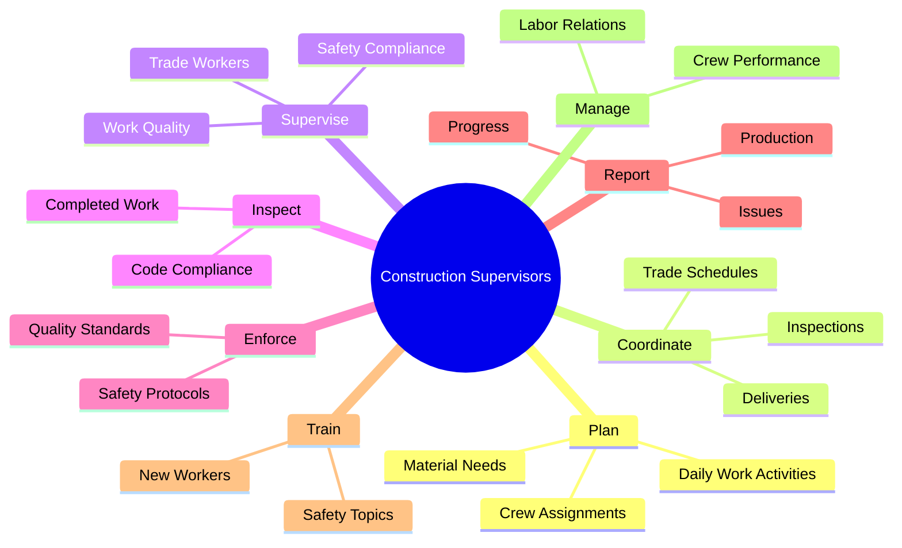
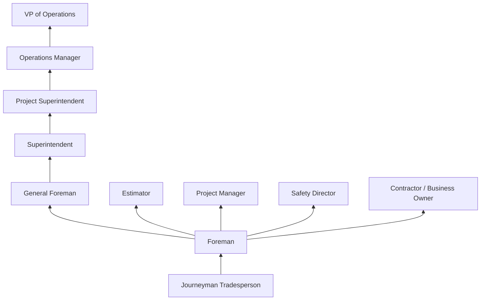
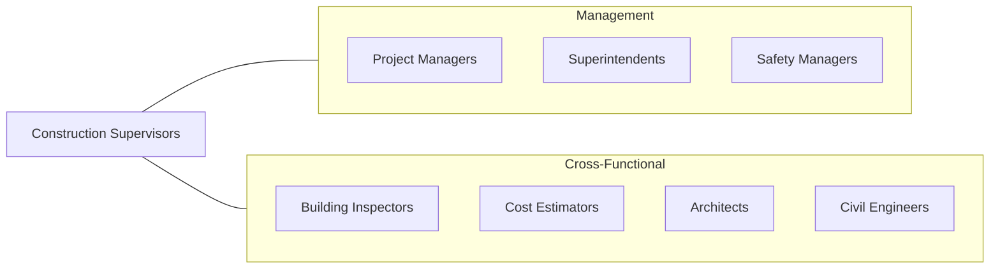

# First-Line Supervisors of Construction Trades and Extraction Workers

> Directly supervise and coordinate activities of construction or extraction workers.

## Overview

First-Line Supervisors of Construction Trades and Extraction Workers, commonly known as construction foremen or field supervisors, directly manage crews of trade workers on construction sites and extraction operations. They serve as the critical link between project management and the workforce, translating plans and schedules into daily work assignments while ensuring quality, safety, and productivity standards are met. This role requires both deep trade expertise and strong leadership abilities.

These supervisors plan and coordinate daily work activities, assign tasks, monitor progress, enforce safety protocols, and resolve field problems. They read and interpret blueprints, inspect completed work for quality and code compliance, order materials, and manage crew schedules. Effective supervisors maintain productive relationships with other trades, inspectors, and project managers while keeping their crews motivated and working efficiently. Many have risen through the ranks from journeyman-level positions in their specific trade.

The role carries significant responsibility for both project outcomes and worker safety. Supervisors conduct daily safety briefings, identify and correct hazards, investigate incidents, and ensure compliance with OSHA and company safety programs. They also manage labor relations, performance evaluations, and training for their crews. As construction projects become more complex and schedules tighter, the demand for skilled field supervisors continues to grow.

## Classification Hierarchy

## Key Statistics

| Metric | Value |
|--------|-------|
| SOC Code | 47-1011.00 |
| Job Zone | 4 (Considerable Preparation) |
| Category | [Construction and Extraction](/occupations/Construction/index) |
| Task Count | 156 |
| Median Salary | $73,900 / year |
| Employment | ~700,000 |
| Job Outlook | 4% (As fast as average) |
| Physical Demands | Medium |
| Source | O*NET |

## Core Tasks

### plan.DailyWorkActivities

Supervisors plan and organize each workday for their crews.

**Actions:**
- `plan.DailyWorkActivities.for.Crews`
- `plan.CrewAssignments.based.on.Skills`
- `plan.MaterialNeeds.for.UpcomingWork`

### supervise.TradeWorkers

Supervisors directly manage trade workers to ensure productive and safe operations.

**Actions:**
- `supervise.TradeWorkers.on.ConstructionSites`
- `supervise.WorkQuality.against.Specifications`
- `supervise.SafetyCompliance.per.OSHAStandards`

## Skills & Competencies

### Technical Skills
- **Trade-Specific Expertise** - Expert (in their trade of origin)
- **Blueprint Reading** - Expert
- **Building Codes and Standards** - Advanced
- **Scheduling and Planning** - Advanced
- **Cost Estimation** - Advanced
- **Quality Control** - Expert
- **Safety Management (OSHA)** - Expert
- **Equipment and Tool Knowledge** - Expert

### Leadership Skills
- **Crew Management** - Expert
- **Conflict Resolution** - Advanced
- **Training and Mentoring** - Advanced
- **Performance Evaluation** - Advanced
- **Decision Making** - Expert
- **Communication (Written and Verbal)** - Expert

### Soft Skills
- **Leadership** - Critical
- **Problem Solving** - Critical
- **Communication** - Critical
- **Organization** - Essential
- **Integrity** - Critical

## Education & Certifications

| Requirement | Details |
|-------------|---------|
| Typical Education | High school diploma + trade experience |
| Trade Experience | 5-10+ years journeyman-level experience |
| Supervisory Training | Company or union leadership programs |
| Continuing Education | Ongoing code and safety updates |

### Certifications
- **OSHA 30-Hour Construction** - Required supervisory safety training
- **OSHA Competent Person** - Various topics (excavation, scaffolding, fall protection)
- **First Aid/CPR/AED** - Required
- **NCCER Supervisor Certification** - Industry credential
- **Trade-Specific Journeyman Card** - Foundation credential
- **Confined Space Competent Person** - If applicable
- **Crane Signal Person** - If applicable

## Career Progression

## Specializations

### Trade-Specific Supervision
- Electrical foreman
- Plumbing/mechanical foreman
- Carpentry foreman
- Concrete foreman
- Iron work foreman

### Project Type
- Residential construction supervisor
- Commercial construction supervisor
- Industrial construction supervisor
- Heavy/civil construction supervisor
- Mining/extraction supervisor

### Functional Role
- General foreman (multiple trades)
- Area superintendent
- Safety supervisor
- Quality control supervisor

## Tools & Equipment

### Planning Tools
- Construction schedules (MS Project, P6)
- Daily reports and logs
- Blueprint sets and specifications
- Two-way radios
- Tablets and field software

### Field Tools
- Measuring instruments
- Levels and surveying tools
- Digital cameras
- PPE (hard hat, vest, glasses, boots)

## Safety Considerations

- **Crew Safety Management** - Responsible for all workers under their supervision
- **Daily Safety Briefings** - Toolbox talks and JHA reviews
- **Hazard Identification** - Continuous site hazard assessment
- **Incident Investigation** - Root cause analysis and corrective actions
- **Regulatory Compliance** - OSHA, MSHA, and local safety requirements
- **Emergency Response** - Site emergency action plan coordination

## Related Occupations

## Industries

- Building Construction - Primary Employment
- Specialty Trade Contractors - Primary Employment
- Heavy and Civil Engineering - High Employment
- [Mining and Extraction](/industries/Mining) - Moderate Employment
- [Government](/industries/PublicAdministration) - Moderate Employment

## Departments

This occupation typically works in:
- Field Operations
- Project Management
- Safety
- Quality Control

---

*Source: O*NET 47-1011.00 - ONETOccupation*
