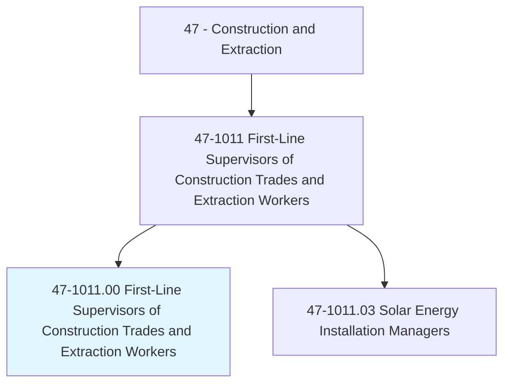
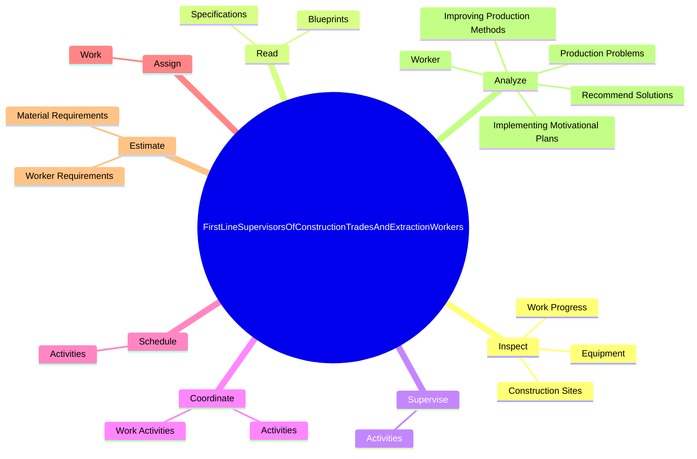
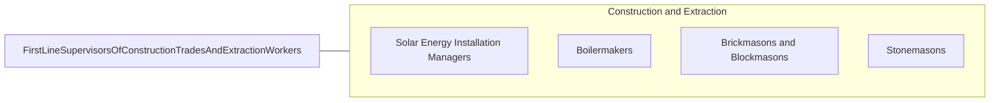

# First-Line Supervisors of Construction Trades and Extraction Workers

> Directly supervise and coordinate activities of construction or extraction workers.

## Overview

First-Line Supervisors of Construction Trades and Extraction Workers is classified under Construction and Extraction (SOC 47). Directly supervise and coordinate activities of construction or extraction workers.

## Classification Hierarchy

## Key Statistics

| Metric | Value |
|--------|-------|
| SOC Code | 47-1011.00 |
| Category | [Construction and Extraction](/occupations/Construction) |
| Task Count | 80 |
| Source | O*NET |

## Core Tasks

### inspect.WorkProgress

First-Line Supervisors of Construction Trades and Extraction Workers inspect work progress as part of their core responsibilities.

**Actions:**
- `inspect.WorkProgress.to.verify.SafetyEnsureSpecificationsAreMet`
- `inspect.WorkProgress.to.ToEnsureSpecificationsAreMet`
- `inspect.Equipment.to.verify.SafetyEnsureSpecificationsAreMet`
- `inspect.Equipment.to.ToEnsureSpecificationsAreMet`

### read.Specifications

First-Line Supervisors of Construction Trades and Extraction Workers read specifications as part of their core responsibilities.

**Actions:**
- `read.Specifications.to.determine.ConstructionRequirementsPlanProcedures`
- `read.Specifications.to.ToPlanProcedures`
- `read.Blueprints.to.determine.ConstructionRequirementsPlanProcedures`
- `read.Blueprints.to.ToPlanProcedures`

### supervise.Activities

First-Line Supervisors of Construction Trades and Extraction Workers supervise activities as part of their core responsibilities.

**Actions:**
- `supervise.Activities.of.ConstructionWorkers`
- `supervise.Activities.of.ExtractiveWorkers`

## Skills & Competencies

### Technical Skills
- **Construction Methods** - Advanced
- **Blueprint Reading** - Advanced
- **Safety Compliance** - Advanced

### Soft Skills
- **Communication** - Essential
- **Problem Solving** - Essential
- **Critical Thinking** - Important
- **Teamwork** - Important
- **Adaptability** - Important

## Related Occupations

## Industries

This occupation is found across multiple industries. See [Industries](/industries) for sector-specific employment data.

## Career Progression

---

*Source: O*NET 47-1011.00 - ONETOccupation*
