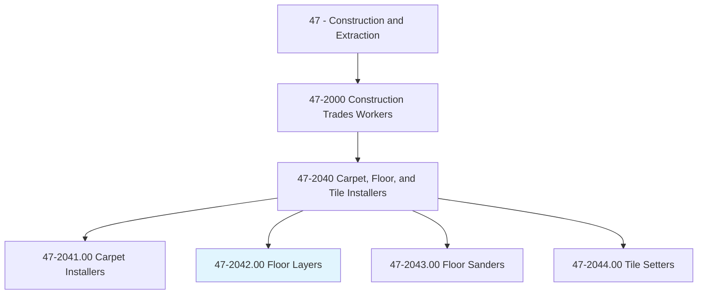
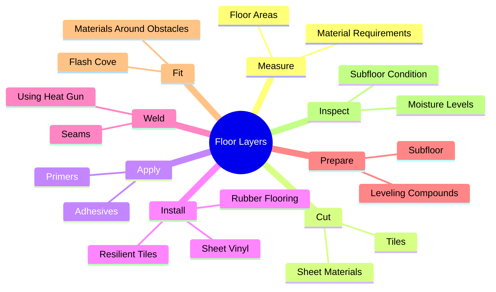
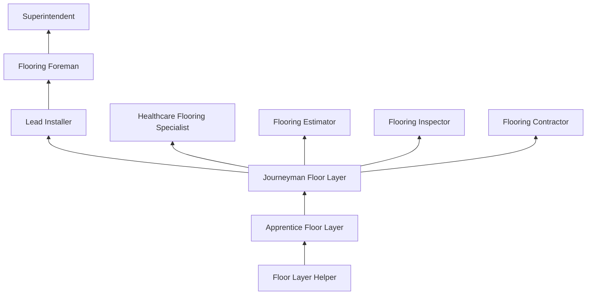
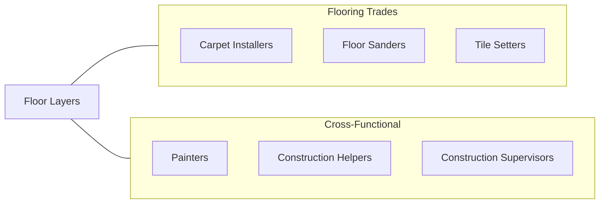

# Floor Layers, Except Carpet, Wood, and Hard Tiles

> Apply blocks, strips, or sheets of shock-absorbing, sound-deadening, or decorative coverings to floors.

## Overview

Floor Layers who work with resilient flooring materials install vinyl, linoleum, rubber, cork, and other sheet and tile products on floors in residential, commercial, healthcare, and industrial settings. This trade specializes in materials that differ from carpet, hardwood, and ceramic tile, focusing on resilient and specialty flooring systems that require unique installation techniques including heat welding, flash coving, and chemical bonding.

The healthcare and institutional sectors drive significant demand for these specialists, as hospitals, laboratories, schools, and cleanrooms require seamless, hygienic flooring systems. Sheet vinyl and linoleum installations in healthcare settings must be heat-welded at seams to prevent moisture and bacteria infiltration. These installations require exceptional precision, as seams must be perfectly aligned and welded to create truly monolithic floor surfaces.

Modern resilient flooring includes luxury vinyl tile (LVT), luxury vinyl plank (LVP), sheet vinyl, linoleum, rubber, cork, and epoxy terrazzo. Each product has specific substrate requirements, adhesive systems, and installation techniques. Floor layers must also be skilled in subfloor preparation, moisture mitigation, and floor leveling, as resilient materials are thin and will telegraph any imperfection in the substrate.

## Classification Hierarchy

## Key Statistics

| Metric | Value |
|--------|-------|
| SOC Code | 47-2042.00 |
| Job Zone | 2 (Some Preparation) |
| Category | [Construction and Extraction](/occupations/Construction/index) |
| Task Count | 96 |
| Median Salary | $46,300 / year |
| Employment | ~16,000 |
| Job Outlook | 2% (Slower than average) |
| Physical Demands | Heavy |
| Source | O*NET |

## Core Tasks

### install.SheetVinyl

Floor Layers install sheet vinyl and other resilient materials using precise fitting techniques.

**Actions:**
- `install.SheetVinyl.using.FullSpreadAdhesive`
- `install.ResilientTiles.in.PatternLayout`
- `install.RubberFlooring.in.CommercialSettings`

### weld.Seams

Floor Layers heat-weld seams to create seamless, hygienic floor surfaces.

**Actions:**
- `weld.Seams.using.HeatGun`
- `weld.Seams.with.WeldingRod`
- `weld.Seams.to.create.MonolithicSurface`

## Skills & Competencies

### Technical Skills
- **Resilient Flooring Installation** - Expert
- **Heat Welding** - Expert
- **Subfloor Preparation** - Expert
- **Moisture Testing and Mitigation** - Advanced
- **Adhesive Systems** - Advanced
- **Flash Coving** - Expert
- **Blueprint Reading** - Intermediate
- **Floor Leveling** - Advanced

### Trade-Specific Skills
- **Sheet Goods Fitting** - Pattern scribing and template making
- **LVT/LVP Installation** - Click-lock and glue-down methods
- **Linoleum Installation** - Natural linoleum (Forbo, Armstrong)
- **Rubber Flooring** - Sheet and tile (Nora, Mondo)
- **Sports Flooring** - Gymnasium and athletic surfaces
- **Static Dissipative Flooring** - ESD-rated installations

### Soft Skills
- **Attention to Detail** - Critical
- **Physical Stamina** - Critical
- **Patience** - Essential
- **Problem Solving** - Essential
- **Customer Service** - Important

## Education & Certifications

| Requirement | Details |
|-------------|---------|
| Typical Education | High school diploma or equivalent |
| Apprenticeship | 3-4 year program available |
| On-the-Job Training | 2,000-4,000 hours |
| Manufacturer Training | Product-specific certification |

### Certifications
- **CFI Certified Installer (Resilient)** - Certified Flooring Installers Association
- **INSTALL Flooring Certification** - Union-based certification
- **OSHA 10-Hour Construction** - Safety certification
- **Manufacturer Certifications** - Armstrong, Forbo, Tarkett, Nora training
- **Moisture Testing Certification** - ASTM F2170, F1869 methods

## Career Progression

## Specializations

### Healthcare Flooring
- Sheet vinyl with heat-welded seams
- Flash cove base
- Cleanroom flooring
- Anti-microbial systems

### Commercial Resilient
- LVT and LVP installations
- Rubber flooring
- Linoleum
- High-traffic commercial spaces

### Sports and Athletic
- Gymnasium flooring
- Running tracks
- Multi-purpose sports surfaces
- Dance and performance floors

### Specialty Applications
- Static dissipative flooring (ESD)
- Chemical-resistant flooring
- Anti-fatigue matting systems
- Marine and transportation flooring

## Tools & Equipment

### Hand Tools
- Flooring knives and blades
- Seam cutters and groovers
- Scribing tools
- Hand rollers (seam and floor)
- Trowels (adhesive notch patterns)
- Straightedges and squares

### Power Tools
- Heat welding guns
- Floor scrapers (powered)
- Grinders and shot blasters
- Floor rollers (100 lb)
- Moisture meters (calcium chloride, RH probes)

### Equipment
- Floor preparation machines
- Self-leveling compound pumps
- Substrate moisture mitigation systems
- Material carts and handling equipment

## Safety Considerations

- **Knee Injuries** - Prolonged kneeling; knee pads required
- **Adhesive Fumes** - VOC exposure; ventilation required
- **Repetitive Motion** - Cutting and fitting; ergonomic awareness
- **Chemical Exposure** - Adhesives, primers, leveling compounds
- **Back Strain** - Floor-level work; proper body mechanics
- **Sharp Tools** - Knife cuts; retractable blade knives
- **Dust Exposure** - Floor preparation and grinding; respiratory protection

## Related Occupations

## Industries

- Flooring Contractors - Primary Employment
- Healthcare Construction - High Employment
- Commercial Building Construction - High Employment
- Institutional Construction - Moderate Employment

## Departments

This occupation typically works in:
- Field Operations
- Flooring Division
- Healthcare Construction
- Estimating

---

*Source: O*NET 47-2042.00 - ONETOccupation*
