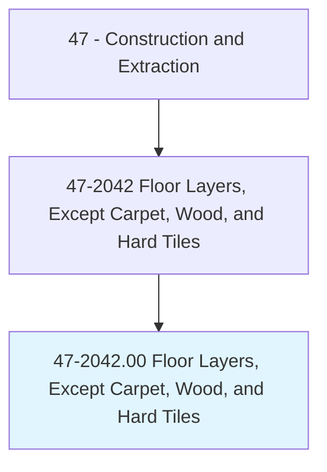
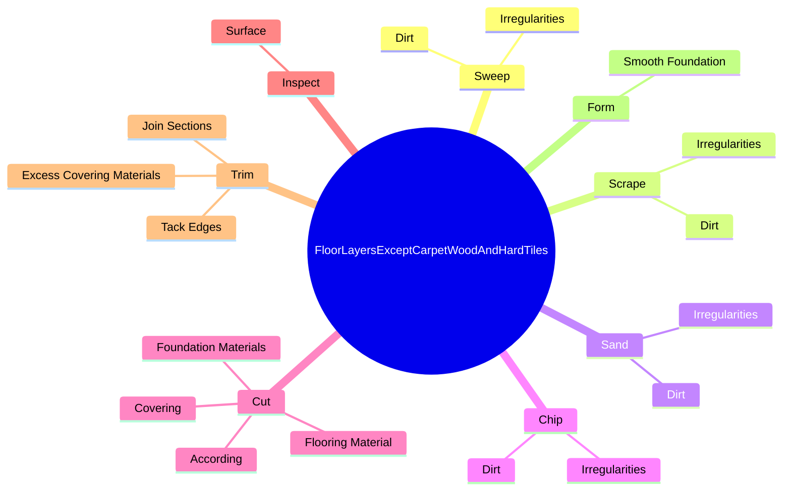
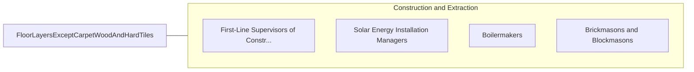

# Floor Layers, Except Carpet, Wood, and Hard Tiles

> Apply blocks, strips, or sheets of shock-absorbing, sound-deadening, or decorative coverings to floors.

## Overview

Floor Layers, Except Carpet, Wood, and Hard Tiles is classified under Construction and Extraction (SOC 47). Apply blocks, strips, or sheets of shock-absorbing, sound-deadening, or decorative coverings to floors.

## Classification Hierarchy

## Key Statistics

| Metric | Value |
|--------|-------|
| SOC Code | 47-2042.00 |
| Category | [Construction and Extraction](/occupations/Construction) |
| Task Count | 111 |
| Source | O*NET |

## Core Tasks

### sweep.Dirt

Floor Layers, Except Carpet, Wood, and Hard Tiles sweep dirt as part of their core responsibilities.

**Actions:**
- `sweep.Dirt.to.clean.BaseSurfaces`
- `sweep.Dirt.to.CorrectingImperfectionsMayShowThroughCovering`
- `sweep.Irregularities.to.clean.BaseSurfaces`
- `sweep.Irregularities.to.CorrectingImperfectionsMayShowThroughCovering`

### scrape.Dirt

Floor Layers, Except Carpet, Wood, and Hard Tiles scrape dirt as part of their core responsibilities.

**Actions:**
- `scrape.Dirt.to.clean.BaseSurfaces`
- `scrape.Dirt.to.CorrectingImperfectionsMayShowThroughCovering`
- `scrape.Irregularities.to.clean.BaseSurfaces`
- `scrape.Irregularities.to.CorrectingImperfectionsMayShowThroughCovering`

### sand.Dirt

Floor Layers, Except Carpet, Wood, and Hard Tiles sand dirt as part of their core responsibilities.

**Actions:**
- `sand.Dirt.to.clean.BaseSurfaces`
- `sand.Dirt.to.CorrectingImperfectionsMayShowThroughCovering`
- `sand.Irregularities.to.clean.BaseSurfaces`
- `sand.Irregularities.to.CorrectingImperfectionsMayShowThroughCovering`

## Skills & Competencies

### Technical Skills
- **Construction Methods** - Advanced
- **Blueprint Reading** - Advanced
- **Safety Compliance** - Advanced

### Soft Skills
- **Communication** - Essential
- **Problem Solving** - Essential
- **Critical Thinking** - Important
- **Teamwork** - Important
- **Adaptability** - Important

## Related Occupations

## Industries

This occupation is found across multiple industries. See [Industries](/industries) for sector-specific employment data.

## Career Progression

---

*Source: O*NET 47-2042.00 - ONETOccupation*
