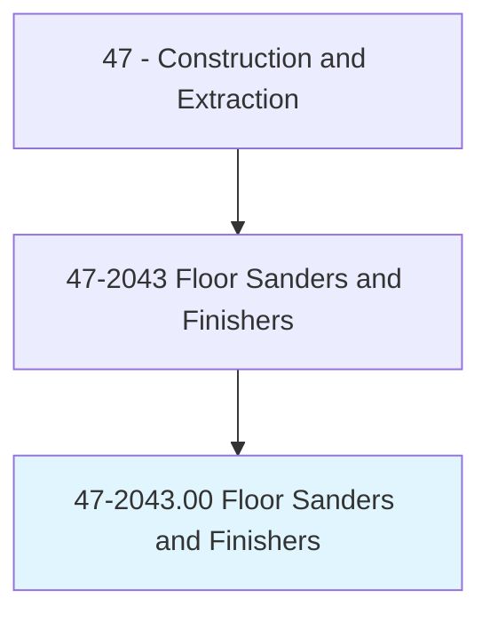
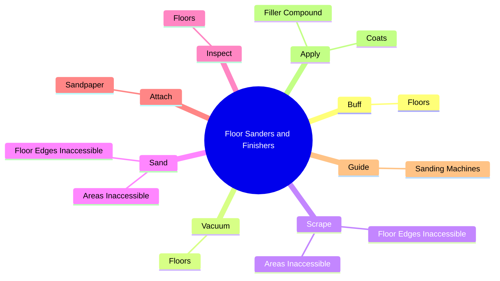
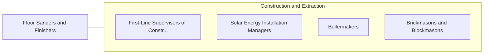

# Floor Sanders and Finishers

> Scrape and sand wooden floors to smooth surfaces using floor scraper and floor sanding machine, and apply coats of finish.

## Overview

Floor Sanders and Finishers is classified under Construction and Extraction (SOC 47). Scrape and sand wooden floors to smooth surfaces using floor scraper and floor sanding machine, and apply coats of finish.

## Classification Hierarchy

## Key Statistics

| Metric | Value |
|--------|-------|
| SOC Code | 47-2043.00 |
| Category | [Construction and Extraction](/occupations/Construction) |
| Task Count | 27 |
| Source | O*NET |

## Core Tasks

### buff.Floors

Floor Sanders and Finishers buff floors as part of their core responsibilities.

**Actions:**
- `buff.Floors.to.ensure.CleanlinessPriorToApplicationOfFinish`

### vacuum.Floors

Floor Sanders and Finishers vacuum floors as part of their core responsibilities.

**Actions:**
- `vacuum.Floors.to.ensure.CleanlinessPriorToApplicationOfFinish`

### scrape.FloorEdgesInaccessible

Floor Sanders and Finishers scrape floor edges inaccessible as part of their core responsibilities.

**Actions:**
- `scrape.FloorEdgesInaccessible.to.FloorSanders`
- `scrape.FloorEdgesInaccessible.to.UsingScrapers`
- `scrape.FloorEdgesInaccessible.to.DiskTypeSanders`
- `scrape.FloorEdgesInaccessible.to.Sandpaper`

## Skills & Competencies

### Technical Skills
- **Construction Methods** - Advanced
- **Blueprint Reading** - Advanced
- **Safety Compliance** - Advanced

### Soft Skills
- **Communication** - Essential
- **Problem Solving** - Essential
- **Critical Thinking** - Important
- **Teamwork** - Important
- **Adaptability** - Important

## Related Occupations

## Industries

This occupation is found across multiple industries. See [Industries](/industries) for sector-specific employment data.

## Career Progression

---

*Source: O*NET 47-2043.00 - ONETOccupation*
