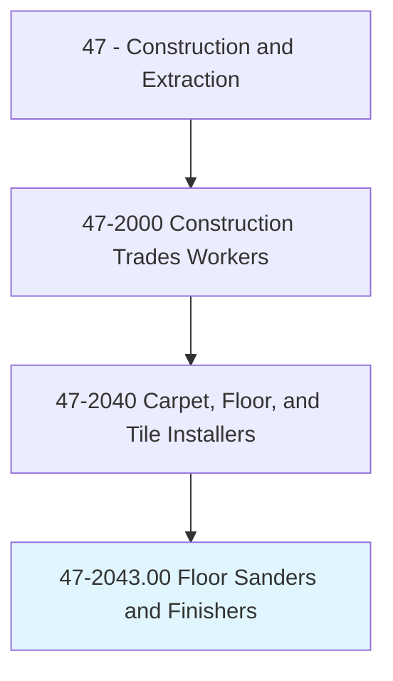
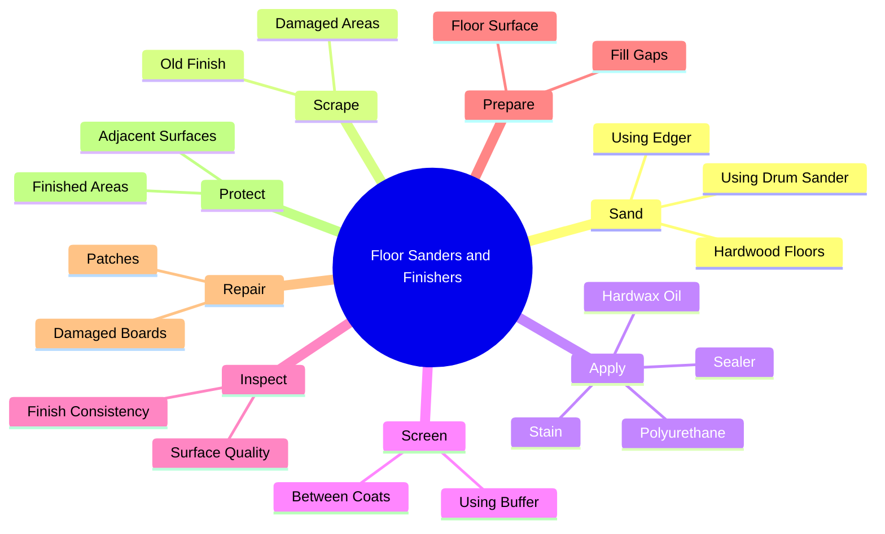
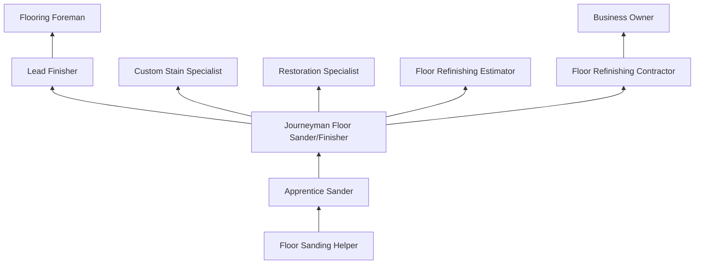
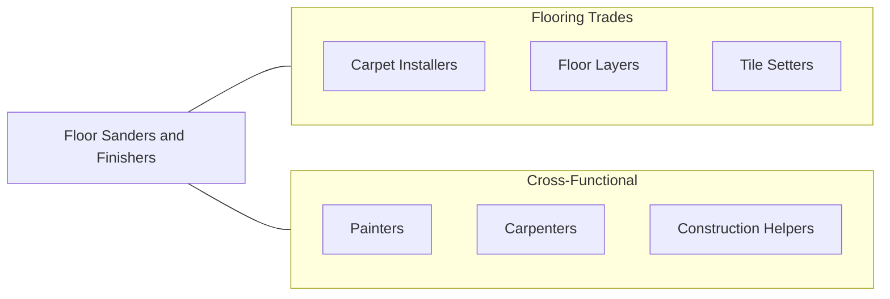

# Floor Sanders and Finishers

> Scrape and sand wooden floors to smooth surfaces using floor scraper and floor sanding machine, and apply coats of finish.

## Overview

Floor Sanders and Finishers specialize in the restoration and finishing of hardwood floors, transforming rough, damaged, or worn wood surfaces into smooth, beautifully finished floors. This trade combines mechanical skill with artistic judgment, as finishers must understand wood species, grain patterns, stain chemistry, and finish application techniques to achieve the desired appearance and durability. The work is divided between sanding (removing old finish and leveling the surface) and finishing (applying stain, sealer, and topcoat).

The sanding process requires progressive passes with increasingly fine abrasives, using drum sanders, edgers, and buffer screens to create a perfectly smooth, level surface. Improper sanding technique can leave visible marks, waves, or cross-grain scratches that become permanently visible under finish. Finishing involves applying stains, sealers, and polyurethane or other protective coatings, each requiring specific application methods, drying times, and environmental conditions.

The trade has evolved with the introduction of dustless sanding systems, water-based finishes, and hardwax oil products. Floor sanders now work with a wider range of materials including engineered hardwood, bamboo, cork, and reclaimed wood. The demand for hardwood floor refinishing remains strong in both residential renovation and commercial restoration markets, as well-maintained hardwood floors add significant value to properties.

## Classification Hierarchy

## Key Statistics

| Metric | Value |
|--------|-------|
| SOC Code | 47-2043.00 |
| Job Zone | 2 (Some Preparation) |
| Category | [Construction and Extraction](/occupations/Construction/index) |
| Task Count | 65 |
| Median Salary | $42,600 / year |
| Employment | ~10,000 |
| Job Outlook | 2% (Slower than average) |
| Physical Demands | Heavy |
| Source | O*NET |

## Core Tasks

### sand.HardwoodFloors

Floor Sanders progressively sand wood surfaces to achieve a smooth, level finish.

**Actions:**
- `sand.HardwoodFloors.using.DrumSander`
- `sand.HardwoodFloors.using.Edger`
- `sand.HardwoodFloors.using.Buffer`

### apply.Finish

Floor Finishers apply stains and protective coatings to sanded wood floors.

**Actions:**
- `apply.Stain.to.SandedFloors`
- `apply.Sealer.to.StainedFloors`
- `apply.Polyurethane.to.SealedFloors`
- `apply.HardwaxOil.to.SandedFloors`

## Skills & Competencies

### Technical Skills
- **Floor Sanding (Drum, Edger, Buffer)** - Expert
- **Finish Application** - Expert
- **Wood Species Identification** - Advanced
- **Stain Color Matching** - Advanced
- **Equipment Maintenance** - Advanced
- **Subfloor Assessment** - Intermediate
- **Board Repair and Replacement** - Advanced
- **Moisture Testing** - Intermediate

### Trade-Specific Skills
- **Dust Containment Systems** - Modern dustless sanding equipment
- **Water-Based Finishes** - Low-VOC application techniques
- **Oil-Modified Polyurethane** - Traditional finish application
- **Hardwax Oil Systems** - European-style natural finishes
- **Custom Staining** - Multi-color, whitewash, gray tones
- **Parquet and Medallion Refinishing** - Intricate pattern work

### Soft Skills
- **Attention to Detail** - Critical
- **Patience** - Critical
- **Physical Stamina** - Essential
- **Customer Service** - Essential (residential work)
- **Artistic Eye** - Important

## Education & Certifications

| Requirement | Details |
|-------------|---------|
| Typical Education | High school diploma or equivalent |
| On-the-Job Training | 1-2 years |
| Manufacturer Training | Finish product certification |

### Certifications
- **NWFA Certified Sand and Finisher** - National Wood Flooring Association
- **NWFA Certified Installation Professional** - Industry credential
- **OSHA 10-Hour Construction** - Safety certification
- **EPA RRP Certified (Lead-Safe)** - Required for pre-1978 buildings
- **Manufacturer Certifications** - Bona, Loba, Rubio Monocoat training

## Career Progression

## Specializations

### Residential Refinishing
- Single-family home floor restoration
- Pre-sale refinishing
- Custom staining and finishing

### Commercial Refinishing
- Gymnasium floors
- Restaurant and retail
- Historical building restoration

### New Installation Finishing
- New hardwood floor finishing
- Unfinished wood sanding and coating
- Site-finished engineered wood

### Specialty Finishes
- Reclaimed wood finishing
- Parquet pattern restoration
- Custom inlays and borders
- Bleaching and pickling

## Tools & Equipment

### Sanding Equipment
- Drum sanders (belt sanders)
- Orbital/planetary sanders
- Edge sanders (edgers)
- Floor buffers/screens
- Detail sanders (triangle, corner)
- Dust containment systems

### Finishing Equipment
- T-bar applicators
- Lambswool applicators
- Roller application systems
- Spray systems (HVLP)
- Buffing pads (maroon, white)

### Support Equipment
- Moisture meters
- Floor gap fillers
- Sanding belts and discs (various grits)
- Containment plastic and tape
- Work lights

## Safety Considerations

- **Dust Inhalation** - Wood dust is a carcinogen; respirator and dust containment required
- **Chemical Exposure** - Finish fumes (polyurethane, stain); ventilation and respirator
- **Fire Hazard** - Flammable finishes and dust; no ignition sources
- **Noise** - Sanding equipment; hearing protection required
- **Vibration** - Prolonged equipment use; hand-arm vibration syndrome
- **Slip Hazards** - Freshly finished surfaces; controlled access
- **Lead Paint** - Older buildings may have lead; EPA RRP compliance

## Related Occupations

## Industries

- [Flooring Contractors](/industries/SpecialtyTrade) - Primary Employment
- [Residential Renovation](/industries/ResidentialConstruction) - High Employment
- [Commercial Building Renovation](/industries/CommercialConstruction) - Moderate Employment
- [Historical Restoration](/industries/Restoration) - Specialty Employment

## Departments

This occupation typically works in:
- [Field Operations](/departments/FieldOperations)
- [Flooring Division](/departments/Flooring)
- [Refinishing Division](/departments/Refinishing)
- [Estimating](/departments/Estimating)

---

*Source: O*NET 47-2043.00 - ONETOccupation*
