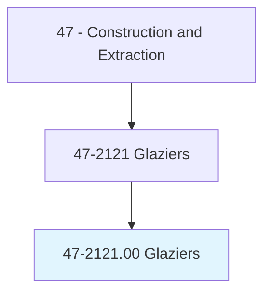
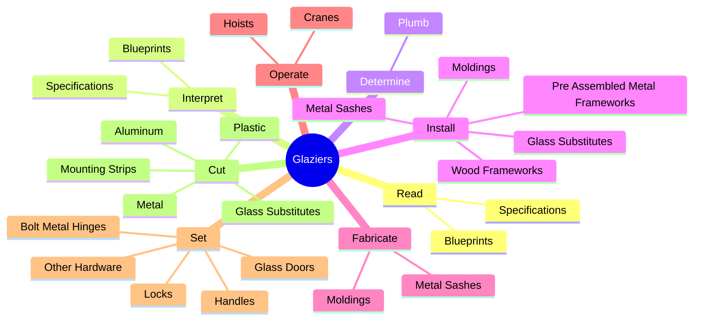
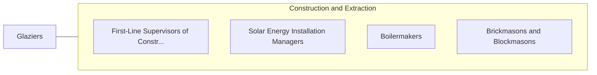

# Glaziers

> Install glass in windows, skylights, store fronts, and display cases, or on surfaces, such as building fronts, interior walls, ceilings, and tabletops.

## Overview

Glaziers is classified under Construction and Extraction (SOC 47). Install glass in windows, skylights, store fronts, and display cases, or on surfaces, such as building fronts, interior walls, ceilings, and tabletops.

## Classification Hierarchy

## Key Statistics

| Metric | Value |
|--------|-------|
| SOC Code | 47-2121.00 |
| Category | [Construction and Extraction](/occupations/Construction/index) |
| Task Count | 214 |
| Source | O*NET |

## Core Tasks

### read.Blueprints

Glaziers read blueprints as part of their core responsibilities.

**Actions:**
- `read.Blueprints.to.determine.Size`
- `read.Blueprints.to.shape`
- `read.Blueprints.to.Color`
- `read.Blueprints.to.type`

### interpret.Blueprints

Glaziers interpret blueprints as part of their core responsibilities.

**Actions:**
- `interpret.Blueprints.to.determine.Size`
- `interpret.Blueprints.to.shape`
- `interpret.Blueprints.to.Color`
- `interpret.Blueprints.to.type`

### determine.Plumb

Glaziers determine plumb as part of their core responsibilities.

**Actions:**
- `determine.Plumb.of.Walls`
- `determine.Plumb.of.Ceilings`
- `determine.Plumb.of.UsingPlumbLines`
- `determine.Plumb.of.Levels`

## Skills & Competencies

### Technical Skills
- **Construction Methods** - Advanced
- **Blueprint Reading** - Advanced
- **Safety Compliance** - Advanced

### Soft Skills
- **Communication** - Essential
- **Problem Solving** - Essential
- **Critical Thinking** - Important
- **Teamwork** - Important
- **Adaptability** - Important

## Related Occupations

## Industries

This occupation is found across multiple industries. See [Industries](/industries) for sector-specific employment data.

## Career Progression

---

*Source: O*NET 47-2121.00 - ONETOccupation*
