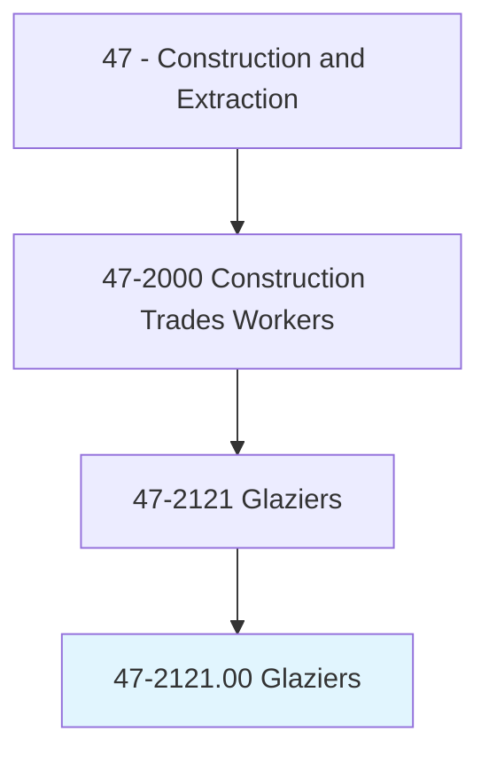
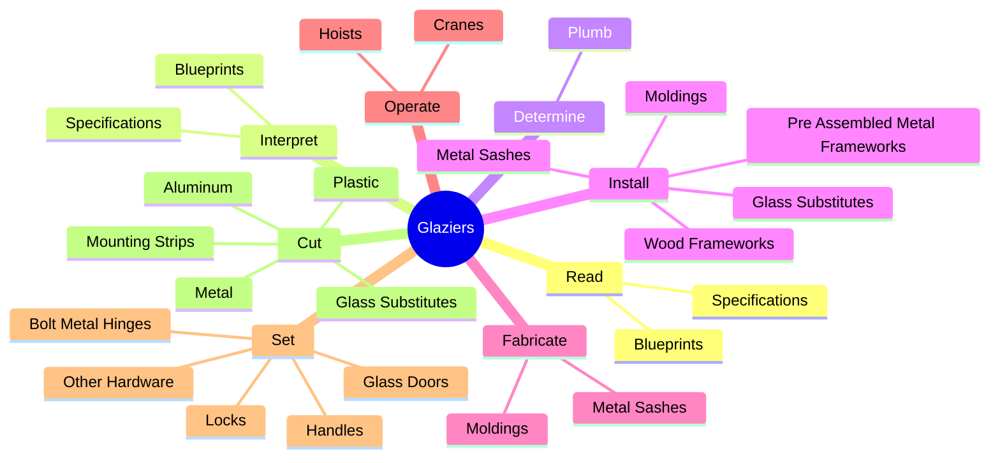
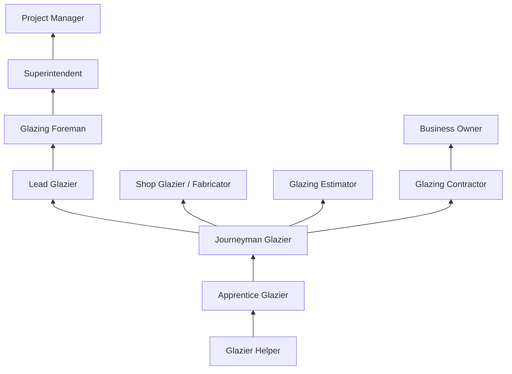
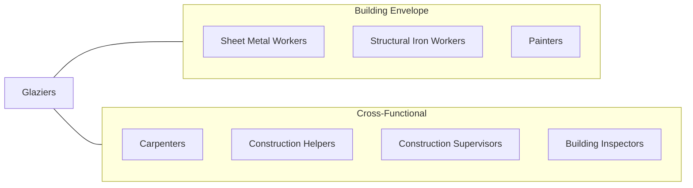

# Glaziers

> Install glass in windows, skylights, store fronts, and display cases, or on surfaces, such as building fronts, interior walls, ceilings, and tabletops.

## Overview

Glaziers are specialized construction trade workers who cut, install, and replace glass and glass substitutes in a wide variety of applications, from residential windows to towering curtain wall facades on skyscrapers. The trade requires a unique combination of precision measurement, material handling skill, and the ability to work at significant heights. Glass is both fragile and heavy, making its installation one of the more technically demanding and hazardous construction specialties.

Modern glazing has evolved far beyond simple window installation. Today's glaziers work with sophisticated systems including structural glazing, insulated glass units (IGUs), laminated safety glass, tempered glass, low-emissivity coatings, and electrochromic (smart) glass. They install curtain wall systems, point-supported glass facades, glass railings, shower enclosures, mirrors, and specialty architectural glass features.

The trade is divided between shop glaziers, who cut and prepare glass in fabrication shops, and field glaziers, who install glass on construction sites. Field glaziers often work at extreme heights on swing stages, scaffolds, or spider cranes, handling panels that can weigh hundreds of pounds. The work demands careful coordination between crew members, crane operators, and other trades.

## Classification Hierarchy

## Key Statistics

| Metric | Value |
|--------|-------|
| SOC Code | 47-2121.00 |
| Job Zone | 3 (Medium Preparation) |
| Category | [Construction and Extraction](/occupations/Construction/index) |
| Task Count | 214 |
| Median Salary | $48,600 / year |
| Employment | ~54,000 |
| Job Outlook | 4% (As fast as average) |
| Physical Demands | Heavy |
| Source | O*NET |

## Core Tasks

### read.Blueprints

Glaziers read blueprints and specifications to determine glass type, size, and installation requirements.

**Actions:**
- `read.Blueprints.to.determine.Size`
- `read.Blueprints.to.shape`
- `read.Blueprints.to.Color`
- `read.Blueprints.to.type`

### install.Frameworks

Glaziers install framing systems and glass units in building openings.

**Actions:**
- `install.PreAssembledMetalFrameworks.in.BuildingOpenings`
- `install.WoodFrameworks.in.BuildingOpenings`
- `install.MetalSashes.in.BuildingOpenings`
- `install.Moldings.around.GlassUnits`

### cut.Glass

Glaziers cut glass and glass substitutes to specified dimensions.

**Actions:**
- `cut.GlassSubstitutes.to.SpecifiedSize`
- `cut.Plastic.to.SpecifiedSize`
- `cut.Aluminum.to.SpecifiedSize`
- `cut.MountingStrips.to.Length`

## Skills & Competencies

### Technical Skills
- **Glass Cutting and Fabrication** - Expert
- **Curtain Wall Installation** - Expert
- **Blueprint Reading** - Advanced
- **Sealant and Caulking Application** - Expert
- **Metal Framing Systems** - Advanced
- **Structural Glazing Techniques** - Advanced
- **Crane Signaling** - Advanced
- **Mathematics (Geometry, Measurement)** - Advanced

### Trade-Specific Skills
- **Insulated Glass Unit (IGU) Handling** - Proper handling to prevent seal failure
- **Curtain Wall Systems** - Stick-built and unitized systems
- **Structural Silicone Glazing** - Adhesive-based glass attachment
- **Storefront Systems** - Aluminum framing and glass installation
- **Shower and Mirror Installation** - Residential and commercial

### Soft Skills
- **Attention to Detail** - Critical
- **Physical Stamina** - Critical
- **Heights Comfort** - Critical
- **Teamwork** - Critical
- **Problem Solving** - Essential

## Education & Certifications

| Requirement | Details |
|-------------|---------|
| Typical Education | High school diploma or equivalent |
| Apprenticeship | 4-year apprenticeship (IUPAT Glaziers) |
| On-the-Job Training | 6,000-8,000 hours |
| Classroom Training | 144+ hours/year during apprenticeship |

### Certifications
- **OSHA 10-Hour Construction** - Required safety certification
- **OSHA 30-Hour Construction** - Supervisory certification
- **IUPAT Journeyman Glazier Card** - Union credential
- **Scaffold/Swing Stage Certification** - Required for high-rise work
- **Rigging and Signal Person** - For crane-assisted installations
- **Fall Protection Competent Person** - Required for elevated work

## Career Progression

## Specializations

### Residential Glazing
- Window and door replacement
- Shower enclosures and mirrors
- Skylights and sunrooms

### Commercial Curtain Wall
- Unitized curtain wall systems
- Stick-built curtain wall
- Point-supported glass
- Structural glazing

### Storefront and Entrance
- Aluminum storefront systems
- All-glass entrance doors
- Revolving doors

### Specialty Glass
- Blast-resistant glazing
- Hurricane-rated glass
- Bullet-resistant glass
- Fire-rated glass

## Tools & Equipment

### Hand Tools
- Glass cutters (oil-fed, diamond)
- Suction cups and lifters
- Glazing bars and pry tools
- Caulking guns (manual and pneumatic)
- Rubber mallets
- Levels (torpedo, 4-foot, laser)

### Power Tools
- Glass edge grinding machines
- Drill presses and hand drills
- Miter saws (aluminum cutting)
- Impact drivers

### Equipment
- Swing stages and bosun chairs
- Spider cranes (mini cranes)
- Glass vacuum lifters (electric)
- Scaffolding systems
- Material hoists

## Safety Considerations

- **Cuts and Lacerations** - Glass edges; cut-resistant gloves mandatory
- **Falls from Heights** - High-rise curtain wall work; full fall protection required
- **Falling Glass** - Dropped panels can be fatal; exclusion zones required
- **Heavy Lifting** - Glass panels are extremely heavy; mechanical aids required
- **Silicone and Sealant Exposure** - Ventilation and skin protection
- **Wind Hazards** - Glass panels act as sails; wind speed monitoring required
- **Noise** - Fabrication shop and power tool use; hearing protection

## Related Occupations

## Industries

- Glazing Contractors - Primary Employment
- Commercial Building Construction - High Employment
- Residential Building Construction - Moderate Employment
- [Glass Product Manufacturing](/industries/Manufacturing) - Moderate Employment

## Departments

This occupation typically works in:
- Field Operations
- Glazing Division
- Curtain Wall Division
- Shop Fabrication
- Estimating

---

*Source: O*NET 47-2121.00 - ONETOccupation*
