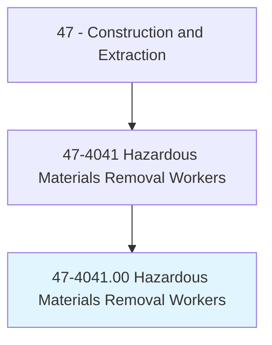
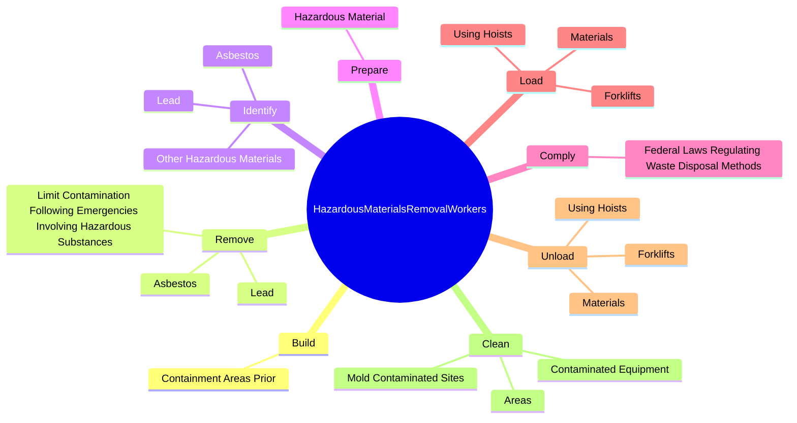
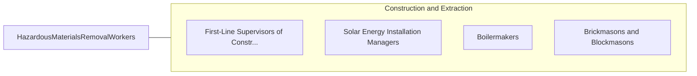

# Hazardous Materials Removal Workers

> Identify, remove, pack, transport, or dispose of hazardous materials, including asbestos, lead-based paint, waste oil, fuel, transmission fluid, radioactive materials, or contaminated soil. Specialized training and certification in hazardous materials handling or a confined entry permit are generally required. May operate earth-moving equipment or trucks.

## Overview

Hazardous Materials Removal Workers is an occupation within the Construction and Extraction category. Identify, remove, pack, transport, or dispose of hazardous materials, including asbestos, lead-based paint, waste oil, fuel, transmission fluid, radioactive materials, or contaminated soil. Specialized training and certification in hazardous materials handling or a confined entry permit are generally required.

## Classification Hierarchy

## Key Statistics

| Metric | Value |
|--------|-------|
| SOC Code | 47-4041.00 |
| Category | [Construction and Extraction](/occupations/Construction/index) |
| Task Count | 93 |
| Source | O*NET |

## Core Tasks

### build.ContainmentAreasPrior

Hazardous Materials Removal Workers build containment areas prior as part of their core responsibilities.

**Actions:**
- `build.ContainmentAreasPrior.to.BeginningAbatementWork`
- `build.ContainmentAreasPrior.to.DecontaminationWork`

### remove.Asbestos

Hazardous Materials Removal Workers remove asbestos as part of their core responsibilities.

**Actions:**
- `remove.Asbestos.from.Surfaces`
- `remove.Asbestos.from.UsingH`
- `remove.Asbestos.from.PowerTools`
- `remove.Asbestos.from.Scrapers`

### identify.Asbestos

Hazardous Materials Removal Workers identify asbestos as part of their core responsibilities.

**Actions:**
- `identify.Asbestos.to.BeRemoved`
- `identify.Asbestos.to.UsingMonitoringDevices`
- `identify.Lead.to.BeRemoved`
- `identify.Lead.to.UsingMonitoringDevices`

## Skills & Competencies

### Technical Skills
- **Construction Methods** - Advanced
- **Blueprint Reading** - Advanced
- **Safety Compliance** - Advanced

### Soft Skills
- **Communication** - Essential
- **Problem Solving** - Essential
- **Critical Thinking** - Important
- **Teamwork** - Important
- **Adaptability** - Important

## Related Occupations

## Industries

This occupation is found across multiple industries. See [Industries](/industries) for sector-specific employment data.

## Career Progression

---

*Source: O*NET 47-4041.00 - ONETOccupation*
