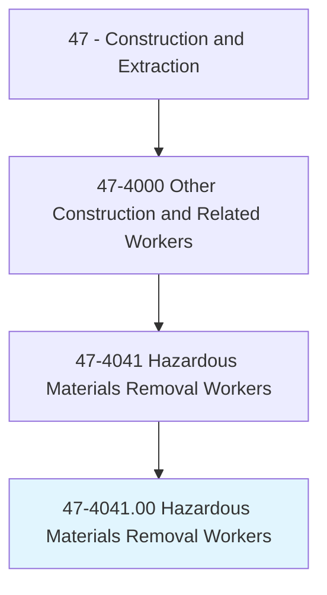
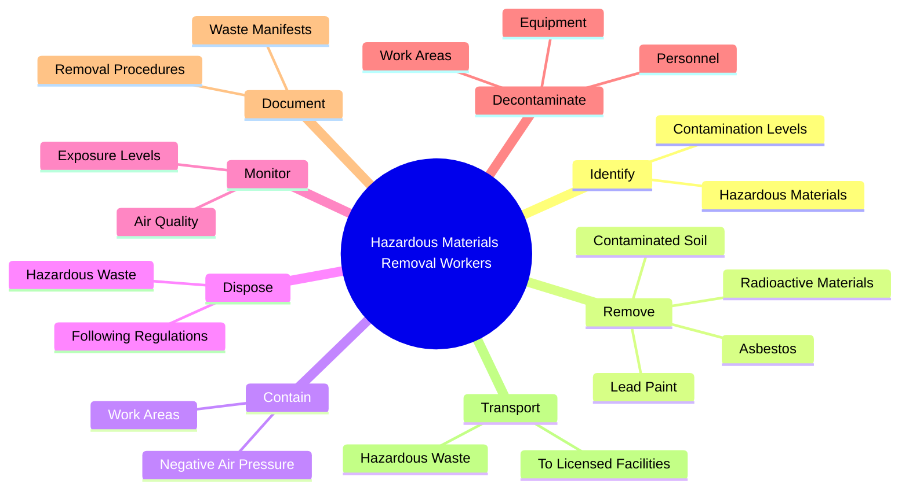
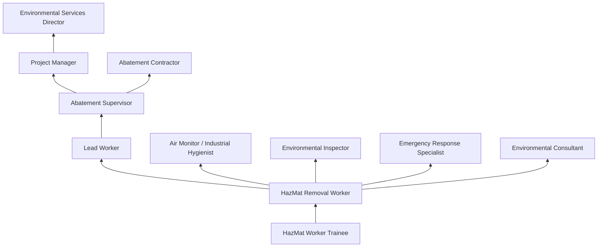
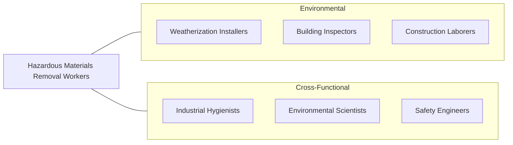

# Hazardous Materials Removal Workers

> Identify, remove, pack, transport, or dispose of hazardous materials, including asbestos, lead-based paint, waste oil, fuel, transmission fluid, radioactive materials, or contaminated soil. Specialized training and certification in hazardous materials handling or a confined area is generally required.

## Overview

Hazardous Materials Removal Workers identify, contain, remove, and dispose of dangerous substances found in buildings, soil, water, and industrial facilities. These workers perform some of the most regulated and safety-critical tasks in the construction industry, dealing with materials that can cause cancer, organ damage, neurological harm, or environmental contamination. The primary materials they handle include asbestos, lead paint, mold, radioactive substances, contaminated soil, underground storage tanks, and chemical waste.

Asbestos abatement constitutes a large portion of the work, particularly in buildings constructed before 1980 when asbestos was widely used in insulation, floor tiles, ceiling materials, and fireproofing. Workers must construct elaborate containment systems with negative air pressure, wear full personal protective equipment including respirators, and follow strict decontamination procedures. Every step is governed by EPA, OSHA, and state environmental regulations, with air monitoring conducted throughout the process.

The occupation has expanded beyond traditional asbestos and lead work to include mold remediation, methamphetamine lab cleanup, emergency spill response, and environmental site remediation. Workers must be trained in hazard recognition, containment techniques, proper PPE selection and use, waste handling and transportation, and emergency response procedures. The work is inherently dangerous, and violations can result in severe penalties for both workers and employers.

## Classification Hierarchy

## Key Statistics

| Metric | Value |
|--------|-------|
| SOC Code | 47-4041.00 |
| Job Zone | 2 (Some Preparation) |
| Category | [Construction and Extraction](/occupations/Construction/index) |
| Task Count | 105 |
| Median Salary | $46,300 / year |
| Employment | ~40,000 |
| Job Outlook | 7% (Faster than average) |
| Physical Demands | Heavy |
| Source | O*NET |

## Core Tasks

### remove.Asbestos

Workers safely remove asbestos-containing materials from buildings.

**Actions:**
- `remove.Asbestos.from.Buildings`
- `remove.LeadPaint.from.Surfaces`
- `remove.ContaminatedSoil.from.Sites`

### contain.WorkAreas

Workers establish containment to prevent hazardous material spread.

**Actions:**
- `contain.WorkAreas.using.NegativeAirPressure`
- `contain.WorkAreas.using.PolyethyleneBarriers`
- `contain.WorkAreas.using.DecontaminationChambers`

## Skills & Competencies

### Technical Skills
- **Asbestos Abatement** - Expert
- **Lead Paint Removal** - Expert
- **Containment Construction** - Expert
- **Air Monitoring** - Advanced
- **Respirator Use and Fit Testing** - Expert
- **Waste Handling and Disposal** - Expert
- **Decontamination Procedures** - Expert
- **Regulatory Compliance (EPA, OSHA)** - Expert

### Trade-Specific Skills
- **Negative Air Enclosure** - Building sealed containment areas
- **Glove Bag Technique** - Asbestos removal from pipes
- **Wet Removal Methods** - Saturating materials to control fibers
- **Mold Remediation** - Assessment and removal protocols
- **Underground Storage Tank Removal** - Excavation and disposal
- **Emergency Spill Response** - HazMat incident cleanup

### Soft Skills
- **Safety Discipline** - Critical
- **Attention to Detail** - Critical
- **Physical Stamina** - Critical
- **Communication** - Essential
- **Teamwork** - Essential

## Education & Certifications

| Requirement | Details |
|-------------|---------|
| Typical Education | High school diploma or equivalent |
| Specialized Training | Required before any hazmat work |
| Medical Monitoring | Annual physicals and respiratory clearance |
| Background Check | May be required for some sites |

### Certifications
- **EPA Asbestos Worker (40-hour)** - Required for asbestos abatement
- **EPA Asbestos Supervisor (40-hour)** - For supervisory roles
- **OSHA HAZWOPER 40-Hour** - Hazardous waste operations
- **OSHA HAZWOPER 8-Hour Refresher** - Annual requirement
- **EPA Lead Abatement Worker** - Required for lead removal
- **EPA RRP Certified Renovator** - Lead-safe renovation
- **Mold Remediation Certification** - IICRC or equivalent
- **OSHA 10/30-Hour Construction** - General safety
- **Respirator Fit Test** - Annual medical clearance and fit testing

## Career Progression

## Specializations

### Asbestos Abatement
- Building demolition preparation
- Pipe and mechanical insulation removal
- Floor tile and mastic removal
- Fireproofing removal

### Lead Abatement
- Residential lead paint removal
- Bridge and steel structure stripping
- Soil remediation

### Mold Remediation
- Water damage restoration
- Indoor air quality improvement
- Building dry-out and dehumidification

### Environmental Remediation
- Contaminated soil excavation
- Underground storage tank removal
- Groundwater treatment support
- Brownfield site cleanup

## Tools & Equipment

### Containment Equipment
- Polyethylene sheeting (6 mil)
- Negative air machines (HEPA filtered)
- Decontamination units (3-stage)
- Air monitoring equipment (PCM, TEM)
- HEPA vacuums

### Removal Tools
- Hand scrapers and putty knives
- Glove bags (for pipe insulation)
- Wetting agents and sprayers
- Needle guns and grinders (lead)
- Demolition tools

### Personal Protective Equipment
- Full-face powered air-purifying respirators (PAPR)
- Half-face and full-face respirators with HEPA cartridges
- Tyvek disposable coveralls
- Rubber boots and gloves
- Supplied air systems (for high-exposure work)

## Safety Considerations

- **Respiratory Hazards** - Asbestos fibers, lead dust, mold spores; respiratory protection critical
- **Skin Exposure** - Chemical contact; full body PPE required
- **Heat Stress** - Working in sealed suits and containment; mandatory rest breaks
- **Confined Spaces** - Underground tank and vessel entry
- **Regulatory Violations** - Severe penalties for non-compliance
- **Contaminated Waste** - Proper handling, packaging, labeling, and transport
- **Medical Monitoring** - Ongoing health surveillance for exposed workers

## Related Occupations

## Industries

- [Remediation and Environmental Services](/industries/EnvironmentalServices) - Primary Employment
- [Specialty Trade Contractors](/industries/SpecialtyTrade) - High Employment
- [Building Demolition](/industries/Demolition) - High Employment
- [Government](/industries/Government) - Moderate Employment
- [Nuclear and Radioactive Waste](/industries/Nuclear) - Specialty Employment

## Departments

This occupation typically works in:
- [Abatement Division](/departments/Abatement)
- [Environmental Services](/departments/Environmental)
- [Emergency Response](/departments/EmergencyResponse)
- [Safety and Compliance](/departments/Safety)

---

*Source: O*NET 47-4041.00 - ONETOccupation*
