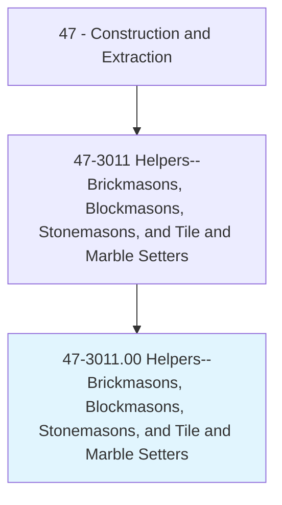
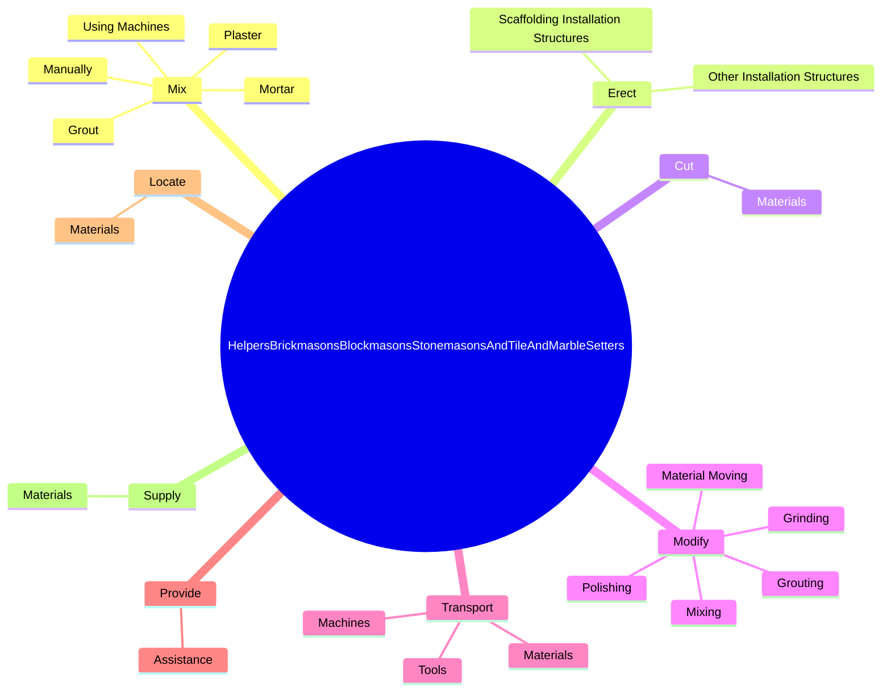
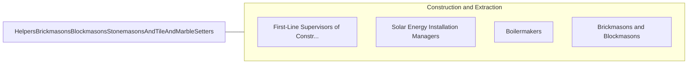

# Helpers--Brickmasons, Blockmasons, Stonemasons, and Tile and Marble Setters

> Help brickmasons, blockmasons, stonemasons, or tile and marble setters by performing duties requiring less skill. Duties include using, supplying, or holding materials or tools, and cleaning work area and equipment.

## Overview

Helpers--Brickmasons, Blockmasons, Stonemasons, and Tile and Marble Setters is an occupation within the Construction and Extraction category. Help brickmasons, blockmasons, stonemasons, or tile and marble setters by performing duties requiring less skill. 

## Classification Hierarchy

## Key Statistics

| Metric | Value |
|--------|-------|
| SOC Code | 47-3011.00 |
| Category | [Construction and Extraction](/occupations/Construction) |
| Task Count | 97 |
| Source | O*NET |

## Core Tasks

### mix.Mortar

Helpers--Brickmasons, Blockmasons, Stonemasons, and Tile and Marble Setters mix mortar as part of their core responsibilities.

**Actions:**
- `mix.Mortar.to.StandardFormulas`
- `mix.Plaster.to.StandardFormulas`
- `mix.Grout.to.StandardFormulas`
- `mix.Manually.to.StandardFormulas`

### erect.ScaffoldingInstallationStructures

Helpers--Brickmasons, Blockmasons, Stonemasons, and Tile and Marble Setters erect scaffolding installation structures as part of their core responsibilities.

**Actions:**
- `erect.ScaffoldingInstallationStructures`
- `erect.OtherInstallationStructures`

### cut.Materials

Helpers--Brickmasons, Blockmasons, Stonemasons, and Tile and Marble Setters cut materials as part of their core responsibilities.

**Actions:**
- `cut.Materials.to.specified.SizesForInstallation`
- `cut.Materials.to.UsingPowerSaws`
- `cut.Materials.to.TileCutters`

## Skills & Competencies

### Technical Skills
- **Construction Methods** - Advanced
- **Blueprint Reading** - Advanced
- **Safety Compliance** - Advanced

### Soft Skills
- **Communication** - Essential
- **Problem Solving** - Essential
- **Critical Thinking** - Important
- **Teamwork** - Important
- **Adaptability** - Important

## Related Occupations

## Industries

This occupation is found across multiple industries. See [Industries](/industries) for sector-specific employment data.

## Career Progression

---

*Source: O*NET 47-3011.00 - ONETOccupation*
